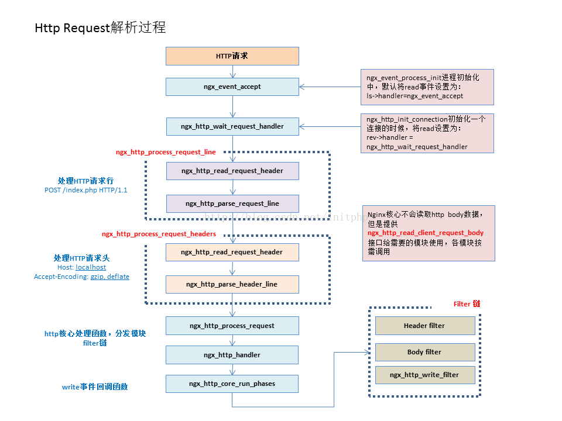

## 2.10 Http请求处理

Nginx中，Http请求的处理过程分为以下几个阶段：
* 建立连接，通过调用ngx_event_accept函数接受客户端的连接请求，然后调用ngx_http_init_connection函数完成http连接的初始化。
* 处理请求行和请求头，建立连接后，就是读取并处理客户端请求的相关数据，Nginx中首先是读取处理Http请求的请求行和请求头。
* 处理请求，读取到Http请求行和请求头后，Http框架就开始处理Http请求了，这里我们将会详细分析ngx_http_process_request函数。
* 读取请求body，需要注意的是Http框架本身并不会读取请求body，而是提供了两种方式处理http请求body。
* 发送响应，

具体如下若下图所示，接下来我们将以下图为例说明一下Http请求的处理：



### 2.10.1 建立连接
在Nginx的初始化启动过程中，worker工作进程会调用事件模块的ngx_event_process_init函数为每个监听套接字ngx_listening_t分配一个ngx_connection_t连接，并设置该连接上读事件的回调函数rev->handler=ngx_event_accept，同时将读事件注册到epoll事件机制中等待该连接上的可读事件发生，然后Nginx就可以接收并处理来自客户端的请求。当监听套接字连接上的可读事件发生时，即该连接上有来自客户端发出的连接请求，则会调用ngx_event_accept函数，在该函数中首先调用accept函数处理来自客户端的连接请求，然后调用监听套接字ngx_listening_t上的handler回调函数ngx_http_init_connection。

#### 初始化请求
在接收HTTP请求之前，首先会初始化已成功建立的连接；ngx_http_init_connection函数的功能是设置读、写事件的回调函数，而实际上写事件的回调函数并不进行任何操作，读事件的回调函数是对HTTP请求进程初始化工作。
```c
void ngx_http_init_connection(ngx_connection_t *c) {
    ngx_uint_t              i;
    ngx_event_t            *rev;
    struct sockaddr_in     *sin;
    ngx_http_port_t        *port;
    ngx_http_in_addr_t     *addr;
    ngx_http_log_ctx_t     *ctx;
    ngx_http_connection_t  *hc;

    //分配http连接ngx_http_connection_t结构体空间
    hc = ngx_pcalloc(c->pool, sizeof(ngx_http_connection_t));
    if (hc == NULL) {
        ngx_http_close_connection(c);
        return;
    }

    c->data = hc;

    port = c->listening->servers;

    if (port->naddrs > 1) {
        if (ngx_connection_local_sockaddr(c, NULL, 0) != NGX_OK) {
            ngx_http_close_connection(c);
            return;
        }

        switch (c->local_sockaddr->sa_family) {
            default:
                sin = (struct sockaddr_in *) c->local_sockaddr;
                addr = port->addrs;

                for (i = 0; i < port->naddrs - 1; i++) {
                    if (addr[i].addr == sin->sin_addr.s_addr) {
                        break;
                    }
                }

                hc->addr_conf = &addr[i].conf;
                break;
        }

    } else {
        switch (c->local_sockaddr->sa_family) {
            default: //AF_INET
                addr = port->addrs;
                hc->addr_conf = &addr[0].conf;
                break;
        }
    }

    //the default server configuration for the address:port
    hc->conf_ctx = hc->addr_conf->default_server->ctx;

    ctx = ngx_palloc(c->pool, sizeof(ngx_http_log_ctx_t));
    if (ctx == NULL) {
        ngx_http_close_connection(c);
        return;
    }

    ctx->connection = c;
    ctx->request = NULL;
    ctx->current_request = NULL;
    ...

    //设置当前连接读、写事件的handler处理函数
    rev = c->read;
    rev->handler = ngx_http_wait_request_handler;
    c->write->handler = ngx_http_empty_handler;

    if (hc->addr_conf->proxy_protocol) {
        hc->proxy_protocol = 1;
        c->log->action = "reading PROXY protocol";
    }

    //读事件准备就绪
    if (rev->ready) {
        if (ngx_use_accept_mutex) {
            ngx_post_event(rev, &ngx_posted_events);
            return;
        }

        rev->handler(rev);
        return;
    }

    //未准备就绪，则将其添加到定时器事件机制，并注册到epoll事件机制中
    ngx_add_timer(rev, c->listening->post_accept_timeout);
    ngx_reusable_connection(c, 1);
    if (ngx_handle_read_event(rev, 0) != NGX_OK) {
        ngx_http_close_connection(c);
        return;
    }
}
```
简单说明一下该函数的执行流程：
* 首先设置当前连接上读/写事件的回调函数：其中读事件的回调函数为ngx_http_wait_request_handler；写事件的回调函数为ngx_http_empty_handler（该函数不进行任何操作）
* 检查当前连接上读事件是否准备就绪（即ready标志位为1）：如就绪（表示当前连接上有可读的TCP流），则执行读事件的回调函数ngx_http_wait_request_handler；否则则将读事件添加到定时器事件机制中（监控读事件是否超时），同时将读事件注册到epoll事件机制中，等待可读事件的发生。

然后我们简单看一下读事件的处理函数ngx_http_wait_request_handler，该函数的功能是初始化HTTP请求，但是它并不会在连接建立之后就开始初始化请求，而是在当前连接所对应的套接字缓冲区上确定收到来了请求数据时才进行初始化工作，这样做可以减少不必要的内存消耗（比如当连接建立之后，客户端并不进行实际数据通信）。接下来我们看一下该函数：
```c
static void ngx_http_wait_request_handler(ngx_event_t *rev) {
    u_char                    *p;
    size_t                     size;
    ssize_t                    n;
    ngx_buf_t                 *b;
    ngx_connection_t          *c;
    ngx_http_connection_t     *hc;
    ngx_http_core_srv_conf_t  *cscf;

    //获取读事件所对应的连接ngx_connection_t对象
    c = rev->data;

    //若当前读事件超时，则关闭连接并退出
    if (rev->timedout) {
        ngx_http_close_connection(c);
        return;
    }

    //若当前读事件所对应的连接设置close标志位，则关闭该链接
    if (c->close) {
        ngx_http_close_connection(c);
        return;
    }

    hc = c->data;
    //获取当前读事件请求的相关配置项结构
    cscf = ngx_http_get_module_srv_conf(hc->conf_ctx, ngx_http_core_module);

    size = cscf->client_header_buffer_size;

    //以下内容是接收缓冲区的操作
    b = c->buffer;
    if (b == NULL) {
        b = ngx_create_temp_buf(c->pool, size);
        if (b == NULL) {
            ngx_http_close_connection(c);
            return;
        }
        c->buffer = b;
    } else if (b->start == NULL) {
        b->start = ngx_palloc(c->pool, size);
        if (b->start == NULL) {
            ngx_http_close_connection(c);
            return;
        }

        b->pos = b->start;
        b->last = b->start;
        b->end = b->last + size;
    }

    //在当前连接上开始接收HTTP请求数据
    n = c->recv(c, b->last, size);

    if (n == NGX_AGAIN) {
        if (!rev->timer_set) {
            ngx_add_timer(rev, c->listening->post_accept_timeout);
            ngx_reusable_connection(c, 1);
        }

        if (ngx_handle_read_event(rev, 0) != NGX_OK) {
            ngx_http_close_connection(c);
            return;
        }

        if (ngx_pfree(c->pool, b->start) == NGX_OK) {
            b->start = NULL;
        }

        return;
    }

    if (n == NGX_ERROR) {
        ngx_http_close_connection(c);
        return;
    }

    if (n == 0) {
        ngx_http_close_connection(c);
        return;
    }

    //若接收HTTP请求数据成功，则调整接收缓冲区成员指针
    b->last += n;

    if (hc->proxy_protocol) {
        hc->proxy_protocol = 0;

        p = ngx_proxy_protocol_parse(c, b->pos, b->last);

        if (p == NULL) {
            ngx_http_close_connection(c);
            return;
        }

        b->pos = p;

        if (b->pos == b->last) {
            c->log->action = "waiting for request";
            b->pos = b->start;
            b->last = b->start;
            ngx_post_event(rev, &ngx_posted_events);
            return;
        }
    }

    c->log->action = "reading client request line";

    ngx_reusable_connection(c, 0);

    //为当前连接创建一个请求结构体ngx_http_request_t
    c->data = ngx_http_create_request(c);
    if (c->data == NULL) {
        ngx_http_close_connection(c);
        return;
    }

    //设置当前读事件的处理函数为ngx_http_process_request_line
    rev->handler = ngx_http_process_request_line;
    //执行该读事件的处理函数ngx_http_process_request_line，接收HTTP请求行
    ngx_http_process_request_line(rev);
}
```
简单看一下ngx_http_wait_request_handler函数的执行流程：
* 首先判断当前读事件是否超时（即timedout标志位是否为1）：若已经超时（timedout标志位为1），则调用ngx_http_close_connection函数关闭当前连接并返回；否则继续检查当前连接的close标志位
* 若当前连接的close标志位为1，则表示当前连接要关闭，则调用ngx_http_close_connection函数关闭当前连接并返回；否则进入下一步
* 首先调用recv函数尝试从当前连接所对应的套接字缓冲区中接收数据，这个步骤是为了确定客户端是否真正的发送请求数据，以免因为客户端不发送实际请求数据，出现初始化请求而导致内存被消耗。根据所读取的数据情况n来判断是否要真正进行初始化请求工作：
* 若n = NGX_AGAIN，表示客户端发起连接请求，但是暂时还没发送实际的数据，则将当前连接上的读事件添加到定时器机制中，同时将读事件注册到epoll事件机制中，然后返回
* 若n = NGX_ERROR，表示当前连接出错，则直接调用ngx_http_close_connection关闭当前连接并返回；
* 若n = 0，表示客户端已经主动关闭当前连接，所有服务器端调用ngx_http_close_connection关闭当前连接并返回；
* 若 n > 0，表示读取到实际的请求数据，开始初始化当前请求，调用ngx_http_create_request函数构造ngx_http_request_t请求结构体，并设置到当前连接的data成员；然后设置当前读事件的回调函数为ngx_http_process_request_line，并执行该回调函数开始接收并解析请求行。

### 2.10.2 处理请求行和请求头
这里以请求行为例简单说明一下HTTP框架是如何处理请求行和请求头的。

#### 处理请求行
HTTP请求的初始化完成之后会调用ngx_http_process_request_line函数开始接收并解析HTTP请求行。在HTTP协议中我们知道，请求行的长度并不是固定的，它与URI长度相关，若当内核套接字缓冲区不能一次性完整的接收HTTP请求行时，则需要多次调用ngx_http_process_request_line函数继续接收，即ngx_http_process_request_line函数重新作为当前连接上读事件的处理函数，必要时还需要将读事件添加到定时器机制，并注册到epoll事件机制，直到接收并解析出完整的HTTP请求行。

### 2.10.3 处理HTTP请求
前面的步骤已经接收到完整的HTTP请求头部，此时已经有足够的信息开始处理HTTP请求。处理HTTP请求的过程有11个HTTP阶段，在不同的阶段由各个HTTP模块进行处理。接下来我们直接看处理HTTP请求的函数ngx_http_process_request：
```c
void ngx_http_process_request(ngx_http_request_t *r) {
    ngx_connection_t  *c;

    //获取当前请求所对应的连接
    c = r->connection;
    ...

    //现在不需要再处理HTTP请求头部超时问题，则把当前连接的读事件从定时器机制中删除
    if (c->read->timer_set) {
        ngx_del_timer(c->read);
    }

    //重新设置当前连接的读、写事件的回调函数
    c->read->handler = ngx_http_request_handler;
    c->write->handler = ngx_http_request_handler;

    //设置请求读事件的回调函数
    r->read_event_handler = ngx_http_block_reading;

    //开始处理各个HTTP模块的handler函数
    ngx_http_handler(r);

    //处理post请求
    ngx_http_run_posted_requests(c);
}
```
简单看一下ngx_http_process_request处理HTTP请求的执行流程：
* 若当前读事件在定时器机制中，则调用ngx_del_timer函数将其从定时器机制中移除，因为在处理HTTP请求时不存在接收HTTP请求头部超时的问题；
* 由于处理HTTP请求时已不需要再接收HTTP请求行或头部，则重新设置当前连接读、写事件的回调函数为ngx_http_request_handler，即后续处理HTTP请求的过程都是通过该函数进行的；
* 设置当前请求ngx_http_request_t结构体中的成员read_event_handler为ngx_http_block_reading，该函数实际不做任何操作，除非某个HTTP模块重新设置该回调函数；
* 接下来调用ngx_http_handler函数开始处理HTTP请求，最后调用函数ngx_http_run_posted_requests处理post子请求。

接下来我们看一下ngx_http_handler函数的执行流程：
```c
void ngx_http_handler(ngx_http_request_t *r) {
    ngx_http_core_main_conf_t  *cmcf;

    r->connection->log->action = NULL;

    r->connection->unexpected_eof = 0;

    //若当前请求的internal标志位为0，表示不需要重定向
    if (!r->internal) {
        //是否使用keepalive机制
        switch (r->headers_in.connection_type) {
            case 0:
                r->keepalive = (r->http_version > NGX_HTTP_VERSION_10);
                break;

            case NGX_HTTP_CONNECTION_CLOSE:
                r->keepalive = 0;
                break;

            case NGX_HTTP_CONNECTION_KEEP_ALIVE:
                r->keepalive = 1;
                break;
        }

        //设置延迟关闭标志位
        r->lingering_close = (r->headers_in.content_length_n > 0 || r->headers_in.chunked);

        //phase_handler序号设置为0，表示执行ngx_http_phase_engine_t结构体成员handlers数组中的第一个回调函数
        r->phase_handler = 0;

    } else {
        //若当前请求的internal标志位为1，表示需要做内部跳转

        //获取ngx_http_core_module模块的main级别的配置项结构
        cmcf = ngx_http_get_module_main_conf(r, ngx_http_core_module);

        //将phase_handler序号设为server_rewriter_index，其是handlers数组中NGX_HTTP_SERVER_REWRITE_PHASE阶段的第一个ngx_http_phase_handler_t回调的函数；
        r->phase_handler = cmcf->phase_engine.server_rewrite_index;
    }

    r->valid_location = 1;
    ...

    //设置当前请求写事件的回调函数
    r->write_event_handler = ngx_http_core_run_phases;
    //执行该回调函数，将调用各个HTTP模块共同处理当前请求，各个HTTP模块按照11个HTTP阶段进行处理
    ngx_http_core_run_phases(r);
}
```
简单看一下该函数的处理流程：
* 首先检查当前请求ngx_http_request_t的internal标志位：若internal标志位为0，表示当前请求不需要重定向，判断是否使用keepalive机制，并设置phase_handler序号为0，表示执行ngx_http_phase_engine_t结构成员handlers数组中的第一个回调函数；
* 否则需要将当前请求做内部跳转，并将phase_handler设置为server_rewrite_index，表示执行ngx_http_phase_engine_t结构成员handlers数组在NGX_HTTP_SERVER_REWRITE_PHASE处理阶段的第一个回调函数；
* 设置当前请求ngx_http_request_t的成员write_event_handler为ngx_http_core_run_phases；最后执行ngx_http_core_run_phases函数。

接下来我们看一下ngx_http_core_run_phases函数的执行流程：
```c
void ngx_http_core_run_phases(ngx_http_request_t *r) {
    ngx_int_t                   rc;
    ngx_http_phase_handler_t   *ph;
    ngx_http_core_main_conf_t  *cmcf;

    //获取ngx_http_core_module模块的main级别的配置项结构体
    cmcf = ngx_http_get_module_main_conf(r, ngx_http_core_module);

    //获取各个HTTP模块处理请求的回调函数数组
    ph = cmcf->phase_engine.handlers;

    //若实现了checker函数
    while (ph[r->phase_handler].checker) {

        //执行phase_handler序号在数组中指定的checker函数
        rc = ph[r->phase_handler].checker(r, &ph[r->phase_handler]);

        //成功执行checker函数，则退出，否则继续执行下一个HTTP模块的checker函数
        if (rc == NGX_OK) {
            return;
        }
    }
}
```
该函数流程比较简单，首先获取各个HTTP模块处理请求的回调函数数组phase_engine.handlers，然后判断每个ngx_http_phase_handler_t处理阶段是否实现checker函数：
* 未实现checker函数则直接退出；
* 否则执行phase_handler序号在handlers数组中指定的checker函数，执行完checker函数：若返回NGX_OK则退出；否则则继续执行下一个HTTP模块在该阶段的checker函数。

需要注意的是这里仅会执行每个ngx_http_phase_handler_t处理阶段的checker函数，而不会执行handler函数。我们前面说过handler函数仅能在checker函数中被调用，而checker函数是由HTTP框架实现的，所以可以控制各HTTP模块实现的处理函数在不同的阶段中采用不同的调用行为。

前面我们说过在ngx_http_process_request函数中会正设置当前连接读、写事件的回调函数为ngx_http_request_handler，当这个连接上的事件再次触发时，HTTP框架将不再调用ngx_http_process_request函数处理请求，而是由ngx_http_request_handler函数开始处理请求。该函数也是先调用r.write_event_handler即ngx_http_core_run_phases，然后再调用ngx_http_run_posted_requests函数

接下来我们看一下ngx_http_request_handler函数：
```c
static void ngx_http_request_handler(ngx_event_t *ev) {
    ngx_connection_t    *c;
    ngx_http_request_t  *r;

    c = ev->data;
    r = c->data;

    if (ev->delayed && ev->timedout) {
        ev->delayed = 0;
        ev->timedout = 0;
    }

    if (ev->write) {
        r->write_event_handler(r);
    } else {
        r->read_event_handler(r);
    }

    ngx_http_run_posted_requests(c);
}
```

### 2.10.4 处理HTTP请求包体
接下来我们开始要分析Nginx是如何处理HTTP请求包体，HTTP框架提供了两种方式处理HTTP包体。两种处理请求包体的方式：把请求包体接收到内存或者文件中；丢弃请求包体。需要注意的是丢弃请求包体并不意味着就不接受请求包体（不接收包体可能会导致客户端出现请求超时的错误），而是把接收到的请求包体进行丢弃，不进一步对其进行处理。

### 2.10.5 发送HTTP响应报文
HTTP的响应报文由Filter模块处理并发送，Filter模块包括过滤头部（Header Filter）和过滤包体（Body Filter），Header Filter处理HTTP响应头部，Body Filter处理HTTP响应包体。HTTP响应报文发送的过程需要经过Nginx的过滤链，所谓的过滤链就是由多个过滤模块组成有序的过滤链表，每个链表元素就是对应过滤模块的处理函数。在HTTP框架中，定义了过滤链表表头（即链表的第一个元素，也是处理函数）如下：
```c
extern ngx_http_output_header_filter_pt  ngx_http_top_header_filter;//发送响应头部
extern ngx_http_output_body_filter_pt  ngx_http_top_body_filter;//发送响应包体
其中，ngx_http_output_header_filter_pt 和 ngx_http_output_body_filter_pt 是函数指针，定义如下：

typedef ngx_int_t (*ngx_http_output_header_filter_pt) (ngx_http_request_t *r);//发送响应头部
typedef ngx_int_t (*ngx_http_output_body_filter_pt) (ngx_http_request_t *r, ngx_chain_t *chain);//发送响应包体
参数 r 是当前的请求，chain 是待发送的HTTP 响应包体；上面提到的只有过滤链表的表头，那么使用什么把所有过滤模块连接起来呢？该工作由下面定义完成，即：

static ngx_http_output_header_filter_pt  ngx_http_next_header_filter;
static ngx_http_output_body_filter_pt  ngx_http_next_body_filter;
这样就可以遍历整个过滤链表，把 HTTP 响应报文发送出去，按照过滤链表的顺序，调用链表元素的回调函数可能会对响应报文数据进行检测、截取、新增、修改 或 删除等操作，即FIlter 模块可以对响应报文进行修改。但是必须注意的是只有最后一个链表元素才会真正的发送响应报文。
```

#### 发送HTTP响应头部
HTTP响应状态行、响应头部由函数ngx_http_send_header发送，该发送函数的执行过程中会遍历过滤链表，该过滤链表的过滤模块是那些对HTTP响应头部感兴趣的过滤模块组成，ngx_http_send_header函数按照过滤链表的顺序依次处理响应头部，直到最后一个链表元素处理响应头部并把该响应头部发送给客户端。如下所示：
```c
ngx_int_t ngx_http_send_header(ngx_http_request_t *r) {
    if (r->header_sent) {
        ngx_log_error(NGX_LOG_ALERT, r->connection->log, 0,
                      "header already sent");
        return NGX_ERROR;
    }

    if (r->err_status) {
        r->headers_out.status = r->err_status;
        r->headers_out.status_line.len = 0;
    }

    return ngx_http_top_header_filter(r);
}
```
从函数的实现过程中我们可以知道，该函数调用 ngx_http_top_header_filter 函数开始顺序遍历过滤链表的每一个元素处理函数，直到最后一个把响应头部发送出去为止。在Nginx中，过滤链表的顺序如下：
```
 +----------------------------+
  |ngx_http_not_modified_filter|
  +----------+-----------------+
             |
             v
  +----------+------------+
  |ngx_http_headers_filter|
  +----------+------------+
             |
             v
  +----------+-----------+
  |ngx_http_userid_filter|
  +----------+-----------+
             |
             v
  +----------+-------------------+
  |ngx_http_charset_header_filter|
  +----------+-------------------+
             |
             v
  +----------+---------------+
  |ngx_http_ssi_header_filter|
  +----------+---------------+
             |
             v
  +----------+----------------+
  |ngx_http_gzip_header_filter|
  +----------+----------------+
             |
             v
  +----------+-----------------+
  |ngx_http_range_header_filter|
  +----------+-----------------+
             |
             v
  +----------+-------------------+
  |ngx_http_chunked_header_filter|
  +----------+-------------------+
             |
             v
  +----------+-----------+
  |ngx_http_header_filter|
  +----------------------+
```
根据发送响应头部的过滤链表顺序可以知道，除了最后一个模块是真正发送响应头部给客户端之外，其他模块都只是对响应头部进行修改，最后一个过来模块是ngx_http_header_filter_module，该模块提供的处理函数是ngx_http_header_filter 根据请求结构体ngx_http_request_t 中的 header_out 成员序列化字符流，并发送序列化之后的响应头部；

ngx_http_header_filter_module 模块的定义如下：

ngx_module_t  ngx_http_header_filter_module = {
    NGX_MODULE_V1,
    &ngx_http_header_filter_module_ctx,    //module context
    NULL,                                  //module directives
    NGX_HTTP_MODULE,                       //module type
    NULL,                                  //init master
    NULL,                                  //init module
    NULL,                                  //init process
    NULL,                                  //init thread
    NULL,                                  //exit thread
    NULL,                                  //exit process
    NULL,                                  //exit master
    NGX_MODULE_V1_PADDING
};

从该模块的定义中可以知道，该模块只调用上下文结构 ngx_http_header_filter_module_ctx，该上下文结构定义如下：

static ngx_http_module_t  ngx_http_header_filter_module_ctx = {
    NULL,                                  //preconfiguration
    ngx_http_header_filter_init,           //postconfiguration

    NULL,                                  //create main configuration
    NULL,                                  //init main configuration

    NULL,                                  //create server configuration
    NULL,                                  //merge server configuration

    NULL,                                  //create location configuration
    NULL,                                  //merge location configuration
};

上下文结构指定了 postconfiguration 的函数为 ngx_http_header_filter_init，该函数定义如下：

//初始化ngx_http_header_filter_module模块
static ngx_int_t
ngx_http_header_filter_init(ngx_conf_t *cf)
{
    //调用ngx_http_header_filter函数发送响应头部
    ngx_http_top_header_filter = ngx_http_header_filter;

    return NGX_OK;
}

最终该模块由函数  ngx_http_header_filter 执行即发送HTTP 响应头部，下面对该函数进行分析；

ngx_http_header_filter 函数执行流程：

首先检查当前请求 ngx_http_request_t 结构的header_sent 标志位，若该标志位为1，则表示已经发送过响应头部，因此，无需重复发送，直接返回NGX_OK 结束该函数；
若之前未发送过响应头部（即 headr_sent 标志位为0），此时，准备发送响应头部，并设置header_sent 标志位为1（防止重复发送），表示正要发送响应头部，同时检查当前请求是否为原始请求，若不是原始请求（即为子请求），则不需要发送响应头部返回 NGX_OK，因为子请求不存在响应头部概念。继而检查HTTP 协议版本，若HTTP 协议版本小于  1.0（即不支持请求头部，也就没有所谓的响应头部）直接返回NGX_OK，若是原始请求且HTTP 协议版本不小于1.0版本，则准备发送响应头部；
根据 HTTP 响应报文的状态行、响应头部将字符串序列化为发送响应头部所需的字节数len，方便下面分配缓冲区空间存在待发送的响应头部；
根据前一步骤计算的 len 值在当前请求内存池中分配用于存储响应头部的字符流缓冲区b，并将响应报文的状态行、响应头部按照HTTP 规范序列化地复制到刚分配的缓冲区b 中；
将待发送响应头部的缓冲区 b 挂载到链表缓冲区 out.buf 中；挂载的目的是：当响应头部不能一次性发送完毕时，ngx_http_header_filter 函数会返回NGX_AGAIN，表示发送的响应头部不完整，则把剩余的响应头部数据保存在out 链表缓冲区中，以便调用ngx_http_filter_request 时，再次调用 HTTP 框架将 out 链表缓冲区的剩余响应头部字符流发送出去；
调用 ngx_http_writer_filter 函数将out 链表缓冲区的响应头部发送出去，但是不能保证一次性发送完毕；
函数 ngx_http_header_filter 在文件src/http/ngx_http_header_filter_module.c 中定义如下：
//发送HTTP响应头部
static ngx_int_t
ngx_http_header_filter(ngx_http_request_t *r)
{
    u_char                    *p;
    size_t                     len;
    ngx_str_t                  host, *status_line;
    ngx_buf_t                 *b;
    ngx_uint_t                 status, i, port;
    ngx_chain_t                out;
    ngx_list_part_t           *part;
    ngx_table_elt_t           *header;
    ngx_connection_t          *c;
    ngx_http_core_loc_conf_t  *clcf;
    ngx_http_core_srv_conf_t  *cscf;
    struct sockaddr_in        *sin;
#if (NGX_HAVE_INET6)
    struct sockaddr_in6       *sin6;
#endif
    u_char                     addr[NGX_SOCKADDR_STRLEN];

    /*
     * 检查当前请求结构的header_sent标志位，若该标志位为1，
     * 表示已经发送HTTP请求响应，则无需再发送，此时返回NGX_OK；

    if (r->header_sent) {
        return NGX_OK;
    }

    //若之前未发送HTTP请求响应，则现在准备发送，并设置header_sent标志位
    r->header_sent = 1;

    //当前请求不是原始请求，则返回NGX_OK
    if (r != r->main) {
        return NGX_OK;
    }

    /*
     * 若HTTP版本为小于1.0 则直接返回NGX_OK；
     * 因为这些版本不支持请求头部，所有就没有响应头部；

    if (r->http_version < NGX_HTTP_VERSION_10) {
        return NGX_OK;
    }

    if (r->method == NGX_HTTP_HEAD) {
        r->header_only = 1;
    }

    if (r->headers_out.last_modified_time != -1) {
        if (r->headers_out.status != NGX_HTTP_OK
            && r->headers_out.status != NGX_HTTP_PARTIAL_CONTENT
            && r->headers_out.status != NGX_HTTP_NOT_MODIFIED)
        {
            r->headers_out.last_modified_time = -1;
            r->headers_out.last_modified = NULL;
        }
    }

    //以下是根据HTTP响应报文的状态行、响应头部字符串序列化为所需的字节数len
    len = sizeof("HTTP/1.x ") - 1 + sizeof(CRLF) - 1
          //the end of the header
          + sizeof(CRLF) - 1;

    //status line

    if (r->headers_out.status_line.len) {
        len += r->headers_out.status_line.len;
        status_line = &r->headers_out.status_line;

     ...
     ...

    //分配用于存储响应头部字符流缓冲区
    b = ngx_create_temp_buf(r->pool, len);
    if (b == NULL) {
        return NGX_ERROR;
    }

    //将响应报文的状态行、响应头部按照HTTP规范序列化地复制到刚分配的缓冲区b中
    //"HTTP/1.x "
    b->last = ngx_cpymem(b->last, "HTTP/1.1 ", sizeof("HTTP/1.x ") - 1);

    //status line
    if (status_line) {
        b->last = ngx_copy(b->last, status_line->data, status_line->len);

    } else {
        b->last = ngx_sprintf(b->last, "%03ui ", status);
    }

    ...
    ...

    /*
     * 将待发送的响应头部挂载到out链表缓冲区中，
     * 挂载的目的是：当响应头部不能一次性发送完成时，
     * ngx_http_header_filter函数返回NGX_AGAIN，表示发送的响应头部不完整，
     * 则把剩余的响应头部保存在out链表中，以便调用ngx_http_finalize_request时，
     * 再次调用HTTP框架将out链表中剩余的响应头部字符流继续发送；

    out.buf = b;
    out.next = NULL;

    /*
     * 调用函数ngx_http_write_filter将响应头部字符流发送出去；
     * 所有实际发送响应头部数据的由ngx_http_write_filter函数实现；

    return ngx_http_write_filter(r, &out);
}

#### 发送HTTP响应包体
HTTP响应包体由函数ngx_http_output_filter发送，该发送函数的执行过程中会遍历过滤链表，该过滤链表的过滤模块是那些对HTTP响应包体感兴趣的过滤模块组成，ngx_http_output_filter函数按照过滤链表的顺序依次处理响应包体，直到最后一个链表元素处理响应包体并把该响应包体发送给客户端。如下所示：
```c
ngx_int_t ngx_http_output_filter(ngx_http_request_t *r, ngx_chain_t *in) {
    ngx_int_t          rc;
    ngx_connection_t  *c;

    c = r->connection;

    ngx_log_debug2(NGX_LOG_DEBUG_HTTP, c->log, 0,
                   "http output filter \"%V?%V\"", &r->uri, &r->args);

    rc = ngx_http_top_body_filter(r, in);

    if (rc == NGX_ERROR) {
        //NGX_ERROR may be returned by any filter
        c->error = 1;
    }

    return rc;
}
```
从函数的实现过程中我们可以知道，该函数调用 ngx_http_top_body_filter 函数开始顺序遍历过滤链表的每一个元素处理函数，直到最后一个把响应包体发送出去为止。在Nginx 中，过滤链表的顺序如下：
```
  +--------------------------+
  |ngx_http_range_body_filter|
  +----------+---------------+
             |
             v
  +----------+---------+
  |ngx_http_copy_filter|
  +----------+---------+
             |
             v
  +----------+-----------------+
  |ngx_http_charset_body_filter|
  +----------+-----------------+
             |
             v
  +----------+-------------+
  |ngx_http_ssi_body_filter|
  +----------+-------------+
             |
             v
  +----------+-------------+
  |ngx_http_postpone_filter|
  +----------+-------------+
             |
             v
  +----------+--------------+
  |ngx_http_gzip_body_filter|
  +----------+--------------+
             |
             v
  +----------+-----------------+
  |ngx_http_chunked_body_filter|
  +----------+-----------------+
             |
             v
  +---------------------+
  |ngx_http_write_filter|
  +---------------------+
```

根据发送响应包体的过滤链表顺序可以知道，除了最后一个模块是真正发送响应包体给客户端之外，其他模块都只是对响应包体进行修改，最后一个过来模块是ngx_http_write_filter_module，该模块提供的处理函数是ngx_http_write_filter；

ngx_http_write_filter_module 模块的定义如下：

ngx_module_t  ngx_http_write_filter_module = {
    NGX_MODULE_V1,
    &ngx_http_write_filter_module_ctx,     //module context
    NULL,                                  //module directives
    NGX_HTTP_MODULE,                       //module type
    NULL,                                  //init master
    NULL,                                  //init module
    NULL,                                  //init process
    NULL,                                  //init thread
    NULL,                                  //exit thread
    NULL,                                  //exit process
    NULL,                                  //exit master
    NGX_MODULE_V1_PADDING
};

该模块的上下文结构 ngx_http_write_filter_module_ctx 定义如下：

static ngx_http_module_t  ngx_http_write_filter_module_ctx = {
    NULL,                                  //preconfiguration
    ngx_http_write_filter_init,            //postconfiguration

    NULL,                                  //create main configuration
    NULL,                                  //init main configuration

    NULL,                                  //create server configuration
    NULL,                                  //merge server configuration

    NULL,                                  //create location configuration
    NULL,                                  //merge location configuration
};

上下文结构中只调用 ngx_http_write_filter_init 函数，该函数定义如下：

//初始化模块
static ngx_int_t
ngx_http_write_filter_init(ngx_conf_t *cf)
{
    //调用模块的回调函数
    ngx_http_top_body_filter = ngx_http_write_filter;

    return NGX_OK;
}

该模块最终调用 ngx_http_write_filter 函数发送HTTP 响应包体，该函数的实现如下分析；

ngx_http_writer_filter 函数执行流程：

检查当前连接的错误标志位 error，若该标志位为 1，表示当前请求出粗，则返回 NGX_ERROR 结束该函数，否则继续；
遍历当前请求 ngx_http_request_t 结构体中的链表缓冲区成员out，计算剩余响应报文的长度size。因为当响应报文一次性不能发送完毕时，会把剩余的响应报文保存在out 中，相对于本次待发送的响应报文 in (即是该函数所传入的参数in )来说，out 链表缓冲区保存的是前一次剩余的响应报文；
将本次待发送的响应报文的缓冲区 in 添加到 out 链表缓冲区的尾部，并计算待发送响应报文的总长度 size；
若缓冲区 ngx_buf_t 块的 last_buf (即 last)、flush 标志位为0，则表示待发送的out 链表缓冲区没有一个是需要立刻发送响应报文，并且本次待发送的in 不为空，且待发送的响应报文数据总长度 size 小于postpone_output 参数（该参数由nginx.conf配置文件中设置），则不需要发送响应报文，即返回NGX_OK 结束该函数；
若需要发送响应报文，则检查当前连接上写事件的 delayed 标志位，若为1，表示发送响应超速，则需要在epoll 事件机制中减速，所有相当于延迟发送响应报文，则返回NGX_AGIAN；
若不需要延迟发送响应报文，检查当前请求的限速标志位 limit_rate，若该标志位设置为大于0，表示当前发送响应报文的速度不能超过limit_rate 值；
根据限速值 r->limit_rate、当前客户开始接收响应的时间r->start_sec、在当前连接上已发送响应的长度c->sent、和limit_after 值计算本次可以发送的字节数limit，若limit 值不大于0，表示当前连接上发送响应的速度超过limit_rate 限速值，即本次不可以发送响应，因此将写事件的delayed 标志位设置为1，把写事件添加到定时器机制，并设置当前连接ngx_connection_t 结构体中的成员buffered 为NGX_HTTP_WRITE_BUFFERED（即可写状态），同时返回NGX_AGAIN，表示链表缓冲区out 还保存着剩余待发送的响应报文；
若 limit 值大于 0，则根据 limit 值、配置项参数 sendfile_max_chunk 和待发送字节数 size 来计算本次发送响应的长度(即三者中的最小值)；
根据前一步骤计算的可发送响应的长度，再次检查 limit_rate 标志位，若limit_rate 还是为1，表示继续需要限速检查。再按照前面的计算函数判断是否超过限速值limit_rate，若超过该限速值，则需再次把写事件添加到定时器机制中，标志位delayed 设置为1；
若不会超过限速值，则发送响应，并重新调整链表缓冲区 out 的情况，把已发送响应数据的缓冲区进行回收内存；
继续检查链表缓冲区 out 是否还存在数据，若存在数据，则表示未发送完毕，返回NGX_AGAIN，表示等待下次HTTP 框架被调用发送out 缓冲区剩余的响应数据；若不存在数据，则表示成功发送完整的响应数据，并返回NGX_OK；
函数 ngx_http_write_filter 在文件 src/http/ngx_http_write_filter_module.c 中定义如下：
//发送响应报文数据

//参数r是对应的请求，in是保存本次待发送数据的链表缓冲区
ngx_int_t
ngx_http_write_filter(ngx_http_request_t *r, ngx_chain_t *in)
{
    off_t                      size, sent, nsent, limit;
    ngx_uint_t                 last, flush;
    ngx_msec_t                 delay;
    ngx_chain_t               *cl, *ln, **ll, *chain;
    ngx_connection_t          *c;
    ngx_http_core_loc_conf_t  *clcf;

    //获取当前请求所对应的连接
    c = r->connection;

    /*
     * 检查当前连接的错误标志位error，若该标志位为1，
     * 表示当前请求出错，返回NGX_ERROR；

    if (c->error) {
        return NGX_ERROR;
    }

    size = 0;
    flush = 0;
    last = 0;
    ll = &r->out;

    //find the size, the flush point and the last link of the saved chain

    /*
     * 遍历当前请求out链表缓冲区，计算剩余响应报文的长度；
     * 因为当响应报文一次性不能发送完成时，会把剩余的响应报文保存在out中，
     * 相对于本次发送的响应报文数据in来说（即该函数所传入的参数in），
     * out链表缓冲区保存的是前一次剩余的响应报文；

    for (cl = r->out; cl; cl = cl->next) {
        ll = &cl->next;

        ngx_log_debug7(NGX_LOG_DEBUG_EVENT, c->log, 0,
                       "write old buf t:%d f:%d %p, pos %p, size: %z "
                       "file: %O, size: %z",
                       cl->buf->temporary, cl->buf->in_file,
                       cl->buf->start, cl->buf->pos,
                       cl->buf->last - cl->buf->pos,
                       cl->buf->file_pos,
                       cl->buf->file_last - cl->buf->file_pos);

#if 1
        ...
#endif

        size += ngx_buf_size(cl->buf);

        if (cl->buf->flush || cl->buf->recycled) {
            flush = 1;
        }

        if (cl->buf->last_buf) {
            last = 1;
        }
    }

    //add the new chain to the existent one

    /*
     * 将本次待发送的响应报文的缓冲区in添加到out链表缓冲区的尾部，
     * 并计算待发送响应报文总的长度size；

    for (ln = in; ln; ln = ln->next) {
        cl = ngx_alloc_chain_link(r->pool);
        if (cl == NULL) {
            return NGX_ERROR;
        }

        cl->buf = ln->buf;
        *ll = cl;//由上面可知 ll=&r->out
        ll = &cl->next;

        ngx_log_debug7(NGX_LOG_DEBUG_EVENT, c->log, 0,
                       "write new buf t:%d f:%d %p, pos %p, size: %z "
                       "file: %O, size: %z",
                       cl->buf->temporary, cl->buf->in_file,
                       cl->buf->start, cl->buf->pos,
                       cl->buf->last - cl->buf->pos,
                       cl->buf->file_pos,
                       cl->buf->file_last - cl->buf->file_pos);

#if 1
        ...
#endif

        size += ngx_buf_size(cl->buf);

        if (cl->buf->flush || cl->buf->recycled) {
            flush = 1;
        }

        if (cl->buf->last_buf) {
            last = 1;
        }
    }

    *ll = NULL;

    ngx_log_debug3(NGX_LOG_DEBUG_HTTP, c->log, 0,
                   "http write filter: l:%d f:%d s:%O", last, flush, size);

    //获取ngx_http_core_module模块的loc级别配置项结构体
    clcf = ngx_http_get_module_loc_conf(r, ngx_http_core_module);

    /*
     * avoid the output if there are no last buf, no flush point,
     * there are the incoming bufs and the size of all bufs
     * is smaller than "postpone_output" directive


    /*
     * 若out链表最后一块缓冲区last为空，且没有强制性刷新flush链表缓冲区out，
     * 且当前有待发响应报文in，但是待发送响应报文总的长度size小于预设可发送条件值postpone_output,
     * 则本次不能发送响应报文，继续保存在out链表缓冲区中，以待下次才发送；
     * 其中postpone_output预设值我们可以在配置文件nginx.conf中设置；

    if (!last && !flush && in && size < (off_t) clcf->postpone_output) {
        return NGX_OK;
    }

    /*
     * 检查当前连接上写事件的delayed标志位，
     * 若该标志位为1，表示需要延迟发送响应报文，
     * 因此，返回NGX_AGAIN，表示延迟发送；

    if (c->write->delayed) {
        c->buffered |= NGX_HTTP_WRITE_BUFFERED;
        return NGX_AGAIN;
    }

    if (size == 0
        && !(c->buffered & NGX_LOWLEVEL_BUFFERED)
        && !(last && c->need_last_buf))
    {
        if (last || flush) {
            for (cl = r->out; cl; //void) {
                ln = cl;
                cl = cl->next;
                ngx_free_chain(r->pool, ln);
            }

            r->out = NULL;
            c->buffered &= ~NGX_HTTP_WRITE_BUFFERED;

            return NGX_OK;
        }

        ngx_log_error(NGX_LOG_ALERT, c->log, 0,
                      "the http output chain is empty");

        ngx_debug_point();

        return NGX_ERROR;
    }

    /*
     * 检查当前请求的限速标志位limit_rate，
     * 若该标志位为大于0，表示发送响应报文的速度不能超过limit_rate指定的速度；

    if (r->limit_rate) {
        if (r->limit_rate_after == 0) {
            r->limit_rate_after = clcf->limit_rate_after;
        }

        //计算发送速度是否超过限速值
        limit = (off_t) r->limit_rate * (ngx_time() - r->start_sec + 1)
                - (c->sent - r->limit_rate_after);

        /*
         * 若当前发送响应报文的速度超过限速值，则写事件标志位delayed设为1，
         * 并把该写事件添加到定时器机制中，并且将buffered设置为可写状态，
         * 返回NGX_AGAIN，表示链表缓冲区out还保存剩余待发送的响应报文；

        if (limit <= 0) {
            c->write->delayed = 1;
            ngx_add_timer(c->write,
                          (ngx_msec_t) (- limit * 1000 / r->limit_rate + 1));

            c->buffered |= NGX_HTTP_WRITE_BUFFERED;

            return NGX_AGAIN;
        }

        if (clcf->sendfile_max_chunk
            && (off_t) clcf->sendfile_max_chunk < limit)
        {
            limit = clcf->sendfile_max_chunk;
        }

    } else {
        limit = clcf->sendfile_max_chunk;
    }

    //若不需要减速，或没有设置速度限制，则向客户端发送响应字符流
    sent = c->sent;

    ngx_log_debug1(NGX_LOG_DEBUG_HTTP, c->log, 0,
                   "http write filter limit %O", limit);

    chain = c->send_chain(c, r->out, limit);

    ngx_log_debug1(NGX_LOG_DEBUG_HTTP, c->log, 0,
                   "http write filter %p", chain);

    if (chain == NGX_CHAIN_ERROR) {
        c->error = 1;
        return NGX_ERROR;
    }

    //再次检查limit_rate标志位
    if (r->limit_rate) {

        nsent = c->sent;

        if (r->limit_rate_after) {

            sent -= r->limit_rate_after;
            if (sent < 0) {
                sent = 0;
            }

            nsent -= r->limit_rate_after;
            if (nsent < 0) {
                nsent = 0;
            }
        }

        //再次计算当前发送响应报文速度是否超过限制值
        delay = (ngx_msec_t) ((nsent - sent) * 1000 / r->limit_rate);

        //若超过，需要限速，并把写事件添加到定时器机制中
        if (delay > 0) {
            limit = 0;
            c->write->delayed = 1;
            ngx_add_timer(c->write, delay);
        }
    }

    if (limit
        && c->write->ready
        && c->sent - sent >= limit - (off_t) (2 * ngx_pagesize))
    {
        c->write->delayed = 1;
        ngx_add_timer(c->write, 1);
    }

    //重新调整链表缓冲区out的情况，把已发送数据的缓冲区内存回收
    for (cl = r->out; cl && cl != chain; //void) {
        ln = cl;
        cl = cl->next;
        ngx_free_chain(r->pool, ln);
    }

    //检查out链表缓冲区是否还有数据
    r->out = chain;

    //若还有数据，返回NGX_AGAIN，表示还存在待发送的响应报文数据
    if (chain) {
        c->buffered |= NGX_HTTP_WRITE_BUFFERED;
        return NGX_AGAIN;
    }

    c->buffered &= ~NGX_HTTP_WRITE_BUFFERED;

    if ((c->buffered & NGX_LOWLEVEL_BUFFERED) && r->postponed == NULL) {
        return NGX_AGAIN;
    }

    //若已发送全部数据则返回NGX_OK
    return NGX_OK;
}

ngx_http_write 函数执行流程如下：

检查写事件的 timedout 标志位，若该标志位为 1（表示超时），进而判断属于哪种情况引起的超时（第一种：网络异常或客户端长时间不接收响应；第二种：由于响应发送速度超速，导致写事件被添加到定时器机制（注意一点：delayed 标志位此时是为1），有超速引起的超时，不算真正的响应发送超时）；
检查 delayed 标志位，若 delayed 为 0，表示由第一种情况引起的超时，即是真正的响应超时，此时设置timedout 标志位为1，并调用函数ngx_http_finalize_request 结束请求；
若 delayed 为 1，表示由第二种情况引起的超时，不算真正的响应超时，此时，把标志位 timedout、delayed 都设置为 0，继续检查写事件的 ready 标志位，若 ready 为 0，表示当前写事件未准备就绪（即不可写），因此，将写事件添加到定时器机制，注册到epoll 事件机制中，等待可写事件发送，返回return 结束该函数；
若写事件 timedout 为 0，且 delayed 为 0，且 ready 为 1，则调用函数 ngx_http_output_filter 发送响应；该函数的第二个参数为NULL，表示需要调用各个包体过滤模块处理链表缓冲区out 中剩余的响应，最后由ngx_http_write_filter 函数把响应发送出去；
函数 ngx_http_writer 在文件 src/http/ngx_http_request.c 中定义如下：
static void
ngx_http_writer(ngx_http_request_t *r)
{
    int                        rc;
    ngx_event_t               *wev;
    ngx_connection_t          *c;
    ngx_http_core_loc_conf_t  *clcf;

    //获取当前请求的连接
    c = r->connection;
    //获取连接上的写事件
    wev = c->write;

    ngx_log_debug2(NGX_LOG_DEBUG_HTTP, wev->log, 0,
                   "http writer handler: \"%V?%V\"", &r->uri, &r->args);

    //获取ngx_http_core_module模块的loc级别配置项结构
    clcf = ngx_http_get_module_loc_conf(r->main, ngx_http_core_module);

    /*
     * 写事件超时有两种可能：
     * 1、由于网络异常或客户端长时间不接收响应，导致真实的发送响应超时；
     * 2、由于响应发送速度超过了请求的限速值limit_rate，导致写事件被添加到定时器机制中，
     *    这是由超速引起的，并不是真正的响应发送超时；注意：写事件被添加到定时器机制时，delayed标志位设置为1；


    //检查写事件是否超时，若超时(即timedout为1)，进而判断属于哪种情况引起的超时
    if (wev->timedout) {
        /*
         * 若是响应真的超时，即网络异常或客户端长时间未接收响应引起的超时；
         * 则将timedout标志位设置为1，并调用ngx_http_finalize_request结束请求；
         * 并return返回结束当前函数；

        if (!wev->delayed) {
            ngx_log_error(NGX_LOG_INFO, c->log, NGX_ETIMEDOUT,
                          "client timed out");
            c->timedout = 1;

            ngx_http_finalize_request(r, NGX_HTTP_REQUEST_TIME_OUT);
            return;
        }

        /*
         * 若是由超速发送响应引起的超时，则将timedout、delayed标志位都设为0；
         * 再继续检查写事件的ready标志位；

        wev->timedout = 0;
        wev->delayed = 0;

        /*
         * 检查写事件的ready标志位，若写事件未准备就绪(ready=0)，即表示当前写事件不可写，
         * 则将写事件添加到定时器机制中，同时将写事件注册到epoll事件机制中，等待可写事件发生；
         * 并return结束当前函数；

        if (!wev->ready) {
            ngx_add_timer(wev, clcf->send_timeout);

            if (ngx_handle_write_event(wev, clcf->send_lowat) != NGX_OK) {
                ngx_http_close_request(r, 0);
            }

            return;
        }

    }

    //当timedout为0，但是delayed为1或是aio，则将写事件注册到epoll事件机制中，并return返回
    if (wev->delayed || r->aio) {
        ngx_log_debug0(NGX_LOG_DEBUG_HTTP, wev->log, 0,
                       "http writer delayed");

        if (ngx_handle_write_event(wev, clcf->send_lowat) != NGX_OK) {
            ngx_http_close_request(r, 0);
        }

        return;
    }

    //若写事件timedout为0，且delayed为0，且ready为1，则调用ngx_http_output_filter 发送响应报文
    rc = ngx_http_output_filter(r, NULL);

    ngx_log_debug3(NGX_LOG_DEBUG_HTTP, c->log, 0,
                   "http writer output filter: %d, \"%V?%V\"",
                   rc, &r->uri, &r->args);

    //若发送响应错误，则调用ngx_http_finalize_request结束请求，并return返回
    if (rc == NGX_ERROR) {
        ngx_http_finalize_request(r, rc);
        return;
    }

    /*
     * 若成功发送响应，则检查当前请求的out链表缓冲区是否存在剩余待发送的响应报文，
     * 若存在剩余待发送响应，又因为此时写事件不可写，则将其添加到定时器机制，注册到epoll事件机制中，
     * 等待可写事件的发生生；*/
    if (r->buffered || r->postponed || (r == r->main && c->buffered)) {

        if (!wev->delayed) {
            ngx_add_timer(wev, clcf->send_timeout);
        }

        if (ngx_handle_write_event(wev, clcf->send_lowat) != NGX_OK) {
            ngx_http_close_request(r, 0);
        }

        return;
    }

    ngx_log_debug2(NGX_LOG_DEBUG_HTTP, wev->log, 0,
                   "http writer done: \"%V?%V\"", &r->uri, &r->args);

    /*
     * 若当前out链表缓冲区不存在未发送的响应数据，则表示已成功发送完整的响应数据，
     * 此时，重新设置写事件的回调函数为ngx_http_request_empty_handler即不进行任何操作；

    r->write_event_handler = ngx_http_request_empty_handler;

    //最终调用ngx_http_finalize_request结束请求
    ngx_http_finalize_request(r, rc);
}

总结：真正发送响应的是 ngx_http_write_filter 函数，但是该函数不能保证一次性把响应发送完毕，若发送不完毕，把剩余的响应保存在out 链表缓冲区中，继而调用ngx_http_writer 把剩余的响应发送出去，函数ngx_http_writer 最终调用的是ngx_http_output_filter 函数发送响应，但是要知道的是ngx_http_output_filter 函数是需要调用个包体过滤模块来处理剩余响应的out 链表缓冲区，并由最后一个过滤模块 ngx_http_write_filter_module 调用ngx_http_write_filter 函数将响应发送出去；因此，我们可知道，真正发送响应的函数是ngx_http_write_filter；

关闭连接请求
当一个动作结束时，会根据引用计数判断是否结束其处理的请求，以下是有关关闭请求的函数；以下函数均在在文件 src/http/ngx_http_request.c 中定义如下；
ngx_http_finalize_request 函数执行流程：

若所传入的参数 rc  =  NGX_DONE，则直接调用ngx_http_finalize_connection 函数结束连接，并return 退出当前函数；
若参数 rc = NGX_DECLINED，表示需要按照11 个HTTP 阶段继续处理，此时，设置r->content_handler = NULL（为了让ngx_http_core_content_phase 函数可以继续调用NGX_HTTP_CONTENT_PHASE 阶段的其他处理函数），并设置写事件的回调函数为ngx_http_core_run_phases，最后调用ngx_http_core_run_phases 函数处理请求，return 从当前函数返回；
若  rc != NGX_DONE 且 rc != NGX_DECLINED，检查当前请求是否为子请求：
若当前请求是子请求，则调用 post_subrequest 的回调函数handler；
若不是子请求则继续执行以下程序；
若 rc 为 NGX_ERROR、NGX_HTTP_REQUEST_TIME_OUT、NGX_HTTP_CLIENT_CLOSED_REQUEST，或当前连接的错误码标志位c->error为1，则调用ngx_http_terminate_request 强制关闭请求，return 从当前函数返回；
若 rc 为 NGX_HTTP_CREATED、NGX_HTTP_NO_CONTENT，或rc 不小于NGX_HTTP_SPECIAL_RESPONSE，接着检查当前请求是否为原始请求，若是原始请求，则检查读、写事件的timer_set 标志位，若 timer_set 为1，将读、写事件从定时器机制中移除，重新设置当前连接的读、写事件的回调函数都为ngx_http_request_handler，并调用ngx_http_finalize_request，此时应该注意的是ngx_http_finalize_request 函数的第二个参数是ngx_http_special_response_handler(r, rc)函数的返回值，ngx_http_special_response_handler(r, rc) 函数根据参数rc 构造完整的HTTP 响应，根据ngx_http_special_response_handler 函数的返回值调用ngx_http_finalize_request 函数结束请求。return 从当前函数返回；
若参数 rc 不是以上步骤所描述的值，检查当前请求是否为原始请求：
若当前请求不是原始请求，
若当前请求是原始请求，检查当前请求的 buffered、postponed、blocked 标志位 或当前连接的buffered 标志位：
若这些标志位有一个是 1，则调用 ngx_http_set_write_handler 函数（该函数的功能就是设置当前请求写事件的回调函数为 ngx_http_writer 发送 out 链表缓冲区的剩余响应，若写事件未准备就绪，则将写事件添加到定时器机制，注册到epoll 事件机制中，最终返回NGX_OK），并return 返回当前函数；
若这些标志位都不为 1，则检查读、写事件的 timer_set 标志位，若 timer_set 标志位为1，则将读、写事件从定时器机制中移除，最后调用ngx_http_finalize_connection 释放请求，并关闭连接；
//结束请求
void
ngx_http_finalize_request(ngx_http_request_t *r, ngx_int_t rc)
{
    ngx_connection_t          *c;
    ngx_http_request_t        *pr;
    ngx_http_core_loc_conf_t  *clcf;

    c = r->connection;

    ngx_log_debug5(NGX_LOG_DEBUG_HTTP, c->log, 0,
                   "http finalize request: %d, \"%V?%V\" a:%d, c:%d",
                   rc, &r->uri, &r->args, r == c->data, r->main->count);

    //若传入的参数rc=NGX_DONE，则直接调用ngx_http_finalize_connection函数
    if (rc == NGX_DONE) {
        ngx_http_finalize_connection(r);
        return;
    }

    if (rc == NGX_OK && r->filter_finalize) {
        c->error = 1;
    }

    /*
     * 若传入的参数rc=NGX_DECLINED，则表示需按照11个HTTP阶段继续处理；
     * 此时，写事件调用ngx_http_core_run_phases；

    if (rc == NGX_DECLINED) {
        r->content_handler = NULL;
        r->write_event_handler = ngx_http_core_run_phases;
        ngx_http_core_run_phases(r);
        return;
    }

    //若传入的参数rc != NGX_DONE 且 rc != NGX_DECLINED，则执行以下程序

    /*
     * 若当前处理的请求是子请求，且post_subrequest标志位为1，
     * 则调用post_subrequest的handler回调函数；

    if (r != r->main && r->post_subrequest) {
        rc = r->post_subrequest->handler(r, r->post_subrequest->data, rc);
    }

    //若处理的当前请求不是子请求，则执行以下程序

    //若rc是以下这些值，或error标志位为1，则调用ngx_http_terminate_request函数强制关闭请求
    if (rc == NGX_ERROR
        || rc == NGX_HTTP_REQUEST_TIME_OUT
        || rc == NGX_HTTP_CLIENT_CLOSED_REQUEST
        || c->error)
    {
        if (ngx_http_post_action(r) == NGX_OK) {
            return;
        }

        if (r->main->blocked) {
            r->write_event_handler = ngx_http_request_finalizer;
        }

        ngx_http_terminate_request(r, rc);
        return;
    }

    /*
     * 若rc为以下值，表示请求的动作是上传文件，
     * 或HTTP模块需要HTTP框架构造并发送响应码不小于300的特殊响应；
     * 则首先检查当前请求是否为原始请求，若不是则调用ngx_http_terminate_request强制关闭请求，
     * 若是原始请求，则将读、写事件从定时器机制中移除；
     * 并重新设置读、写事件的回调函数为ngx_http_request_handler,
     * 最后调用ngx_http_finalize_request关闭请求（指定特定的rc参数）；

    if (rc >= NGX_HTTP_SPECIAL_RESPONSE
        || rc == NGX_HTTP_CREATED
        || rc == NGX_HTTP_NO_CONTENT)
    {
        if (rc == NGX_HTTP_CLOSE) {
            ngx_http_terminate_request(r, rc);
            return;
        }

        if (r == r->main) {
            if (c->read->timer_set) {
                ngx_del_timer(c->read);
            }

            if (c->write->timer_set) {
                ngx_del_timer(c->write);
            }
        }

        c->read->handler = ngx_http_request_handler;
        c->write->handler = ngx_http_request_handler;

        ngx_http_finalize_request(r, ngx_http_special_response_handler(r, rc));
        return;
    }

    //若rc不是以上的值，则执行以下程序

    //再次检查当前请求是否为原始请求
    if (r != r->main) {

        /*
         * 若当前请求不是原始请求，即当前请求是子请求；
         * 若子请求的buffered 或 postponed 标志位为1，
         * 则调用 ngx_http_set_write_handler;

        if (r->buffered || r->postponed) {

            if (ngx_http_set_write_handler(r) != NGX_OK) {
                ngx_http_terminate_request(r, 0);
            }

            return;
        }

        /*
         * 若子请求的buffered且postponed标志位都为0，则找到当前子请求的父亲请求；

        pr = r->parent;

        /*
         * 将父亲请求放置在ngx_http_posted_request_t结构体中，
         * 并将该结构体添加到原始请求的posted_requests链表中；

        if (r->buffered || r->postponed) {

            if (ngx_http_set_write_handler(r) != NGX_OK) {
                ngx_http_terminate_request(r, 0);
            }
        if (r == c->data) {

            r->main->count--;
            r->main->subrequests++;

            if (!r->logged) {

                clcf = ngx_http_get_module_loc_conf(r, ngx_http_core_module);

                if (clcf->log_subrequest) {
                    ngx_http_log_request(r);
                }

                r->logged = 1;

            } else {
                ngx_log_error(NGX_LOG_ALERT, c->log, 0,
                              "subrequest: \"%V?%V\" logged again",
                              &r->uri, &r->args);
            }

            r->done = 1;

            if (pr->postponed && pr->postponed->request == r) {
                pr->postponed = pr->postponed->next;
            }

            c->data = pr;

        } else {

            ngx_log_debug2(NGX_LOG_DEBUG_HTTP, c->log, 0,
                           "http finalize non-active request: \"%V?%V\"",
                           &r->uri, &r->args);

            r->write_event_handler = ngx_http_request_finalizer;

            if (r->waited) {
                r->done = 1;
            }
        }

        if (ngx_http_post_request(pr, NULL) != NGX_OK) {
            r->main->count++;
            ngx_http_terminate_request(r, 0);
            return;
        }

        ngx_log_debug2(NGX_LOG_DEBUG_HTTP, c->log, 0,
                       "http wake parent request: \"%V?%V\"",
                       &pr->uri, &pr->args);

        return;
    }

    //若当前请求是原始请求

    /*
     * 若r->buffered或c->buffered 或 r->postponed 或 r->blocked 标志位为1；
     * 则调用ngx_http_set_write_handler函数；

    if (r->buffered || c->buffered || r->postponed || r->blocked) {

        if (ngx_http_set_write_handler(r) != NGX_OK) {
            ngx_http_terminate_request(r, 0);
        }

        return;
    }

    if (r != c->data) {
        ngx_log_error(NGX_LOG_ALERT, c->log, 0,
                      "http finalize non-active request: \"%V?%V\"",
                      &r->uri, &r->args);
        return;
    }

    r->done = 1;
    r->write_event_handler = ngx_http_request_empty_handler;

    if (!r->post_action) {
        r->request_complete = 1;
    }

    if (ngx_http_post_action(r) == NGX_OK) {
        return;
    }

    /*
     * 将读、写事件从定时器机制中移除；

    if (c->read->timer_set) {
        ngx_del_timer(c->read);
    }

    if (c->write->timer_set) {
        c->write->delayed = 0;
        ngx_del_timer(c->write);
    }

    if (c->read->eof) {
        ngx_http_close_request(r, 0);
        return;
    }

    //关闭连接，并结束请求
    ngx_http_finalize_connection(r);
}

ngx_http_set_write_handler 函数执行流程：

设置当前请求的读事件回调函数为：ngx_httpp_discarded_request_body_handler（丢弃包体） 或ngx_http_test_reading；
设置当前请求的写事件回调函数为 ngx_http_writer（发送out 链表缓冲区剩余的响应）；
若当前写事件准备就绪（即 ready 和 delayed 标志位为 1）开始限速的发送 out 链表缓冲区中的剩余响应；
若当前写事件未准备就绪，则将写事件添加到定时器机制，注册到 epoll 事件机制中；
static ngx_int_t
ngx_http_set_write_handler(ngx_http_request_t *r)
{
    ngx_event_t               *wev;
    ngx_http_core_loc_conf_t  *clcf;

    r->http_state = NGX_HTTP_WRITING_REQUEST_STATE;

    //设置当前请求读事件的回调函数：丢弃包体或不进行任何操作
    r->read_event_handler = r->discard_body ?
                                ngx_http_discarded_request_body_handler:
                                ngx_http_test_reading;
    //设置写事件的回调函数为ngx_http_writer，即发送out链表缓冲区剩余的响应
    r->write_event_handler = ngx_http_writer;

#if (NGX_HTTP_SPDY)
    if (r->spdy_stream) {
        return NGX_OK;
    }
#endif

    wev = r->connection->write;

    //若写事件的ready标志位和delayed标志为都为1，则返回NGX_OK
    if (wev->ready && wev->delayed) {
        return NGX_OK;
    }

    /*
     * 若写事件的ready标志位为0，或delayed标志位为0，则将写事件添加到定时器机制中；
     * 同时将写事件注册到epoll事件机制中；
     * 最后返回NGX_OK；

    clcf = ngx_http_get_module_loc_conf(r, ngx_http_core_module);
    if (!wev->delayed) {
        ngx_add_timer(wev, clcf->send_timeout);
    }

    if (ngx_handle_write_event(wev, clcf->send_lowat) != NGX_OK) {
        ngx_http_close_request(r, 0);
        return NGX_ERROR;
    }

    return NGX_OK;
}

ngx_http_finalize_connection 函数的执行流程：

检查原始请求的引用计数，若原始请求的引用计数不为 1，则表示其他动作在操作该请求，检查当前请求的discard_body 标志位：
若 discard_body 标志位为 1，表示当前请求正在丢弃包体，把读事件的回调函数设为 ngx_http_discarded_request_body_handler 函数，并将读事件添加到定时器机制中（超时时间为lingering_timeout），最后调用ngx_http_close_request 关闭请求，并 return 从当前函数返回；
若 discard_body 标志位为 0，直接调用 ngx_http_close_request 关闭请求，并return 从当前函数返回；
若原始请求的引用计数为 1，检查当前请求的 keepalive 标志位：
若 keepalive 标志位为 1，则调用 ngx_http_set_keepalive方 法将当前连接设置为keepalive 状态，并return 从当前函数返回；
若 keepalive 标志位为 0，检查 lingering_close 标志位：
若 lingering_close 标志位为 1，则调用 ngx_http_set_lingering_close 延迟关闭请求，return 从当前函数返回；
若 lingering_close 标志位为 0，则调用 ngx_http_close_request 函数关闭请求；
//结束当前连接
static void
ngx_http_finalize_connection(ngx_http_request_t *r)
{
    ngx_http_core_loc_conf_t  *clcf;

#if (NGX_HTTP_SPDY)
    if (r->spdy_stream) {
        ngx_http_close_request(r, 0);
        return;
    }
#endif

    clcf = ngx_http_get_module_loc_conf(r, ngx_http_core_module);

    /*
     * 检查原始请求的引用计数，若原始请求的引用计数不为1，表示有其他动作在操作该请求；

    if (r->main->count != 1) {

        /*
         * 检查当前请求的discard_body标志位，若该标志位为1，表示当前请求正在丢弃包体；

        if (r->discard_body) {
            //设置当前请求读事件的回调函数，并将读事件添加到定时器机制中
            r->read_event_handler = ngx_http_discarded_request_body_handler;
            ngx_add_timer(r->connection->read, clcf->lingering_timeout);

            if (r->lingering_time == 0) {
                r->lingering_time = ngx_time()
                                      + (time_t) (clcf->lingering_time / 1000);
            }
        }

        //关闭当前请求
        ngx_http_close_request(r, 0);
        return;
    }

    //若原始请求的引用计数为1，则执行以下程序

    /*
     * 若keepalive标志为1，表示只需要释放请求，但是当前连接需要复用；
     * 则调用ngx_http_set_keepalive 设置当前连接为keepalive状态；

    if (!ngx_terminate
         && !ngx_exiting
         && r->keepalive
         && clcf->keepalive_timeout > 0)
    {
        ngx_http_set_keepalive(r);
        return;
    }

    /*
     * 若keepalive标志为0，但是lingering_close标志为1，表示需要延迟关闭连接；
     * 则调用ngx_http_set_lingering_close函数延迟关闭请求；

    if (clcf->lingering_close == NGX_HTTP_LINGERING_ALWAYS
        || (clcf->lingering_close == NGX_HTTP_LINGERING_ON
            && (r->lingering_close
                || r->header_in->pos < r->header_in->last
                || r->connection->read->ready)))
    {
        ngx_http_set_lingering_close(r);
        return;
    }

    //若keepalive标志为0，且lingering_close标志也为0，则立刻关闭请求
    ngx_http_close_request(r, 0);
}

ngx_http_close_request 函数的执行流程：

将原始请求的引用计数 count 减 1，若此时引用计数 count 不为 0，或当前请求的 blocked 标志位为 1，即不需要正在关闭该请求，因为该请求有其他动作在操作，return 从当前函数返回；
若引用计数 count 为 0（表示没有其他动作操作当前请求），且 blocked 标志位为0（表示没有HTTP 模块会处理当前请求），因此，调用ngx_http_free_request 释放当前请求的结构体ngx_http_request_t，并调用函数ngx_http_close_connection 关闭当前连接；
//关闭当前请求
static void
ngx_http_close_request(ngx_http_request_t *r, ngx_int_t rc)
{
    ngx_connection_t  *c;

    r = r->main;
    c = r->connection;

    ngx_log_debug2(NGX_LOG_DEBUG_HTTP, c->log, 0,
                   "http request count:%d blk:%d", r->count, r->blocked);

    if (r->count == 0) {
        ngx_log_error(NGX_LOG_ALERT, c->log, 0, "http request count is zero");
    }

    //将原始请求的引用计数减1
    r->count--;

    /*
     * 若此时引用计数不为0，或blocked标志位不为0，则该函数到此结束；
     * 到此，即ngx_http_close_request函数的功能只是将原始请求引用计数减1；

    if (r->count || r->blocked) {
        return;
    }

#if (NGX_HTTP_SPDY)
    if (r->spdy_stream) {
        ngx_http_spdy_close_stream(r->spdy_stream, rc);
        return;
    }
#endif

    /*
     * 若引用计数此时为0（表示请求没有其他动作要使用），
     * 且blocked也为0（表示没有HTTP模块还需要处理请求），
     * 则调用ngx_http_free_request释放请求所对应的结构体ngx_http_request_t，
     * 调用ngx_http_close_connection关闭当前连接；

    ngx_http_free_request(r, rc);
    ngx_http_close_connection(c);
}

ngx_http_free_request 函数的执行流程：

调用当前请求的 cleanup 链表的回调函数 handler 开始清理工作释放资源；
在 HTTP 的 NGX_HTTP_LOG_PHASE 阶段调用所有回调函数记录日志；
调用 ngx_destroy_pool 函数销毁保存请求结构ngx_http_request_t 的内存池pool；
//释放当前请求 ngx_http_request_t 的数据结构
void
ngx_http_free_request(ngx_http_request_t *r, ngx_int_t rc)
{
    ngx_log_t                 *log;
    ngx_pool_t                *pool;
    struct linger              linger;
    ngx_http_cleanup_t        *cln;
    ngx_http_log_ctx_t        *ctx;
    ngx_http_core_loc_conf_t  *clcf;

    log = r->connection->log;

    ngx_log_debug0(NGX_LOG_DEBUG_HTTP, log, 0, "http close request");

    if (r->pool == NULL) {
        ngx_log_error(NGX_LOG_ALERT, log, 0, "http request already closed");
        return;
    }

    //获取当前请求的清理cleanup函数
    cln = r->cleanup;
    r->cleanup = NULL;

    //调用清理函数cleanup的回调函数handler开始清理工作
    while (cln) {
        if (cln->handler) {
            cln->handler(cln->data);
        }

        cln = cln->next;
    }

#if (NGX_STAT_STUB)

    if (r->stat_reading) {
        (void) ngx_atomic_fetch_add(ngx_stat_reading, -1);
    }

    if (r->stat_writing) {
        (void) ngx_atomic_fetch_add(ngx_stat_writing, -1);
    }

#endif

    //记录日志
    if (rc > 0 && (r->headers_out.status == 0 || r->connection->sent == 0)) {
        r->headers_out.status = rc;
    }

    log->action = "logging request";

    ngx_http_log_request(r);

    log->action = "closing request";

    if (r->connection->timedout) {
        clcf = ngx_http_get_module_loc_conf(r, ngx_http_core_module);

        if (clcf->reset_timedout_connection) {
            linger.l_onoff = 1;
            linger.l_linger = 0;

            if (setsockopt(r->connection->fd, SOL_SOCKET, SO_LINGER,
                           (const void *) &linger, sizeof(struct linger)) == -1)
            {
                ngx_log_error(NGX_LOG_ALERT, log, ngx_socket_errno,
                              "setsockopt(SO_LINGER) failed");
            }
        }
    }

    //the various request strings were allocated from r->pool
    ctx = log->data;
    ctx->request = NULL;

    r->request_line.len = 0;

    r->connection->destroyed = 1;

    /*
     * Setting r->pool to NULL will increase probability to catch double close
     * of request since the request object is allocated from its own pool.


    pool = r->pool;
    r->pool = NULL;

    //销毁请求ngx_http_request_t 所对应的内存池
    ngx_destroy_pool(pool);
}

ngx_http_close_connection 函数的执行流程：

将当前连接的 destroyed 标志位设置为 1，表示即将销毁该连接；
调用 ngx_close_connection 函数开始销毁连接；
最后销毁该链接所使用的内存池 pool；
//关闭TCP连接
void
ngx_http_close_connection(ngx_connection_t *c)
{
    ngx_pool_t  *pool;

    ngx_log_debug1(NGX_LOG_DEBUG_HTTP, c->log, 0,
                   "close http connection: %d", c->fd);

#if (NGX_HTTP_SSL)

    if (c->ssl) {
        if (ngx_ssl_shutdown(c) == NGX_AGAIN) {
            c->ssl->handler = ngx_http_close_connection;
            return;
        }
    }

#endif

#if (NGX_STAT_STUB)
    (void) ngx_atomic_fetch_add(ngx_stat_active, -1);
#endif

    //设置当前连接的destroyed标志位为1，表示即将销毁该连接
    c->destroyed = 1;

    pool = c->pool;

    //关闭套接字连接
    ngx_close_connection(c);

    //销毁连接所使用的内存池
    ngx_destroy_pool(pool);
}

ngx_close_connection 函数的执行流程：

检查读、写事件的 timer_set 标志位，若该标志位都为1，则调用ngx_del_timer 函数将读、写事件从定时器机制中移除；
若定义了 ngx_del_conn 宏调用 ngx_del_conn 函数将当前连接上的读、写事件从 epoll 事件机制中移除，若没定义ngx_del_conn 宏，则调用ngx_del_event 函数将读、写事件从epoll 事件机制中移除；
调用 ngx_free_connection 函数释放当前连接结构；
调用 ngx_close_socket 函数关闭套接字连接；
//关闭套接字连接
void
ngx_close_connection(ngx_connection_t *c)
{
    ngx_err_t     err;
    ngx_uint_t    log_error, level;
    ngx_socket_t  fd;

    if (c->fd == (ngx_socket_t) -1) {
        ngx_log_error(NGX_LOG_ALERT, c->log, 0, "connection already closed");
        return;
    }

    //将当前连接的读、写事件从定时器机制中移除
    if (c->read->timer_set) {
        ngx_del_timer(c->read);
    }

    if (c->write->timer_set) {
        ngx_del_timer(c->write);
    }

    //将当前连接的读、写事件从epoll事件机制中移除
    if (ngx_del_conn) {
        ngx_del_conn(c, NGX_CLOSE_EVENT);

    } else {
        if (c->read->active || c->read->disabled) {
            ngx_del_event(c->read, NGX_READ_EVENT, NGX_CLOSE_EVENT);
        }

        if (c->write->active || c->write->disabled) {
            ngx_del_event(c->write, NGX_WRITE_EVENT, NGX_CLOSE_EVENT);
        }
    }

#if (NGX_THREADS)

    /*
     * we have to clean the connection information before the closing
     * because another thread may reopen the same file descriptor
     * before we clean the connection


    ngx_mutex_lock(ngx_posted_events_mutex);

    if (c->read->prev) {
        ngx_delete_posted_event(c->read);
    }

    if (c->write->prev) {
        ngx_delete_posted_event(c->write);
    }

    c->read->closed = 1;
    c->write->closed = 1;

    ngx_unlock(&c->lock);
    c->read->locked = 0;
    c->write->locked = 0;

    ngx_mutex_unlock(ngx_posted_events_mutex);

#else

    if (c->read->prev) {
        ngx_delete_posted_event(c->read);
    }

    if (c->write->prev) {
        ngx_delete_posted_event(c->write);
    }

    c->read->closed = 1;
    c->write->closed = 1;

#endif

    ngx_reusable_connection(c, 0);

    log_error = c->log_error;

    //释放当前连接结构体
    ngx_free_connection(c);

    fd = c->fd;
    c->fd = (ngx_socket_t) -1;

    //关闭套接字连接
    if (ngx_close_socket(fd) == -1) {

        err = ngx_socket_errno;

        if (err == NGX_ECONNRESET || err == NGX_ENOTCONN) {

            switch (log_error) {

            case NGX_ERROR_INFO:
                level = NGX_LOG_INFO;
                break;

            case NGX_ERROR_ERR:
                level = NGX_LOG_ERR;
                break;

            default:
                level = NGX_LOG_CRIT;
            }

        } else {
            level = NGX_LOG_CRIT;
        }

        //we use ngx_cycle->log because c->log was in c->pool

        ngx_log_error(level, ngx_cycle->log, err,
                      ngx_close_socket_n " %d failed", fd);
    }
}

ngx_http_terminate_request 函数的执行流程：

调用原始请求的 cleanup 链表的回调函数 handler 开始清理工作；
调用 ngx_http_close_request 函数关闭请求；
//强制关闭连接
static void
ngx_http_terminate_request(ngx_http_request_t *r, ngx_int_t rc)
{
    ngx_http_cleanup_t    *cln;
    ngx_http_request_t    *mr;
    ngx_http_ephemeral_t  *e;

    mr = r->main;

    ngx_log_debug1(NGX_LOG_DEBUG_HTTP, r->connection->log, 0,
                   "http terminate request count:%d", mr->count);

    if (rc > 0 && (mr->headers_out.status == 0 || mr->connection->sent == 0)) {
        mr->headers_out.status = rc;
    }

    //调用原始请求的cleanup的回调函数，开始清理工作
    cln = mr->cleanup;
    mr->cleanup = NULL;

    while (cln) {
        if (cln->handler) {
            cln->handler(cln->data);
        }

        cln = cln->next;
    }

    ngx_log_debug2(NGX_LOG_DEBUG_HTTP, r->connection->log, 0,
                   "http terminate cleanup count:%d blk:%d",
                   mr->count, mr->blocked);

    if (mr->write_event_handler) {

        if (mr->blocked) {
            return;
        }

        e = ngx_http_ephemeral(mr);
        mr->posted_requests = NULL;
        mr->write_event_handler = ngx_http_terminate_handler;
        (void) ngx_http_post_request(mr, &e->terminal_posted_request);
        return;
    }

    //释放请求，并关闭连接
    ngx_http_close_request(mr, rc);
}
