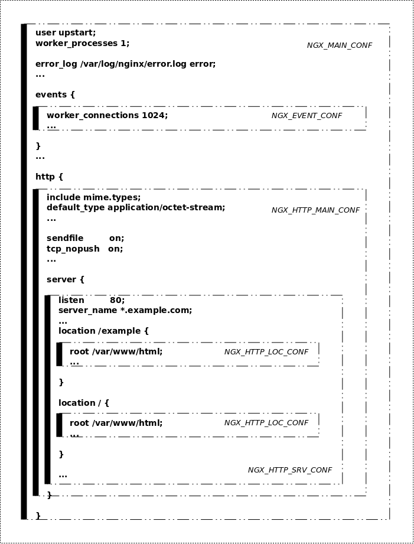
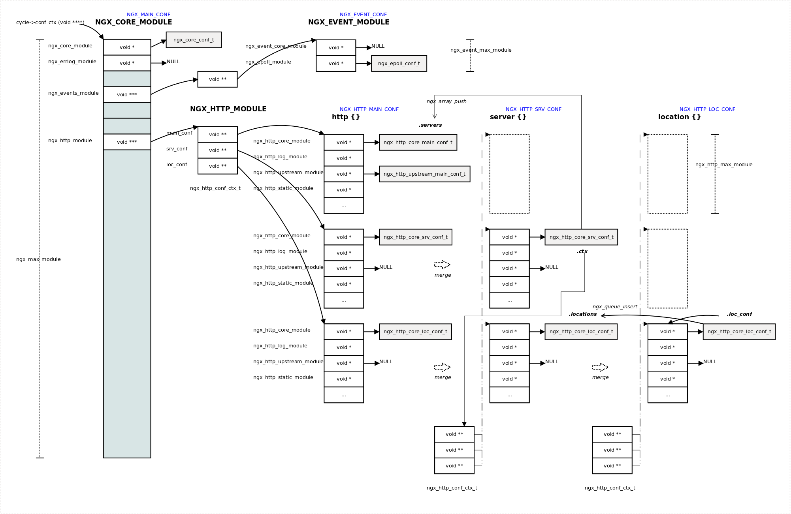

## 2.4 配置文件解析

配置指令具有作用域，分为全局作用域和使用{}创建其它作用域。
每个配置指令都只能在预先定义好的作用域中使用。
Nginx运行时各模块行为都和配置指令密切相关。

配置指令是与模块相关的，本文就以core模块为例说明nginx如何解析配置指令。

### 2.4.1 准备工作

#### 相关数据结构
这里首先回顾一下相关数据结构：
```c
//全局变量cycle
struct ngx_cycle_t {
    void                  ****conf_ctx; //配置文件上下文的数组，每个模块的配置信息
    ngx_pool_t               *pool; //内存池地址
    ...

    ngx_module_t            **modules;  //模块数组
    ngx_uint_t                modules_n;    //模块个数
    ngx_uint_t                modules_used;    /* unsigned  modules_used:1; */
    ...
};
```
这里我们简单看一下conf_ctx和modules成员：
* conf_ctx：配置文件上下文，每个模块的配置文件数据结构的指针地址都会按照模块的index索引放置在cycle->conf_ctx数组中
* modules：模块数组，模块也会按照模块的索引index放在cycle->modules数组上

```c
//模块数据结构
struct ngx_module_t {
    ngx_uint_t            ctx_index;
    ngx_uint_t            index; //模块的唯一标识符号

    char                 *name;  //模块名称
    ...
    void                 *ctx;  //模块上下文
    ngx_command_t        *commands; //模块支持的配置指令
    ngx_uint_t            type; //模块类型
    ...
};
```
这里我们简单看一下ctx和commands成员：
* ctx：模块上下文，其定义了针对模块配置的一系列操作 (申请配置存储、 继承上级模块的配置等等)，不同的操作在配置分析的不同阶段被调用。模块上下文根据模块类型分为ngx_core_module_t、ngx_event_module_t和ngx_http_module_t等等
* commands：模块支持的配置指令，主要用于将配置信息设置到每个模块的配置文件数据结构上（例如核心模块的ngx_core_conf_t）

```c
//模块支持的配置指令
struct ngx_command_t {
    ngx_str_t             name; //指令名称
    ngx_uint_t            type; //指令类别：指明配置指令的作用域等
    char               *(*set)(ngx_conf_t *cf, ngx_command_t *cmd, void *conf); //set回调函数
    ngx_uint_t            conf;
    ngx_uint_t            offset; //偏移量，命令长度
    void                 *post; //支持的回调方法，大多数情况为NULL
};
```
这里我们看一下其中的name、type和set成员：
* name：指令名称，配置文件中对应配置的名字。
* type：指令类别，指明配置指令的作用域等。
* set：配置指令解析函数，Nginx在解析配置过程中，如果遇到了该指令，会调用此回调函数对指令进行进一步的解析。

```c
struct ngx_conf_t {
    char                 *name;     //当前解析到的指令 */
    ngx_array_t          *args;     //当前指令所包含的所有参数 */

    ngx_cycle_t          *cycle;    /* 待解析的全局变量ngx_cycle_t */
    ngx_pool_t           *pool;     /* 内存池 */
    ngx_pool_t           *temp_pool;/* 临时内存池，分配一些临时数组或变量 */
    ngx_conf_file_t      *conf_file;/* 待解析的配置文件 */
    ngx_log_t            *log;      /* 日志信息 */

    void                 *ctx;      /* 描述指令的上下文 */
    ngx_uint_t            module_type;/* 当前解析的指令的模块类型 */
    ngx_uint_t            cmd_type; /* 当前解析的指令的指令类型 */

    ngx_conf_handler_pt   handler;  /* 模块自定义的handler，即指令自定义的处理函数 */
    char                 *handler_conf;/* 自定义处理函数需要的相关配置 */
};
```
该结构体用于Nginx在解析配置文件时描述每个指令的属性。

#### 配置指令作用域
配置指令作用域目前有NGX_MAIN_CONF、NGX_EVENT_CONF、NGX_HTTP_MAIN_CONF、NGX_HTTP_SRV_CONF、NGX_HTTP_LOC_CONF等。一个配置指令可以在多个作用域中定义。在父作用域里定义的指令，会被子作用域继承或者覆盖。

有一些配置指令，比如http, event, server, location等，用来显式的定义作用域，它们被标识为NGX_CONF_BLOCK，表示一个{}块的开始。

下图是一个简单nginx.conf的作用域示意图：



### 2.4.2 core模块定义
我们首先看一下core模块的定义：
```c
//nginx.c
//core模块配置命令集
static ngx_command_t  ngx_core_commands[] = {
    { ngx_string("daemon"), //name
      NGX_MAIN_CONF|NGX_DIRECT_CONF|NGX_CONF_FLAG, //type
      ngx_conf_set_flag_slot, //set回调函数
      0,
      offsetof(ngx_core_conf_t, daemon), //偏移量；使用这个偏移量后，可以参考ngx_core_module_create_conf
      NULL },

    { ngx_string("master_process"),
      NGX_MAIN_CONF|NGX_DIRECT_CONF|NGX_CONF_FLAG,
      ngx_conf_set_flag_slot,
      0,
      offsetof(ngx_core_conf_t, master),
      NULL },

    { ngx_string("timer_resolution"),
      NGX_MAIN_CONF|NGX_DIRECT_CONF|NGX_CONF_TAKE1,
      ngx_conf_set_msec_slot,
      0,
      offsetof(ngx_core_conf_t, timer_resolution),
      NULL },

    { ngx_string("pid"),
      NGX_MAIN_CONF|NGX_DIRECT_CONF|NGX_CONF_TAKE1,
      ngx_conf_set_str_slot,
      0,
      offsetof(ngx_core_conf_t, pid),
      NULL },
    ...
};
//core模块上下文
static ngx_core_module_t  ngx_core_module_ctx = {
    ngx_string("core"),
    ngx_core_module_create_conf,    //create_conf回调函数
    ngx_core_module_init_conf       //init_conf回调函数
};
//core模块
ngx_module_t  ngx_core_module = {
    NGX_MODULE_V1,
    &ngx_core_module_ctx,                  /* module context */
    ngx_core_commands,                     /* module directives */
    NGX_CORE_MODULE,                       /* module type */
    NULL,                                  /* init master */
    NULL,                                  /* init module */
    NULL,                                  /* init process */
    NULL,                                  /* init thread */
    NULL,                                  /* exit thread */
    NULL,                                  /* exit process */
    NULL,                                  /* exit master */
    NGX_MODULE_V1_PADDING
};
```
这里简单说明一下：
1. ngx_core_module主要管理core模块的信息
2. ngx_core_module_ctx核心模块的上下文，core模块的ngx_core_module_ctx主要定义了ngx_core_module_create_conf和ngx_core_module_init_conf回调函数（创建和初始化core模块配置结构ngx_core_conf_t）
3. ngx_core_commands核心模块定义的命令集，之后通过这个命令集，解析nginx.conf文件的配置指令，并赋值到核心模块对应的配置项结构体上（cycle->conf_ctx）。

core模块对应的配置结构ngx_core_conf_t
```c
typedef struct {
    ngx_flag_t                daemon;
    ngx_flag_t                master;

    ngx_msec_t                timer_resolution;

    ngx_int_t                 worker_processes;
    ngx_int_t                 debug_points;

    ngx_int_t                 rlimit_nofile;
    off_t                     rlimit_core;

    int                       priority;

    ngx_uint_t                cpu_affinity_auto;
    ngx_uint_t                cpu_affinity_n;
    ngx_cpuset_t             *cpu_affinity;

    char                     *username;
    ngx_uid_t                 user;
    ngx_gid_t                 group;

    ngx_str_t                 working_directory;
    ngx_str_t                 lock_file;

    ngx_str_t                 pid;
    ngx_str_t                 oldpid;

    ngx_array_t               env;
    char                    **environment;
} ngx_core_conf_t;

//ngx_core_conf_t对应的配置文件（nginx.conf文件）信息：
#user  nobody;
worker_processes  1;

#error_log  logs/error.log;
#error_log  logs/error.log  notice;
#error_log  logs/error.log  info;

#pid        logs/nginx.pid;
```
ngx_core_conf_t是核心模块对应的配置数据结构，其由ngx_core_module_ctx中的create_conf和init_conf回调函数创建和初始化，最终其n指针地址会按照core模块的index，放在cycle->conf_ctx成员中。

### 2.4.3 core模块配置解析
还是从ngx_init_cycle方法开始：
```c
//ngx_cycle.c
ngx_cycle_t * ngx_init_cycle(ngx_cycle_t *old_cycle){
    ...
    //为conf_ctx分配内存
    cycle->conf_ctx = ngx_pcalloc(pool, ngx_max_module * sizeof(void *));
    ...

    for (i = 0; cycle->modules[i]; i++) {
        if (cycle->modules[i]->type != NGX_CORE_MODULE) {
            continue;
        }

        module = cycle->modules[i]->ctx;

        if (module->create_conf) {
            //调用create_conf回调函数创建ngx_core_conf_t
            rv = module->create_conf(cycle);
            ...
            //按照模块对应的index存储到cycle->conf_ctx
            cycle->conf_ctx[cycle->modules[i]->index] = rv;
        }
    }
    ...

    //初始化ngx_conf_t：注意这里并没有设置handler回调函数
    ngx_conf_t           conf;
    ...
    ngx_memzero(&conf, sizeof(ngx_conf_t));
    conf.args = ngx_array_create(pool, 10, sizeof(ngx_str_t));
    conf.temp_pool = ngx_create_pool(NGX_CYCLE_POOL_SIZE, log);
    conf.ctx = cycle->conf_ctx;
    conf.cycle = cycle;
    conf.pool = pool;
    conf.log = log;
    conf.module_type = NGX_CORE_MODULE;
    conf.cmd_type = NGX_MAIN_CONF;

    //读取解析配置命令
    if (ngx_conf_param(&conf) != NGX_CONF_OK) {
        environ = senv;
        ngx_destroy_cycle_pools(&conf);
        return NULL;
    }
    if (ngx_conf_parse(&conf, &cycle->conf_file) != NGX_CONF_OK) {
        environ = senv;
        ngx_destroy_cycle_pools(&conf);
        return NULL;
    }

    //调用init_conf回调函数完成core模块配置的初始化
    for (i = 0; cycle->modules[i]; i++) {
        if (cycle->modules[i]->type != NGX_CORE_MODULE) {
            continue;
        }

        module = cycle->modules[i]->ctx;

        if (module->init_conf) {
            if (module->init_conf(cycle, cycle->conf_ctx[cycle->modules[i]->index]) == NGX_CONF_ERROR) {
                environ = senv;
                ngx_destroy_cycle_pools(&conf);
                return NULL;
            }
        }
    }
    ...
}
```
该方法中与配置解析相关的代码如上所是，其中主要包括以下几个部分：首先需要创建core模块对应的配置数据结构ngx_core_conf_t；然后是解析相关配置指令；最后完成配置指令的初始化。

#### 创建ngx_core_conf_t数据结构
直接看ngx_core_module_create_conf方法：
```c
//创建ngx_core_conf_t配置数据结构，并预初始化：
static void * ngx_core_module_create_conf(ngx_cycle_t *cycle) {
    ngx_core_conf_t  *ccf;

    ccf = ngx_pcalloc(cycle->pool, sizeof(ngx_core_conf_t));
    if (ccf == NULL) {
        return NULL;
    }

    ccf->daemon = NGX_CONF_UNSET;
    ccf->master = NGX_CONF_UNSET;
    ccf->timer_resolution = NGX_CONF_UNSET_MSEC;
    ccf->shutdown_timeout = NGX_CONF_UNSET_MSEC;

    ccf->worker_processes = NGX_CONF_UNSET;
    ccf->debug_points = NGX_CONF_UNSET;

    ccf->rlimit_nofile = NGX_CONF_UNSET;
    ccf->rlimit_core = NGX_CONF_UNSET;

    ccf->user = (ngx_uid_t) NGX_CONF_UNSET_UINT;
    ccf->group = (ngx_gid_t) NGX_CONF_UNSET_UINT;

    if (ngx_array_init(&ccf->env, cycle->pool, 1, sizeof(ngx_str_t)) != NGX_OK) {
        return NULL;
    }

    return ccf;
}
```
该方法比较简单，这里就不再详述。

#### 解析配置命令
直接看ngx_conf_parse函数：
```c
//ngx_conf_file.c
char* ngx_conf_parse(ngx_conf_t *cf, ngx_str_t *filename) {
    char             *rv;
    ngx_fd_t          fd;
    ngx_int_t         rc;
    ngx_buf_t         buf;
    ngx_conf_file_t  *prev, conf_file;
    enum {
        parse_file = 0,
        parse_block,
        parse_param
    } type;

    if (filename) {
        fd = ngx_open_file(filename->data, NGX_FILE_RDONLY, NGX_FILE_OPEN, 0);
        ...

        prev = cf->conf_file;

        cf->conf_file = &conf_file;

        if (ngx_fd_info(fd, &cf->conf_file->file.info) == NGX_FILE_ERROR) {
            ngx_log_error(NGX_LOG_EMERG, cf->log, ngx_errno, ngx_fd_info_n " \"%s\" failed", filename->data);
        }

        cf->conf_file->buffer = &buf;

        buf.start = ngx_alloc(NGX_CONF_BUFFER, cf->log);
        if (buf.start == NULL) {
            goto failed;
        }

        buf.pos = buf.start;
        buf.last = buf.start;
        buf.end = buf.last + NGX_CONF_BUFFER;
        buf.temporary = 1;
        
        //复制文件属性以及文件内容
        cf->conf_file->file.fd = fd;
        cf->conf_file->file.name.len = filename->len;
        cf->conf_file->file.name.data = filename->data;
        cf->conf_file->file.offset = 0;
        cf->conf_file->file.log = cf->log;
        cf->conf_file->line = 1;
        
        //解析的类型是配置文件
        type = parse_file;
        ...
    } else if (cf->conf_file->file.fd != NGX_INVALID_FILE) {
        //解析的类型是block块
        type = parse_block;
    } else {
        //解析的类型是命令行配置
        type = parse_param;
    }

    for ( ;; ) {
        //语法分析
        rc = ngx_conf_read_token(cf);
        
        //判断语法分析的结果是否和type相匹配
        if (rc == NGX_CONF_BLOCK_DONE) {
            if (type != parse_block) {
                goto failed;
            }
            goto done;
        }
        if (rc == NGX_CONF_FILE_DONE) {
            if (type == parse_block) {
                goto failed;
            }
            goto done;
        }
        if (rc == NGX_CONF_BLOCK_START) {
            if (type == parse_param) {
                goto failed;
            }
        }
        
        //自定义配置命令处理函数，前面说过core模块并没有设置cf->handler
        if (cf->handler) {
            //the custom handler, i.e., that is used in the http's "types { ... }" directive
            if (rc == NGX_CONF_BLOCK_START) {
                ngx_conf_log_error(NGX_LOG_EMERG, cf, 0, "unexpected \"{\"");
                goto failed;
            }
            
            //调用配置命令处理函数
            rv = (*cf->handler)(cf, NULL, cf->handler_conf);
            if (rv == NGX_CONF_OK) {
                continue;
            }
            ...
            goto failed;
        }

        //若自定义handler为null，则调用ngx_conf_handler方法解析配置命令
        rc = ngx_conf_handler(cf, rc);
        ...
    }

failed:
    ...

done:
    ...
}
```
该方法支持三种不同的解析类型：配置文件；block块设置和命令行配置。其具体解析过程可以分为两个阶段：语法分析和配置命令解析。

##### 语法分析
其中语法分析由ngx_conf_read_token函数完成，该主要是将配置文件分解成逐个的单词数组，例如配置文件中遇到“空格”则为分隔符，“;”为结束符。每一个数组，就是一条配置命令语句。

这里给定nginx.conf配置文件如下所示：
```
user  nfsnobody nfsnobody;
worker_processes 8;
error_log  /usr/local/nginx-1.4.7/nginx_error.log  crit;
pid        /usr/local/nginx-1.4.7/nginx.pid;

worker_rlimit_nofile 65535;
events {
    use epoll;
    worker_connections 65535;
}
```
解析成下面的格式：
```
#分解成逐个单词数组：
user
nfsnobody
nfsnobody

worker_processes
8

error_log
/usr/local/nginx-1.4.7/nginx_error.log
crit

pid
/usr/local/nginx-1.4.7/nginx.pid

worker_rlimit_nofile
65535

events
```

##### 配置命令解析
而配置命令解析有两种方式：一种是自定义的配置命令解析机制；另一种是调用ngx_conf_handler函数完成解析。前面我们说过解析core模块配置时并没有设置ngx_conf_t中的handler，所以是通过第二种方式完成解析的，我们看一下该方法：
```c
//ngx_conf_file.c
static ngx_int_t ngx_conf_handler(ngx_conf_t *cf, ngx_int_t last) {
    char           *rv;
    void           *conf, **confp;
    ngx_uint_t      i, found;
    ngx_str_t      *name;
    ngx_command_t  *cmd;

    name = cf->args->elts;

    found = 0;

    for (i = 0; cf->cycle->modules[i]; i++) {
        cmd = cf->cycle->modules[i]->commands;
        if (cmd == NULL) {
            continue;
        }

        for ( /* void */ ; cmd->name.len; cmd++) {
            //匹配指令名称
            if (name->len != cmd->name.len) {
                continue;
            }
            if (ngx_strcmp(name->data, cmd->name.data) != 0) {
                continue;
            }
            found = 1;

            //匹配指令类型
            if (cf->cycle->modules[i]->type != NGX_CONF_MODULE && cf->cycle->modules[i]->type != cf->module_type) {
                continue;
            }

            //验证指令可以出现的作用域是否正确
            if (!(cmd->type & cf->cmd_type)) {
                continue;
            }
            if (!(cmd->type & NGX_CONF_BLOCK) && last != NGX_OK) {
                return NGX_ERROR;
            }
            if ((cmd->type & NGX_CONF_BLOCK) && last != NGX_CONF_BLOCK_START) {
                return NGX_ERROR;
            }

            //验证指令的参数个数是否正确
            if (!(cmd->type & NGX_CONF_ANY)) {
                if (cmd->type & NGX_CONF_FLAG) {
                    if (cf->args->nelts != 2) {
                        goto invalid;
                    }
                } else if (cmd->type & NGX_CONF_1MORE) {
                    if (cf->args->nelts < 2) {
                        goto invalid;
                    }
                } else if (cmd->type & NGX_CONF_2MORE) {
                    if (cf->args->nelts < 3) {
                        goto invalid;
                    }
                } else if (cf->args->nelts > NGX_CONF_MAX_ARGS) {
                    goto invalid;
                } else if (!(cmd->type & argument_number[cf->args->nelts - 1])) {
                    goto invalid;
                }
            }

            //set up the directive's configuration context
            conf = NULL;
            if (cmd->type & NGX_DIRECT_CONF) {
                //在core模块中使用
                conf = ((void **) cf->ctx)[cf->cycle->modules[i]->index];
            } else if (cmd->type & NGX_MAIN_CONF) {
                //指令配置项出现在全局配置中，不属于任何{}配置块
                conf = &(((void **) cf->ctx)[cf->cycle->modules[i]->index]);
            } else if (cf->ctx) {
                //除了core模块，其他模块都是用该项
                confp = *(void **) ((char *) cf->ctx + cmd->conf);
                if (confp) {
                    conf = confp[cf->cycle->modules[i]->ctx_index];
                }
            }

            //调用set回调函数，完成配置项初始化
            rv = cmd->set(cf, cmd, conf);
            ...
        }
    }
    ...
}
```
这里我们看一下配置项的具体存储：Nginx根据配置指令的不同类型，配置项的存储位置也不同。
NGX_DIRECT_CONF类型的配置指令，其配置项存储空间是全局作用域对应的存储空间。这个类型的指令主要出现在core模块里。
```c
conf = ((void **) cf->ctx)[ngx_modules[i]->index];
```
NGX_MAIN_CONF表示配置指令的作用域为全局作用域。Nginx中除了core模块的配置指令 (同时标识为NGX_DIRECT_CONF) 位于这个作用域中外，另外几个定义新的子级作用域的指令：events、http、mail等。 非NGX_DIRECT_CONF的NGX_MAIN_CONF指令在全局作用域中并未被分配空间，所以在指令处理函数中分配的空间需要挂接到全局作用域中。
```c
conf = &(((void **) cf->ctx)[ngx_modules[i]->index];
```
其它类型配置指令项的存储位置和指令出现的作用域 (并且非全局作用域) 有关：
```c
confp = *(void **) ((char *) cf->ctx + cmd->conf);
if (confp) {
    conf = confp[cf->cycle->modules[i]->ctx_index];
}
```

#### 完成core模块配置结构的初始化
直接看ngx_core_module_init_conf函数：
```c
//进一步初始化conf
static char * ngx_core_module_init_conf(ngx_cycle_t *cycle, void *conf) {
    ngx_core_conf_t  *ccf = conf;

    ngx_conf_init_value(ccf->daemon, 1);
    ngx_conf_init_value(ccf->master, 1);
    ngx_conf_init_msec_value(ccf->timer_resolution, 0);
    ngx_conf_init_msec_value(ccf->shutdown_timeout, 0);

    ngx_conf_init_value(ccf->worker_processes, 1);
    ngx_conf_init_value(ccf->debug_points, 0);
    ...
}
```
配置文件解析框架大抵如此，最后来看一张配置文件解析后的配置结构图：



最后我们看一下，如何获取对应模块的配置结构，主要通过下面的宏实现：
```c
#define ngx_http_get_module_main_conf(r, module) (r)->main_conf[module.ctx_index]
#define ngx_http_get_module_srv_conf(r, module) (r)->srv_conf[module.ctx_index]
#define ngx_http_get_module_loc_conf(r, module) (r)->loc_conf[module.ctx_index]
#define ngx_http_conf_get_module_main_conf(cf, module) ((ngx_http_conf_ctx_t *) cf->ctx)->main_conf[module.ctx_index]
#define ngx_http_conf_get_module_srv_conf(cf, module) ((ngx_http_conf_ctx_t *) cf->ctx)->srv_conf[module.ctx_index]
#define ngx_http_conf_get_module_loc_conf(cf, module) ((ngx_http_conf_ctx_t *) cf->ctx)->loc_conf[module.ctx_index]
#define ngx_get_conf(conf_ctx, module)  conf_ctx[module.index]
```