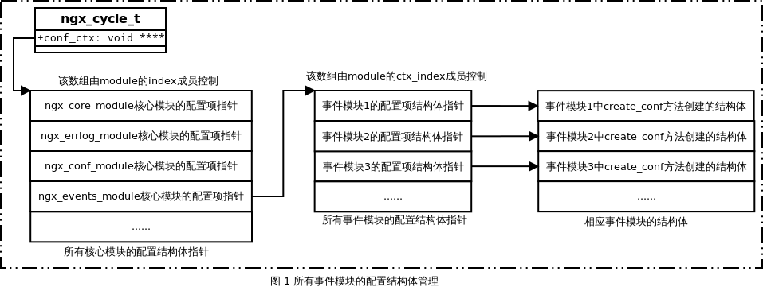

## 2.7 Event模块详解
event事件模块分为两层：core模块ngx_events_module和event模块ngx_event_core_module、ngx_epoll_module等（本文主要分析ngx_event_core_module）。
* ngx_events_module属于NGX_CORE_MODULE，该模块的功能是：定义新的事件类型，并为事件模块定义通用接口ngx_event_module_t结构体，管理事件模块生成的配置项结构体，并负责解析事件类配置项。
* ngx_event_core_module属于NGX_EVENT_MODULE，它在所有event模块中的顺序是第一，是其它event模块的基础。它主要完成以下任务：创建连接池，决定使用哪些事件驱动机制，初始化将要使用的事件模块。

### 2.7.1 Event模块数据结构
在Nginx中，ngx_module_t是模块最基本的接口，对于每一类模块，还有一个具体的数据结构来描述这一类模块的通用接口，该接口由ngx_module_t中的成员ctx管理。而event模块的通用接口是ngx_event_module_t：
```c
//event模块通用接口
typedef struct {
    //事件模块名称
    ngx_str_t              *name;

    void                 *(*create_conf)(ngx_cycle_t *cycle);
    char                 *(*init_conf)(ngx_cycle_t *cycle, void *conf);

    //每个event模块具体实现的方法，即IO多路复用模型的统一接口
    ngx_event_actions_t     actions;
} ngx_event_module_t;
```
在ngx_event_module_t结构体中actions的类型是ngx_event_actions_t结构体，该成员结构实现了事件驱动模块的具体方法：
```c
//IO多路复用模型的统一接口
typedef struct {
    //添加事件，将某个描述符的某个事件添加到事件驱动机制监控描述符集中 
    ngx_int_t  (*add)(ngx_event_t *ev, ngx_int_t event, ngx_uint_t flags);
    //删除事件，将某个描述符的某个事件从事件驱动机制监控描述符集中删除 
    ngx_int_t  (*del)(ngx_event_t *ev, ngx_int_t event, ngx_uint_t flags);

    //启动对某个指定事件的监控 
    ngx_int_t  (*enable)(ngx_event_t *ev, ngx_int_t event, ngx_uint_t flags);
    //禁用对某个指定事件的监控 
    ngx_int_t  (*disable)(ngx_event_t *ev, ngx_int_t event, ngx_uint_t flags);

    //将指定连接所关联的描述符添加到事件驱动机制监控中 
    ngx_int_t  (*add_conn)(ngx_connection_t *c);
    //将指定连接所关联的描述符从事件驱动机制监控中删除 
    ngx_int_t  (*del_conn)(ngx_connection_t *c, ngx_uint_t flags);

    //监控事件是否发生变化，仅用在多线程环境中 
    ngx_int_t  (*process_changes)(ngx_cycle_t *cycle, ngx_uint_t nowait);
    //等待事件的发生，并对事件进行处理 
    ngx_int_t  (*process_events)(ngx_cycle_t *cycle, ngx_msec_t timer, ngx_uint_t flags);

    //初始化事件驱动模块 
    ngx_int_t  (*init)(ngx_cycle_t *cycle, ngx_msec_t timer);
    //在退出事件驱动模块前调用该函数回收资源 
    void       (*done)(ngx_cycle_t *cycle);
} ngx_event_actions_t;
```
在Nginx中，每一个具体事件的定义由ngx_event_t来表示：
```c
struct ngx_event_s {
    //事件相关对象的数据，通常指向ngx_connect_t连接对象 
    void            *data;

    //标志位，为1表示事件可写，即当前对应的TCP连接状态可写 
    unsigned         write:1;

    //标志位，为1表示事件可以建立新连接 
    unsigned         accept:1;

    //used to detect the stale events in kqueue, rtsig, and epoll 
    unsigned         instance:1;

    //标志位，为1表示事件处于活跃状态 
    unsigned         active:1;

    //标志位，为1表示禁用事件 
    unsigned         disabled:1;

    //标志位，为1表示当前事件已经准备就绪 
    unsigned         ready:1;

    //该标志位用于异步AIO事件处理 
    unsigned         complete:1;

    //标志位，为1表示当前处理的字符流已经结束 
    unsigned         eof:1;
    //标志位，为1表示当前事件处理过程中出错 
    unsigned         error:1;

    //标志位，为1表示当前事件已超时 
    unsigned         timedout:1;
    //标志位，为1表示当前事件存在于定时器中 
    unsigned         timer_set:1;

    //标志位，为1表示当前事件需要延迟处理 
    unsigned         delayed:1;

    //标志位，为1表示TCP建立需要延迟，即完成建立TCP连接的三次握手后，不会立即建立TCP连接，直到接收到数据包才建立TCP连接
    unsigned         deferred_accept:1;

    //the pending eof reported by kqueue, epoll or in aio chain operation 
    //标志位，为1表示等待字符流结束 
    unsigned         pending_eof:1;

    //标志位，为1表示处理post事件 
    unsigned         posted:1;
    ...

    //当前事件发生时的处理方法
    ngx_event_handler_pt  handler;

    //epoll机制不使用该变量 
    ngx_uint_t       index;

    //日志记录 
    ngx_log_t       *log;

    //定时器 
    ngx_rbtree_node_t   timer;

    //the posted queue 
    ngx_queue_t      queue;

    //标志位，为1表示当前事件已经关闭 
    unsigned         closed:1;

    //to test on worker exit 
    unsigned         channel:1;
    unsigned         resolver:1;

    unsigned         cancelable:1;
    ...
};
```
其中最重要的一个成员是handler回调函数，该回调函数定义了当事件发生时的处理方法。该回调方法原型如下所是：
```c
typedef void (*ngx_event_handler_pt)(ngx_event_t *ev);
```

当客户端向Nginx服务器发起连接请求时，此时若Nginx服务器被动接收该连接，则相对Nginx服务器来说称为被动连接，被动连接由ngx_connection_t完成：
```c
//当Nginx服务器产生新的socket时，都会创建一个ngx_connection_s结构体，该结构体用于保存socket的属性和数据；
struct ngx_connection_s {
    //当连接未被使用时，data充当连接池中空闲连接表中的next指针。当连接被使用时，data的意义由具体Nginx模块决定
    void               *data;
    //设置该链接的读事件 
    ngx_event_t        *read;
    //设置该连接的写事件 
    ngx_event_t        *write;

    //用于设置socket的套接字描述符 
    ngx_socket_t        fd;

    //接收网络字符流的方法，是一个函数指针，指向接收函数 
    ngx_recv_pt         recv;
    //发送网络字符流的方法，是一个函数指针，指向发送函数 
    ngx_send_pt         send;
    //以ngx_chain_t链表方式接收网络字符流的方法 
    ngx_recv_chain_pt   recv_chain;
    //以ngx_chain_t链表方式发送网络字符流的方法 
    ngx_send_chain_pt   send_chain;

    //当前连接对应的ngx_listening_t监听对象
    ngx_listening_t    *listening;

    //当前连接已发生的字节数 
    off_t               sent;

    //记录日志 
    ngx_log_t          *log;

    //内存池 
    ngx_pool_t         *pool;

    //对端的socket地址sockaddr属性
    struct sockaddr    *sockaddr;
    socklen_t           socklen;
    //字符串形式的IP地址 
    ngx_str_t           addr_text;

    ngx_str_t           proxy_protocol_addr;

#if (NGX_SSL)
    ngx_ssl_connection_t  *ssl;
#endif

    //本端的监听端口对应的socket的地址sockaddr属性 
    struct sockaddr    *local_sockaddr;
    socklen_t           local_socklen;

    //用于接收、缓存对端发来的字符流 
    ngx_buf_t          *buffer;

    //表示将当前连接作为双向连接中节点元素，添加到ngx_cycle_t结构体的成员reuseable_connections_queue的双向链表中
    ngx_queue_t         queue;

    //连接使用次数 
    ngx_atomic_uint_t   number;

    //处理请求的次数 
    ngx_uint_t          requests;

    unsigned            buffered:8;

    unsigned            log_error:3;     //ngx_connection_log_error_e 

    //标志位，为1表示不期待字符流结束 
    unsigned            unexpected_eof:1;
    //标志位，为1表示当前连接已经超时 
    unsigned            timedout:1;
    //标志位，为1表示处理连接过程出错 
    unsigned            error:1;
    //标志位，为1表示当前TCP连接已经销毁 
    unsigned            destroyed:1;

    //标志位，为1表示当前连接处于空闲状态 
    unsigned            idle:1;
    //标志位，为1表示当前连接可重用 
    unsigned            reusable:1;
    //标志为，为1表示当前连接已经关闭 
    unsigned            close:1;

    //标志位，为1表示正在将文件的数据发往对端 
    unsigned            sendfile:1;

    //标志位，若为1，则表示只有连接对应的发送缓冲区满足最低设置的阈值时，事件驱动模块才会分发事件
    unsigned            sndlowat:1;
    unsigned            tcp_nodelay:2;   //ngx_connection_tcp_nodelay_e 
    unsigned            tcp_nopush:2;    //ngx_connection_tcp_nopush_e 

    unsigned            need_last_buf:1;
    ...
};
```
在处理请求的过程中，若Nginx服务器主动向上游服务器建立连接，完成连接建立并与之进行通信，这种相对Nginx服务器来说是一种主动连接，主动连接由ngx_peer_connection_t 表示。需要注意的是ngx_peer_connection_t中封装了一个ngx_connection_t。
```c
//主动连接的结构体
struct ngx_peer_connection_s {
    //这里是对ngx_connection_t连接结构体的引用
    ngx_connection_t                *connection;

    //远端服务器的socket的地址sockaddr信息 
    struct sockaddr                 *sockaddr;
    socklen_t                        socklen;
    //远端服务器的名称 
    ngx_str_t                       *name;

    //连接重试的次数 
    ngx_uint_t                       tries;

    //获取连接的方法 
    ngx_event_get_peer_pt            get;
    //释放连接的方法 
    ngx_event_free_peer_pt           free;
    //配合get、free使用 
    void                            *data;

#if (NGX_SSL)
    ngx_event_set_peer_session_pt    set_session;
    ngx_event_save_peer_session_pt   save_session;
#endif

    //本地地址信息 
    ngx_addr_t                      *local;

    //接收缓冲区 
    int                              rcvbuf;

    //记录日志 
    ngx_log_t                       *log;

    //标志位，为1表示connection连接已经缓存 
    unsigned                         cached:1;

    //ngx_connection_log_error_e
    unsigned                         log_error:2;
};
```

### 2.7.2 Event模块定义

#### ngx_events_module
我们先看一下ngx_events_module定义：
```c
//events模块命令集
static ngx_command_t  ngx_events_commands[] = {
    { ngx_string("events"),                         //负责处理events{}配置块
      NGX_MAIN_CONF|NGX_CONF_BLOCK|NGX_CONF_NOARGS,
      ngx_events_block,                            //set回调函数，用于解析events{}块中的配置命令
      0,
      0,
      NULL },
      
      ngx_null_command
};

//events模块上下文
static ngx_core_module_t  ngx_events_module_ctx = {
    ngx_string("events"),
    NULL,                  //create_conf回调函数
    ngx_event_init_conf    //init_conf回调函数
};

//events模块，其模块类型是NGX_CORE_MODULE
ngx_module_t  ngx_events_module = {
    NGX_MODULE_V1,
    &ngx_events_module_ctx,                //module context 
    ngx_events_commands,                   //module directives 
    NGX_CORE_MODULE,                       //module type 
    NULL,                                  //init master 
    NULL,                                  //init module 
    NULL,                                  //init process 
    NULL,                                  //init thread 
    NULL,                                  //exit thread 
    NULL,                                  //exit process 
    NULL,                                  //exit master 
    NGX_MODULE_V1_PADDING
};
```

#### ngx_event_core_module
继续看一下ngx_event_core_module定义：
```c
static ngx_str_t  event_core_name = ngx_string("event_core");
//ngx_event_core_module命令集
static ngx_command_t  ngx_event_core_commands[] = {
    { ngx_string("worker_connections"),
      NGX_EVENT_CONF|NGX_CONF_TAKE1,
      ngx_event_connections,
      0,
      0,
      NULL },

    { ngx_string("use"),
      NGX_EVENT_CONF|NGX_CONF_TAKE1,
      ngx_event_use,
      0,
      0,
      NULL },

    { ngx_string("multi_accept"),
      NGX_EVENT_CONF|NGX_CONF_FLAG,
      ngx_conf_set_flag_slot,
      0,
      offsetof(ngx_event_conf_t, multi_accept),
      NULL },

    { ngx_string("accept_mutex"),
      NGX_EVENT_CONF|NGX_CONF_FLAG,
      ngx_conf_set_flag_slot,
      0,
      offsetof(ngx_event_conf_t, accept_mutex),
      NULL },

    { ngx_string("accept_mutex_delay"),
      NGX_EVENT_CONF|NGX_CONF_TAKE1,
      ngx_conf_set_msec_slot,
      0,
      offsetof(ngx_event_conf_t, accept_mutex_delay),
      NULL },
    ...
};

//ngx_event_core_module上下文
static ngx_event_module_t  ngx_event_core_module_ctx = {
    &event_core_name,
    ngx_event_core_create_conf,    //create_conf回调函数
    ngx_event_core_init_conf,     //init_conf回调函数

    { NULL, NULL, NULL, NULL, NULL, NULL, NULL, NULL, NULL, NULL }
};

//ngx_event_core_module模块，注意其模块类型是NGX_EVENT_MODULE
ngx_module_t  ngx_event_core_module = {
    NGX_MODULE_V1,
    &ngx_event_core_module_ctx,            //module context 
    ngx_event_core_commands,               //module directives 
    NGX_EVENT_MODULE,                      //module type 
    NULL,                                  //init master 
    ngx_event_module_init,                 //init module 
    ngx_event_process_init,                //init process 
    NULL,                                  //init thread 
    NULL,                                  //exit thread 
    NULL,                                  //exit process 
    NULL,                                  //exit master 
    NGX_MODULE_V1_PADDING
};
```

### 2.7.3 Event模块初始化
关于模块的初始化流程，我们在2.3节已经看过了，这里我们主要看一下ngx_event_core_module中的init_module和init_process回调函数。其中init_module函数主要是初始化一些变量，这里就不再详述。接下来我们看一下init_module函数：
```c
static ngx_int_t ngx_event_process_init(ngx_cycle_t *cycle) {
    ngx_uint_t           m, i;
    ngx_event_t         *rev, *wev;
    ngx_listening_t     *ls;
    ngx_connection_t    *c, *next, *old;
    ngx_core_conf_t     *ccf;
    ngx_event_conf_t    *ecf;
    ngx_event_module_t  *module;
    
    //获取ngx_core_module的配置结构
    ccf = (ngx_core_conf_t *) ngx_get_conf(cycle->conf_ctx, ngx_core_module);
    ecf = ngx_event_get_conf(cycle->conf_ctx, ngx_event_core_module);
    
    //是否启用负载均衡锁
    if (ccf->master && ccf->worker_processes > 1 && ecf->accept_mutex) {
        ngx_use_accept_mutex = 1;
        ngx_accept_mutex_held = 0;
        ngx_accept_mutex_delay = ecf->accept_mutex_delay;
    } else {
        ngx_use_accept_mutex = 0;
    }

    ngx_queue_init(&ngx_posted_accept_events);
    ngx_queue_init(&ngx_posted_events);
    
    //初始化定时器
    if (ngx_event_timer_init(cycle->log) == NGX_ERROR) {
        return NGX_ERROR;
    }
    
    //根据use配置项所指定的事件模块，调用ngx_actions_t中init回调函数初始化该事件模块
    for (m = 0; cycle->modules[m]; m++) {
        if (cycle->modules[m]->type != NGX_EVENT_MODULE) {
            continue;
        }

        if (cycle->modules[m]->ctx_index != ecf->use) {
            continue;
        }

        module = cycle->modules[m]->ctx;

        if (module->actions.init(cycle, ngx_timer_resolution) != NGX_OK) {
            exit(2);
        }

        break;
    }

#if !(NGX_WIN32)
    //是否设置了timer_resolution配置项
    if (ngx_timer_resolution && !(ngx_event_flags & NGX_USE_TIMER_EVENT)) {
        struct sigaction  sa;
        struct itimerval  itv;

        ngx_memzero(&sa, sizeof(struct sigaction));
        sa.sa_handler = ngx_timer_signal_handler;
        sigemptyset(&sa.sa_mask);

        if (sigaction(SIGALRM, &sa, NULL) == -1) {
            return NGX_ERROR;
        }

        itv.it_interval.tv_sec = ngx_timer_resolution / 1000;
        itv.it_interval.tv_usec = (ngx_timer_resolution % 1000) * 1000;
        itv.it_value.tv_sec = ngx_timer_resolution / 1000;
        itv.it_value.tv_usec = (ngx_timer_resolution % 1000 ) * 1000;

        if (setitimer(ITIMER_REAL, &itv, NULL) == -1) {
            ngx_log_error(NGX_LOG_ALERT, cycle->log, ngx_errno, "setitimer() failed");
        }
    }

    if (ngx_event_flags & NGX_USE_FD_EVENT) {
        struct rlimit  rlmt;

        if (getrlimit(RLIMIT_NOFILE, &rlmt) == -1) {
            return NGX_ERROR;
        }

        cycle->files_n = (ngx_uint_t) rlmt.rlim_cur;

        cycle->files = ngx_calloc(sizeof(ngx_connection_t *) * cycle->files_n, cycle->log);
        if (cycle->files == NULL) {
            return NGX_ERROR;
        }
    }

#else

    if (ngx_timer_resolution && !(ngx_event_flags & NGX_USE_TIMER_EVENT)) {
        ngx_timer_resolution = 0;
    }

#endif
    
    //预分配连接池
    cycle->connections = ngx_alloc(sizeof(ngx_connection_t) * cycle->connection_n, cycle->log);
    if (cycle->connections == NULL) {
        return NGX_ERROR;
    }
    c = cycle->connections;
    
    //预分配读事件结构
    cycle->read_events = ngx_alloc(sizeof(ngx_event_t) * cycle->connection_n, cycle->log);
    if (cycle->read_events == NULL) {
        return NGX_ERROR;
    }
    rev = cycle->read_events;
    for (i = 0; i < cycle->connection_n; i++) {
        rev[i].closed = 1;
        rev[i].instance = 1;
    }
    
    //预分配写事件结构
    cycle->write_events = ngx_alloc(sizeof(ngx_event_t) * cycle->connection_n, cycle->log);
    if (cycle->write_events == NULL) {
        return NGX_ERROR;
    }
    wev = cycle->write_events;
    for (i = 0; i < cycle->connection_n; i++) {
        wev[i].closed = 1;
    }
    
    //按照序号，将读、写事件和连接对象对应，即设置到每个ngx_connection_t对象中
    i = cycle->connection_n;
    next = NULL;
    do {
        i--;

        c[i].data = next;
        c[i].read = &cycle->read_events[i];
        c[i].write = &cycle->write_events[i];
        c[i].fd = (ngx_socket_t) -1;

        next = &c[i];
    } while (i);
    
    //设置空闲连接指针
    cycle->free_connections = next;
    cycle->free_connection_n = cycle->connection_n;

    //为所有ngx_listening_t监听对象中的connections成员分配连接，并设置读事件的处理方法
    ls = cycle->listening.elts;
    for (i = 0; i < cycle->listening.nelts; i++) {

#if (NGX_HAVE_REUSEPORT)
        if (ls[i].reuseport && ls[i].worker != ngx_worker) {
            continue;
        }
#endif

        c = ngx_get_connection(ls[i].fd, cycle->log);

        if (c == NULL) {
            return NGX_ERROR;
        }

        c->type = ls[i].type;
        c->log = &ls[i].log;

        c->listening = &ls[i];
        ls[i].connection = c;

        rev = c->read;

        rev->log = c->log;
        rev->accept = 1;

#if (NGX_HAVE_DEFERRED_ACCEPT)
        rev->deferred_accept = ls[i].deferred_accept;
#endif

        if (!(ngx_event_flags & NGX_USE_IOCP_EVENT)) {
            if (ls[i].previous) {
                old = ls[i].previous->connection;

                if (ngx_del_event(old->read, NGX_READ_EVENT, NGX_CLOSE_EVENT) == NGX_ERROR) {
                    return NGX_ERROR;
                }

                old->fd = (ngx_socket_t) -1;
            }
        }
        
        //为监听端口的读事件设置处理方法ngx_event_accept
        rev->handler = (c->type == SOCK_STREAM) ? ngx_event_accept : ngx_event_recvmsg;

#if (NGX_HAVE_REUSEPORT)

        if (ls[i].reuseport) {
            if (ngx_add_event(rev, NGX_READ_EVENT, 0) == NGX_ERROR) {
                return NGX_ERROR;
            }

            continue;
        }

#endif

        if (ngx_use_accept_mutex) {
            continue;
        }

        //将监听对象连接的读事件添加到事件驱动模块中
#if (NGX_HAVE_EPOLLEXCLUSIVE)
                
        if ((ngx_event_flags & NGX_USE_EPOLL_EVENT) && ccf->worker_processes > 1) {
            if (ngx_add_event(rev, NGX_READ_EVENT, NGX_EXCLUSIVE_EVENT) == NGX_ERROR) {
                return NGX_ERROR;
            }
            continue;
        }

#endif

        if (ngx_add_event(rev, NGX_READ_EVENT, 0) == NGX_ERROR) {
            return NGX_ERROR;
        }
    }

    return NGX_OK;
}
```
简单看一下该函数的流程：
* 是否打开accept_mutex负载均衡锁
* 初始化定时器
* 根据use配置项，初始化所使用的事件模块
* 根据timer_resolution配置项，是否需要控制时间精度
* 预分配ngx_connection_t数组作为连接池，ngx_event_t数组作为读写事件池
* 按照序号，将上述3个数组对应的读/写事件设置到每一个ngx_connection_t连接对象中，同时将这些连接串联成链表结构（使用data成员作为next指针）
* 将ngx_cycle_t结构体中的空闲连接指针free_connections指向connections数组的最后一个元素
* 然后在刚刚建立好的连接池中，为所有ngx_listening_t监听对象中的connection分配连接，同时将监听端口的读事件设置处理ngx_event_accept函数，即当有新连接事件时将调用ngx_event_accept函数建立新连接。

### 2.7.4 Event模块配置文件解析
首先我们看一下event模块对应的配置：
```
events {
        use epoll;
        worker_connections  1024;
}
```
接下来我们看一下其对应的配置结构ngx_event_conf_t：
```c
typedef struct {
    //连接池中最大连接数
    ngx_uint_t    connections;
    //使用的事件模块在cycle->modules中索引
    ngx_uint_t    use;

    //标志位，为1表示可批量建立连接
    ngx_flag_t    multi_accept;
    //标志位，为1表示打开负载均衡
    ngx_flag_t    accept_mutex;
    //延迟建立连接
    ngx_msec_t    accept_mutex_delay;

    //使用的事件模块名称
    u_char       *name;
} ngx_event_conf_t;
```

#### event模块配置信息解析
ngx_events_module的模块类型为NGX_CORE_MODULE，2.4节中我们分析过core模块的配置解析，这里我们看一下其对应的ngx_command_t命令集中的set回调函数ngx_events_block。该函数主要是完成event模块配置信息的解析。具体如下所示：
```c
static char* ngx_events_block(ngx_conf_t *cf, ngx_command_t *cmd, void *conf) {
    char *rv;
    void ***ctx;
    ngx_uint_t i;
    ngx_conf_t pcf;
    ngx_event_module_t *m;

    if (*(void **) conf) {
        return "is duplicate";
    }

    //统计event模块数量
    ngx_event_max_module = ngx_count_modules(cf->cycle, NGX_EVENT_MODULE);

    ctx = ngx_pcalloc(cf->pool, sizeof(void *));
    //分配指针数组，用于存储event模块对应的配置项结构体指针
    *ctx = ngx_pcalloc(cf->pool, ngx_event_max_module * sizeof(void *));

    *(void **) conf = ctx;

    //创建event模块配置信息，调用其create_conf回调函数
    for (i = 0; cf->cycle->modules[i]; i++) {
        if (cf->cycle->modules[i]->type != NGX_EVENT_MODULE) {
            continue;
        }

        m = cf->cycle->modules[i]->ctx;

        if (m->create_conf) {
            (*ctx)[cf->cycle->modules[i]->ctx_index] = m->create_conf(cf->cycle);
            if ((*ctx)[cf->cycle->modules[i]->ctx_index] == NULL) {
                return NGX_CONF_ERROR ;
            }
        }
    }

    pcf = *cf;
    cf->ctx = ctx;
    cf->module_type = NGX_EVENT_MODULE;
    cf->cmd_type = NGX_EVENT_CONF;

    //解析events{}块中的配置命令
    rv = ngx_conf_parse(cf, NULL);

    *cf = pcf;

    if (rv != NGX_CONF_OK) {
        return rv;
    }

    //初始化event模块的配置信息，调用event模块的init_conf回调函数
    for (i = 0; cf->cycle->modules[i]; i++) {
        if (cf->cycle->modules[i]->type != NGX_EVENT_MODULE) {
            continue;
        }

        m = cf->cycle->modules[i]->ctx;

        if (m->init_conf) {
            rv = m->init_conf(cf->cycle, (*ctx)[cf->cycle->modules[i]->ctx_index]);
            if (rv != NGX_CONF_OK) {
                return rv;
            }
        }
    }

    return NGX_CONF_OK;
}
```
该方法中首先调用event模块定义的create_conf回调函数创建event模块对应的配置结构ngx_event_conf_t，然后调用ngx_conf_parse函数解析配置文件中events{}块中的配置命令，最后调用event模块定义的init_conf回调函数完成配置命令的初始化。前面我们分析过ngx_conf_parse，这里我们只看一下create_conf函数和init_conf函数。
```c
//创建event模块的配置结构
static void* ngx_event_core_create_conf(ngx_cycle_t *cycle) {
    ngx_event_conf_t *ecf;

    //预初始化ngx_event_conf_t
    ecf = ngx_palloc(cycle->pool, sizeof(ngx_event_conf_t));
    ecf->connections = NGX_CONF_UNSET_UINT;
    ecf->use = NGX_CONF_UNSET_UINT;
    ecf->multi_accept = NGX_CONF_UNSET;
    ecf->accept_mutex = NGX_CONF_UNSET;
    ecf->accept_mutex_delay = NGX_CONF_UNSET_MSEC;
    ecf->name = (void *) NGX_CONF_UNSET;

    return ecf;
}

//初始化event模块的配置结构
static char* ngx_event_core_init_conf(ngx_cycle_t *cycle, void *conf) {
    ngx_event_conf_t *ecf = conf;

#if (NGX_HAVE_EPOLL) && !(NGX_TEST_BUILD_EPOLL)
    int fd;
#endif
    ngx_int_t i;
    ngx_module_t *module;
    ngx_event_module_t *event_module;

    module = NULL;

#if (NGX_HAVE_EPOLL) && !(NGX_TEST_BUILD_EPOLL)

    fd = epoll_create(100);

    if (fd != -1) {
        (void) close(fd);
        module = &ngx_epoll_module;
    } else if (ngx_errno != NGX_ENOSYS) {
        module = &ngx_epoll_module;
    }

#endif

#if (NGX_HAVE_DEVPOLL) && !(NGX_TEST_BUILD_DEVPOLL)

    module = &ngx_devpoll_module;

#endif
    ...

    if (module == NULL) {
        for (i = 0; cycle->modules[i]; i++) {
            if (cycle->modules[i]->type != NGX_EVENT_MODULE) {
                continue;
            }

            event_module = cycle->modules[i]->ctx;

            if (ngx_strcmp(event_module->name->data, event_core_name.data) == 0) {
                continue;
            }

            module = cycle->modules[i];
            break;
        }
    }

    if (module == NULL) {
        return NGX_CONF_ERROR ;
    }

    ngx_conf_init_uint_value(ecf->connections, DEFAULT_CONNECTIONS);
    cycle->connection_n = ecf->connections;

    //存储使用的事件模块索引
    ngx_conf_init_uint_value(ecf->use, module->ctx_index);

    event_module = module->ctx;

    ngx_conf_init_ptr_value(ecf->name, event_module->name->data);

    ngx_conf_init_value(ecf->multi_accept, 0);
    ngx_conf_init_value(ecf->accept_mutex, 1);
    ngx_conf_init_msec_value(ecf->accept_mutex_delay, 500);

    return NGX_CONF_OK;
}
```

然后我们看一下如何获取event模块配置，先获取ngx_events_module配置，然后再到ngx_events_module模块上找到ngx_event_core_module模块的配置。
```c
#define ngx_event_get_conf(conf_ctx, module) (*(ngx_get_conf(conf_ctx, ngx_events_module))) [module.ctx_index];
```

最后我们看一下event模块配置结构图：



