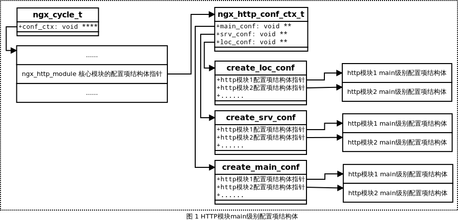
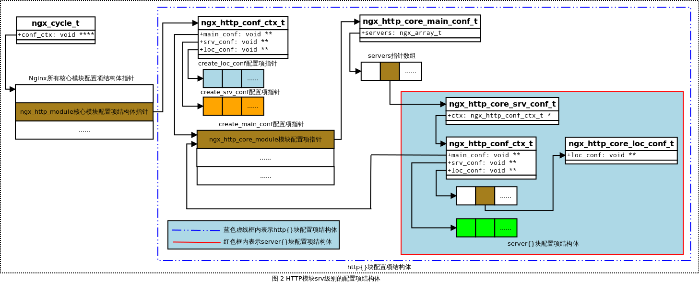
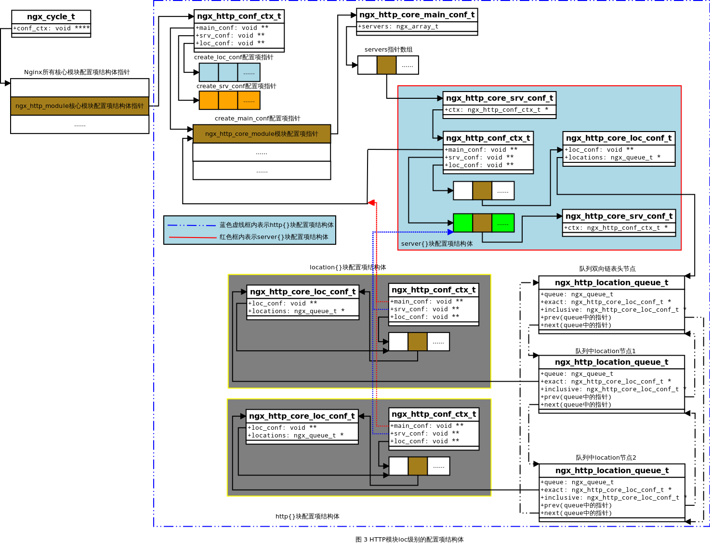
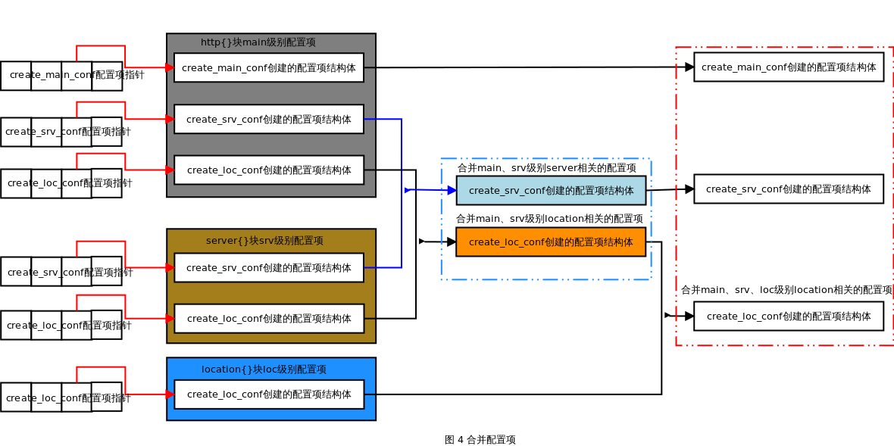

## 2.9 Http模块详解
同event事件模块一样，Http模块也分为两层：core模块ngx_http_module和http模块ngx_http_core_module等。
* ngx_http_module属于NGX_CORE_MODULE，该模块的功能是：定义新的HTTP模块类型，并为每个HTTP模块定义通用接口ngx_http_module_t结构体，管理HTTP模块生成的配置项结构体，并解析HTTP类配置项。
* ngx_http_core_module属于NGX_HTTP_MODULE，它在所有http模块中的顺序是第一，是其它http类模块的基础。

关于核心模块初始化和配置文件解析，我们前面已经分析过了，本文主要分析后者的初始化过程和配置解析。

### 2.9.1 Http模块数据结构

在Nginx中，ngx_module_t是模块最基本的接口，对于每一类模块，还有一个具体的数据结构来描述这一类模块的通用接口，该接口由ngx_module_t中的成员ctx管理，而Http模块的通用接口是ngx_http_module_t。
```c
typedef struct {
    //在解析http{}块内的配置项前回调
    ngx_int_t   (*preconfiguration)(ngx_conf_t *cf);
    //在解析http{}块内的配置项后回调
    ngx_int_t   (*postconfiguration)(ngx_conf_t *cf);

    //创建和初始化Http模块配置项结构体，该结构体中的成员将保存直属于http{}块的配置项参数
    void       *(*create_main_conf)(ngx_conf_t *cf);
    char       *(*init_main_conf)(ngx_conf_t *cf, void *conf);

    //创建用于存储可同时出现在main、srv级别配置项结构体，该结构体中的成员与server配置是相关联的
    void       *(*create_srv_conf)(ngx_conf_t *cf);
    //将出现在main级别中的配置项值合并到srv级别的配置项中
    char       *(*merge_srv_conf)(ngx_conf_t *cf, void *prev, void *conf);

    //创建用于存储同时出现在main、srv、loc级别配置项的结构体，该结构体成员与location配置相关联
    void       *(*create_loc_conf)(ngx_conf_t *cf);
    //将出现在main、srv级别的配置项值合并到loc级别的配置项中；
    char       *(*merge_loc_conf)(ngx_conf_t *cf, void *prev, void *conf);
} ngx_http_module_t;
```
这里我们把直属于http{}、server{}和location{}块的配置项分别称为main、srv和loc级别配置项。

接下来我们看一下HTTP模块配置项上下文ngx_http_conf_ctx_t：
```c
typedef struct {
    /*
     * 指向一个指针数组；
     * 数组中的每个成员都是由所有HTTP模块create_main_conf方法创建的存放全局配置项的结构体，
     * 它们存放着解析直属于http{}块内main级别的配置项参数；
    */
    void        **main_conf;
    
    /*
     * 指向一个指针数组；
     * 数组中的每个成员都是由所有HTTP模块create_srv_conf方法创建的与server相关的配置项结构体，
     * 它们存放着main级别，或srv级别的配置项参数；
     * 这与当前的ngx_http_conf_ctx_t是在解析http{}或server{}块时创建有关；
    */
    
    void        **srv_conf;
    /*
     * 指向一个指针数组；
     * 数组中的每个成员都是由所有HTTP模块create_loc_conf方法创建的与location有关的配置项结构体，
     * 它们存放着main级别、srv级别、loc级别的配置项参数；
     * 这与当前ngx_http_conf_ctx_t是在解析http{}、server{}或location{}块时创建有关；
    */
    void        **loc_conf;
} ngx_http_conf_ctx_t;
```
该结构有三个成员，分别指向三个指针数组，指针数组是由相应地HTTP模块create_main_conf、create_srv_conf和create_loc_conf函数创建的结构体指针组成的数组。

### 2.9.2 Http模块定义
前面我们已经说了event模块分为两层：ngx_events_module和ngx_event_core_module，前者属于NGX_CORE_MODULE，而后者属于NGX_EVENT_MODULE。

### ngx_http_module
首先我们看一下Http模块定义：
```c
//http模块命令集
static ngx_command_t  ngx_http_commands[] = {
    { ngx_string("http"),                           //负责处理http{}配置块
      NGX_MAIN_CONF|NGX_CONF_BLOCK|NGX_CONF_NOARGS,
      ngx_http_block,                               //set回调函数，用于解析http{}块中的配置命令
      0,
      0,
      NULL },

      ngx_null_command
};

//http模块上下文
static ngx_core_module_t  ngx_http_module_ctx = {
    ngx_string("http"),
    NULL,                       //create_conf回调函数
    NULL                        //init_conf回调函数
};

//定义http核心模块，其模块类型是NGX_CORE_MODULE
ngx_module_t  ngx_http_module = {
    NGX_MODULE_V1,
    &ngx_http_module_ctx,                  //module context
    ngx_http_commands,                     //module directives
    NGX_CORE_MODULE,                       //module type
    NULL,                                  //init master
    NULL,                                  //init module
    NULL,                                  //init process
    NULL,                                  //init thread
    NULL,                                  //exit thread
    NULL,                                  //exit process
    NULL,                                  //exit master
    NGX_MODULE_V1_PADDING
};
```
从http模块的定义中可以知道，该模块只有一个初始化处理函数ngx_http_block，用于http模块配置文件解析。

#### ngx_http_core_module
继续看一下ngx_http_core_module定义：
```c
//ngx_http_core_module命令集
static ngx_command_t  ngx_http_core_commands[] = {
    ...
    { ngx_string("server"),
      NGX_HTTP_MAIN_CONF|NGX_CONF_BLOCK|NGX_CONF_NOARGS,
      ngx_http_core_server,
      0,
      0,
      NULL },
    ...

    { ngx_string("location"),
      NGX_HTTP_SRV_CONF|NGX_HTTP_LOC_CONF|NGX_CONF_BLOCK|NGX_CONF_TAKE12,
      ngx_http_core_location,
      NGX_HTTP_SRV_CONF_OFFSET,
      0,
      NULL },
      ...
      ngx_null_command
};

//ngx_http_core_module上下文
static ngx_http_module_t  ngx_http_core_module_ctx = {
    ngx_http_core_preconfiguration,        //preconfiguration
    ngx_http_core_postconfiguration,       //postconfiguration

    ngx_http_core_create_main_conf,        //create main configuration
    ngx_http_core_init_main_conf,          //init main configuration

    ngx_http_core_create_srv_conf,         //create server configuration
    ngx_http_core_merge_srv_conf,          //merge server configuration

    ngx_http_core_create_loc_conf,         //create location configuration
    ngx_http_core_merge_loc_conf           //merge location configuration
};

//ngx_http_core_module模块定义，其模块类型是NGX_HTTP_MODULE
ngx_module_t  ngx_http_core_module = {
    NGX_MODULE_V1,
    &ngx_http_core_module_ctx,             //module context
    ngx_http_core_commands,                //module directives
    NGX_HTTP_MODULE,                       //module type
    NULL,                                  //init master
    NULL,                                  //init module
    NULL,                                  //init process
    NULL,                                  //init thread
    NULL,                                  //exit thread
    NULL,                                  //exit process
    NULL,                                  //exit master
    NGX_MODULE_V1_PADDING
};
```

### 2.9.3 Http模块初始化
关于core模块的初始化流程，我们之前已经分析过了，而ngx_http_core_module中的init_module和init_process函数又都是null，所以http模块的初始化任务就只有配置解析了。

### 2.9.4 Http模块配置解析
在看Http模块配置解析之前，我们先看一下相关的数据结构：

#### http模块配置数据结构
首先我们看一下结构体ngx_http_core_main_conf_t，ngx_http_core_main_conf_t是ngx_http_core_module的main_conf，主要保存了http{}层的配置参数：
```c
typedef struct {
    //指针数组，每个指针指向表示server{}块的ngx_http_core_srv_conf_t结构体地址
    ngx_array_t                servers;         /* ngx_http_core_srv_conf_t */

    //一个http请求所要经历的http处理阶段
    ngx_http_phase_engine_t    phase_engine;
    ...

    //存放http{}配置块下监听的所有ngx_http_conf_port_t端口
    ngx_array_t               *ports;
    ...

    //仅在启动过程中使用，主要是按照11阶段的概念初始化phase_engine中的handlers数组
    ngx_http_phase_t           phases[NGX_HTTP_LOG_PHASE + 1];
} ngx_http_core_main_conf_t;
```
接下来我们看一下ngx_http_core_srv_conf_t结构体，ngx_http_core_srv_conf_t是ngx_http_core_module的srv_conf，存储了server{}层的配置参数：
```c
typedef struct {
    //array of the ngx_http_server_name_t, "server_name" directive
    ngx_array_t                 server_names;

    //指向当前server{}块所属的ngx_http_conf_ctx_t结构体
    ngx_http_conf_ctx_t        *ctx;

    //当前server{}块的虚拟主机名
    ngx_str_t                   server_name;
    ...

    ngx_http_core_loc_conf_t  **named_locations;
} ngx_http_core_srv_conf_t;
```
最后我们看一下ngx_http_core_loc_conf_t结构体，ngx_http_core_loc_conf_t是ngx_http_core_module的loc_conf，存储了location{}层的配置参数：
```c
struct ngx_http_core_loc_conf_s {
    //location名称，即nginx.conf配置文件中location后面的表达式
    ngx_str_t     name;
    ...

    //指向所属location{}块内ngx_http_conf_ctx_t结构体中的loc_conf指针数组
    void        **loc_conf;

    //阶段处理函数
    ngx_http_handler_pt  handler;
    ...

    //将同一个server{}块内多个location{}块的ngx_http_core_loc_conf_t结构体以双向链表方式组织
    ngx_queue_t  *locations;
};
```

#### Http模块配置信息解析
ngx_http_module的模块类型为NGX_CORE_MODULE，2.4节中我们分析过core模块的配置解析，这里我们看一下其对应的ngx_command_t命令集中的set回调函数ngx_http_block，该函数主要是完成NGX_HTTP_MODULE模块配置信息的解析。具体代码如下所示：
```c
static char* ngx_http_block(ngx_conf_t *cf, ngx_command_t *cmd, void *conf) {
    char                        *rv;
    ngx_uint_t                   mi, m, s;
    ngx_conf_t                   pcf;
    ngx_http_module_t           *module;
    ngx_http_conf_ctx_t         *ctx;
    ngx_http_core_loc_conf_t    *clcf;
    ngx_http_core_srv_conf_t   **cscfp;
    ngx_http_core_main_conf_t   *cmcf;

    //分配HTTP模块的上下文结构ngx_http_conf_ctx_t空间
    ctx = ngx_pcalloc(cf->pool, sizeof(ngx_http_conf_ctx_t));
    if (ctx == NULL) {
        return NGX_CONF_ERROR;
    }

    //conf是全局变量cycle->conf_ctx数组中的元素，其指向ngx_http_module模块所对应的配置项结构信息
    *(ngx_http_conf_ctx_t **) conf = ctx;

    //初始化所有HTTP模块的index
    ngx_http_max_module = 0;
    for (m = 0; ngx_modules[m]; m++) {
        if (ngx_modules[m]->type != NGX_HTTP_MODULE) {
            continue;
        }

        ngx_modules[m]->ctx_index = ngx_http_max_module++;
    }

    //分配存储HTTP模块main级别下的main_conf配置项的空间
    ctx->main_conf = ngx_pcalloc(cf->pool, sizeof(void *) * ngx_http_max_module);
    if (ctx->main_conf == NULL) {
        return NGX_CONF_ERROR;
    }

    //分配存储HTTP模块main级别下的srv_conf配置项的空间
    ctx->srv_conf = ngx_pcalloc(cf->pool, sizeof(void *) * ngx_http_max_module);
    if (ctx->srv_conf == NULL) {
        return NGX_CONF_ERROR;
    }

    //分配存储HTTP模块main级别下的loc_conf配置项的空间
    ctx->loc_conf = ngx_pcalloc(cf->pool, sizeof(void *) * ngx_http_max_module);
    if (ctx->loc_conf == NULL) {
        return NGX_CONF_ERROR;
    }

    //遍历所有HTTP模块，为每个HTTP模块创建main级别的配置项结构main_conf、srv_conf和loc_conf
    for (m = 0; ngx_modules[m]; m++) {
        if (ngx_modules[m]->type != NGX_HTTP_MODULE) {
            continue;
        }

        module = ngx_modules[m]->ctx;
        mi = ngx_modules[m]->ctx_index;

        //调用create_main_conf回调函数创建main级别的配置项结构main_conf；
        if (module->create_main_conf) {
            ctx->main_conf[mi] = module->create_main_conf(cf);
            if (ctx->main_conf[mi] == NULL) {
                return NGX_CONF_ERROR;
            }
        }

        //调用create_srv_conf回调函数创建main级别的配置项结构srv_conf；
        if (module->create_srv_conf) {
            ctx->srv_conf[mi] = module->create_srv_conf(cf);
            if (ctx->srv_conf[mi] == NULL) {
                return NGX_CONF_ERROR;
            }
        }

        //调用create_loc_conf回调函数创建main级别的配置项结构loc_conf；
        if (module->create_loc_conf) {
            ctx->loc_conf[mi] = module->create_loc_conf(cf);
            if (ctx->loc_conf[mi] == NULL) {
                return NGX_CONF_ERROR;
            }
        }
    }

    //备份待解析配置项结构体cf，以便递归调用ngx_conf_parse函数
    pcf = *cf;
    //把HTTP模块解析指令的上下文参数保存到配置项结构ngx_http_conf_ctx_t ctx中；
    cf->ctx = ctx;/* 值-结果 模式 */

    //遍历所有HTTP模块，并调用每个模块的preconfiguration回调函数
    for (m = 0; ngx_modules[m]; m++) {
        if (ngx_modules[m]->type != NGX_HTTP_MODULE) {
            continue;
        }

        module = ngx_modules[m]->ctx;

        if (module->preconfiguration) {
            if (module->preconfiguration(cf) != NGX_OK) {
                return NGX_CONF_ERROR;
            }
        }
    }

    //调用模块通用配置项解析函数ngx_conf_parse解析http{}块内的指令；
    cf->module_type = NGX_HTTP_MODULE; //模块类型为HTTP模块
    cf->cmd_type = NGX_HTTP_MAIN_CONF; //指令类型为HTTP模块的main级别指令

    //解析http{}块内的指令，而由于http{}块内可能会包含server{}块，而server{}可能会包含location{}块...所以该函数会被递归调用
    rv = ngx_conf_parse(cf, NULL);

    if (rv != NGX_CONF_OK) {
        goto failed;
    }

    //获取ngx_http_core_module模块的main_conf配置项结构
    cmcf = ctx->main_conf[ngx_http_core_module.ctx_index];
    //获取所有srv_conf配置项结构
    cscfp = cmcf->servers.elts;

    //遍历所有HTTP模块，并初始化每个HTTP模块的main_conf结构，合并srv_conf结构和loc_conf结构
    for (m = 0; ngx_modules[m]; m++) {
        if (ngx_modules[m]->type != NGX_HTTP_MODULE) {
            continue;
        }

        module = ngx_modules[m]->ctx;
        mi = ngx_modules[m]->ctx_index;

        //初始化HTTP模块的main_conf结构
        if (module->init_main_conf) {
            rv = module->init_main_conf(cf, ctx->main_conf[mi]);
            if (rv != NGX_CONF_OK) {
                goto failed;
            }
        }

        //合并当前HTTP模块不同级别的配置项结构
        rv = ngx_http_merge_servers(cf, cmcf, module, mi);
        if (rv != NGX_CONF_OK) {
            goto failed;
        }
    }

    //构建静态二叉查找树来保存location配置
    for (s = 0; s < cmcf->servers.nelts; s++) {
        //获取server{}块下location{}块所对应的ngx_http_core_loc_conf_t结构体
        clcf = cscfp[s]->ctx->loc_conf[ngx_http_core_module.ctx_index];

        //将ngx_http_core_loc_conf_t组成的双向链表按照location匹配字符串进行排序
        if (ngx_http_init_locations(cf, cscfp[s], clcf) != NGX_OK) {
            return NGX_CONF_ERROR;
        }

        //根据已排序的location{}的双向链表构建静态的二叉查找树
        if (ngx_http_init_static_location_trees(cf, clcf) != NGX_OK) {
            return NGX_CONF_ERROR;
        }
    }

    //初始化可添加自定义处理方法的7个HTTP阶段的动态数组
    if (ngx_http_init_phases(cf, cmcf) != NGX_OK) {
        return NGX_CONF_ERROR;
    }

    //将HTTP请求的头部header初始化成hash结构
    if (ngx_http_init_headers_in_hash(cf, cmcf) != NGX_OK) {
        return NGX_CONF_ERROR;
    }

    //调用所有HTTP模块的postconfiguration回调函数
    for (m = 0; ngx_modules[m]; m++) {
        if (ngx_modules[m]->type != NGX_HTTP_MODULE) {
            continue;
        }

        module = ngx_modules[m]->ctx;

        if (module->postconfiguration) {
            if (module->postconfiguration(cf) != NGX_OK) {
                return NGX_CONF_ERROR;
            }
        }
    }

    if (ngx_http_variables_init_vars(cf) != NGX_OK) {
        return NGX_CONF_ERROR;
    }

    //恢复配置项结构体cf
    *cf = pcf;

    //初始化phase_engine_handlers数组
    if (ngx_http_init_phase_handlers(cf, cmcf) != NGX_OK) {
        return NGX_CONF_ERROR;
    }

    //设置server与监听端口的关系，并设置新连接事件的处理方法
    if (ngx_http_optimize_servers(cf, cmcf, cmcf->ports) != NGX_OK) {
        return NGX_CONF_ERROR;
    }

    return NGX_CONF_OK;

failed:
    ...
}
```
从上面的分析中可以总结出HTTP模块配置解析的流程如下：
* Nginx进程进入主循环，在主循环中调用配置解析器解析配置文件nginx.conf;
* 在配置文件中遇到http{}块配置，则HTTP框架开始初始化并启动，其由函数ngx_http_block()实现；
* HTTP框架初始化所有HTTP模块的序列号；
* 创建3个类型为ngx_http_conf_ctx_t结构的数组用于存储所有HTTP模块的create_main_conf、create_srv_conf、create_loc_conf方法返回的指针地址；
* 调用每个HTTP模块的preconfiguration方法；
* HTTP框架调用函数ngx_conf_parse()开始循环解析配置文件nginx.conf中的http{}块里面的所有配置项，http{}块内可嵌套多个server{}块，而server{}块可嵌套多个location{}，location{}依旧可以嵌套location{}，因此配置项解析函数是递归调用；
* HTTP框架处理完毕http{}配置项，根据解析配置项的结果，必要时调用ngx_http_merge_servers方法进行配置项合并处理，即合并main、srv、loc级别下server、location相关的配置项；
* 初始化可添加处理方法的HTTP阶段的动态数组；
* 调用所有HTTP模块的postconfiguration方法使HTTP模块可以处理HTTP阶段，即将HTTP模块的ngx_http_handler_pt处理方法添加到HTTP阶段中；
* 根据HTTP模块处理HTTP阶段的方法构造phase_engine_handlers数组；
* 构造server相关的监听端口，并设置新连接事件的回调函数为ngx_http_init_connection；
* 继续处理其他http{}块之外的配置项，直到配置文件解析器处理完所有配置项后通知Nginx主循环配置项解析完毕。此时，Nginx才会启动Web服务器。

### 2.9.5 管理Http模块配置结构
在HTTP模块的http{}配置项解析过程中，可能遇到多个嵌套server{}块以及location{}，不同块之间的解析都会创建相应的结构体保存配置项参数，但是由于属于嵌套关系，所有必须管理好不同块之间的配置项结构体，以便解析完毕后合并相应的配置项，以下针对不同级别的配置项结构体进行分析。

#### 获取不同级别配置项结构
根据不同结构体变量的参数获取不同级别的配置项结构体由宏定义实现，具体如下所示：
```c
//利用结构体变量ngx_http_request_t r获取HTTP模块main、srv、loc级别的配置项结构体
#define ngx_http_get_module_main_conf(r, module)  (r)->main_conf[module.ctx_index]
#define ngx_http_get_module_srv_conf(r, module)  (r)->srv_conf[module.ctx_index]
#define ngx_http_get_module_loc_conf(r, module)  (r)->loc_conf[module.ctx_index]

//利用结构体变量ngx_conf_t cf获取HTTP模块的main、srv、loc级别的配置项结构体
#define ngx_http_conf_get_module_main_conf(cf, module)  ((ngx_http_conf_ctx_t *) cf->ctx)->main_conf[module.ctx_index]
#define ngx_http_conf_get_module_srv_conf(cf, module)  ((ngx_http_conf_ctx_t *) cf->ctx)->srv_conf[module.ctx_index]
#define ngx_http_conf_get_module_loc_conf(cf, module)  ((ngx_http_conf_ctx_t *) cf->ctx)->loc_conf[module.ctx_index]

//利用全局变量ngx_cycle_t cycle获取HTTP模块的main级别配置项结构体
#define ngx_http_cycle_get_module_main_conf(cycle, module)
    (cycle->conf_ctx[ngx_http_module.index]
        ? ((ngx_http_conf_ctx_t *) cycle->conf_ctx[ngx_http_module.index])->main_conf[module.ctx_index]
        : NULL)
```

#### main级别的配置项结构体
在http模块http{}块配置项解析的初始化过程中由ngx_http_block函数实现的，在实现过程中创建并初始化了HTTP模块main级别的配置项main_conf、srv_conf、loc_conf结构体。main 级别的配置项结构体之间的关系如下图所示：



#### server级别的配置项结构体
在http模块在调用函数ngx_conf_parse解析http{}块main级别配置项时，若遇到server{}块配置项，则会递归调用函数ngx_conf_parse解析ngx_http_core_module模块中server{} 块配置项，并调用ngx_http_core_server函数初始化server{}块，该方法创建并初始化了HTTP模块srv级别的配置项srv_conf、loc_conf结构体。该函数具体代码如下所示：
```c
static char* ngx_http_core_server(ngx_conf_t *cf, ngx_command_t *cmd, void *dummy) {
    char                        *rv;
    void                        *mconf;
    ngx_uint_t                   i;
    ngx_conf_t                   pcf;
    ngx_http_module_t           *module;
    struct sockaddr_in          *sin;
    ngx_http_conf_ctx_t         *ctx, *http_ctx;
    ngx_http_listen_opt_t        lsopt;
    ngx_http_core_srv_conf_t    *cscf, **cscfp;
    ngx_http_core_main_conf_t   *cmcf;

    //分配HTTP框架的上下文结构ngx_http_conf_ctx_t
    ctx = ngx_pcalloc(cf->pool, sizeof(ngx_http_conf_ctx_t));
    if (ctx == NULL) {
        return NGX_CONF_ERROR;
    }

    //main_conf将指向所属于http{}块下ngx_http_conf_ctx_t结构体的main_conf指针数组
    http_ctx = cf->ctx;
    ctx->main_conf = http_ctx->main_conf;

    //分配HTTP模块srv级别下的srv_conf配置项空间
    ctx->srv_conf = ngx_pcalloc(cf->pool, sizeof(void *) * ngx_http_max_module);
    if (ctx->srv_conf == NULL) {
        return NGX_CONF_ERROR;
    }

    //分配HTTP模块srv级别下的loc_conf配置项空间
    ctx->loc_conf = ngx_pcalloc(cf->pool, sizeof(void *) * ngx_http_max_module);
    if (ctx->loc_conf == NULL) {
        return NGX_CONF_ERROR;
    }

    //遍历所有HTTP模块，为每个模块创建srv级别的配置项结构srv_conf、loc_conf
    for (i = 0; ngx_modules[i]; i++) {
        if (ngx_modules[i]->type != NGX_HTTP_MODULE) {
            continue;
        }

        module = ngx_modules[i]->ctx;

        //调用create_srv_conf创建srv级别的配置项结构srv_conf
        if (module->create_srv_conf) {
            mconf = module->create_srv_conf(cf);
            if (mconf == NULL) {
                return NGX_CONF_ERROR;
            }

            ctx->srv_conf[ngx_modules[i]->ctx_index] = mconf;
        }

        //调用create_loc_conf创建srv级别的配置项结构loc_conf
        if (module->create_loc_conf) {
            mconf = module->create_loc_conf(cf);
            if (mconf == NULL) {
                return NGX_CONF_ERROR;
            }

            ctx->loc_conf[ngx_modules[i]->ctx_index] = mconf;
        }
    }

    //将属于当前server{}块的ngx_http_core_srv_conf_t添加到结构体ngx_http_core_main_conf_t成员servers的动态数组中
    cscf = ctx->srv_conf[ngx_http_core_module.ctx_index];
    cscf->ctx = ctx;

    cmcf = ctx->main_conf[ngx_http_core_module.ctx_index];

    cscfp = ngx_array_push(&cmcf->servers);
    if (cscfp == NULL) {
        return NGX_CONF_ERROR;
    }

    *cscfp = cscf;

    //解析当前server{}块下的全部srv级别的配置项
    pcf = *cf;
    cf->ctx = ctx;
    cf->cmd_type = NGX_HTTP_SRV_CONF;

    rv = ngx_conf_parse(cf, NULL);

    //设置listen监听端口
    *cf = pcf;

    if (rv == NGX_CONF_OK && !cscf->listen) {
        ngx_memzero(&lsopt, sizeof(ngx_http_listen_opt_t));

        sin = &lsopt.u.sockaddr_in;

        sin->sin_family = AF_INET;

        sin->sin_port = htons((getuid() == 0) ? 80 : 8000);

        sin->sin_addr.s_addr = INADDR_ANY;

        lsopt.socklen = sizeof(struct sockaddr_in);

        lsopt.backlog = NGX_LISTEN_BACKLOG;
        lsopt.rcvbuf = -1;
        lsopt.sndbuf = -1;
#if (NGX_HAVE_SETFIB)
        lsopt.setfib = -1;
#endif
#if (NGX_HAVE_TCP_FASTOPEN)
        lsopt.fastopen = -1;
#endif
        lsopt.wildcard = 1;

        (void) ngx_sock_ntop(&lsopt.u.sockaddr, lsopt.socklen, lsopt.addr, NGX_SOCKADDR_STRLEN, 1);

        if (ngx_http_add_listen(cf, cscf, &lsopt) != NGX_OK) {
            return NGX_CONF_ERROR;
        }
    }

    return rv;
}
```
简单说明一下该函数：
* 首先像解析http{}块，建立属于这个server块的ngx_http_conf_ctx_t结构体，其中main_conf将指向该server{}块所属的http{}ngx_http_conf_ctx_t结构体中的main_conf成员，而srv_conf和loc_conf都将重新分配空间；
* 循环调用所有http模块的create_srv_conf函数和create_loc_conf函数，其返回的结构体指针按照模块序号ctx_index保存上的上述的srv_conf和loc_conf指针数组中；
* 将ngx_http_core_srv_conf_t配置结构体（该配置结构体是由ngx_http_core_module模块的create_srv_conf函数生成的）保存到全局ngx_http_core_main_conf_t结构体中的servers数组中；
* 解析当前server{}块中的所有配置项；
* 最后设置坚挺端口。

最后，我们用一张图表示srv级别的配置项结构体之间的关系：



#### location级别的配置项结构体
在ngx_http_core_module模块在调用ngx_conf_parse函数解析server{}块配置项时，若遇到location{}块配置项，则会递归调用该函数ngx_conf_parse解析该配置项，并调用ngx_http_core_location函数初始化location{}块，该方法创建并初始化了HTTP模块loc级别的配置项loc_conf结构体。其具体过程和ngx_http_core_server函数很相似，这里就不再详述，最后看一下loc级别的配置项结构体之间的关系：



#### 合并配置项
HTTP框架解析完http{}块配置项时，会根据解析的结果进行合并配置项操作，即合并http{}、server{}、location{}不同级别下各HTTP模块生成的存放配置项的结构体。其合并过程如下所示：
```c
static char* ngx_http_merge_servers(ngx_conf_t *cf, ngx_http_core_main_conf_t *cmcf, ngx_http_module_t *module, ngx_uint_t ctx_index) {
    char                        *rv;
    ngx_uint_t                   s;
    ngx_http_conf_ctx_t         *ctx, saved;
    ngx_http_core_loc_conf_t    *clcf;
    ngx_http_core_srv_conf_t   **cscfp;

    //从ngx_http_core_main_conf_t结构中的servers动态数组中获取ngx_http_core_srv_conf_t结构体
    cscfp = cmcf->servers.elts;
    ctx = (ngx_http_conf_ctx_t *) cf->ctx;
    saved = *ctx;
    rv = NGX_CONF_OK;

    //遍历每一个server{}块内对应的ngx_http_core_srv_conf_t结构体
    for (s = 0; s < cmcf->servers.nelts; s++) {

        //srv_conf指向所有HTTP模块产生的server相关的srv级别配置项结构体
        ctx->srv_conf = cscfp[s]->ctx->srv_conf;

        /*
         * 如果当前http模块实现merge_srv_conf函数，则合并http{}块下main、server{}块下srv级别与server相关的配置项
         * 其中saved.srv_conf[ctx_index]表示当前HTTP模块在http{}块下由create_srv_conf方法创建的结构体
         * cscfp[s]->ctx->srv_conf[ctx_index]表示当前HTTP模块在server{}块下由create_srv_conf方法创建的结构体
         */
        if (module->merge_srv_conf) {
            rv = module->merge_srv_conf(cf, saved.srv_conf[ctx_index], cscfp[s]->ctx->srv_conf[ctx_index]);
            if (rv != NGX_CONF_OK) {
                goto failed;
            }
        }

        //如果当前http模块实现了merge_loc_conf函数，则合并location相关的配置项
        if (module->merge_loc_conf) {
            
            ctx->loc_conf = cscfp[s]->ctx->loc_conf;
            /*
             *首先合并http{}块下main级别与server{}块下srv级别的location相关的配置项
             *其中saved.loc_conf[ctx_index]表示当前HTTP模块在http{}块下由create_loc_conf方法生成的配置项结构体
             *cscfp[s]->ctx->loc_conf[ctx_index]表示当前HTTP模块在server{}块下由create_loc_conf方法创建的配置项结构体
             */            
            rv = module->merge_loc_conf(cf, saved.loc_conf[ctx_index], cscfp[s]->ctx->loc_conf[ctx_index]);
            
            if (rv != NGX_CONF_OK) {
                goto failed;
            }
            
            //clcf表示ngx_http_core_module模块在server{}块下使用create_loc_conf函数创建的ngx_http_core_loc_conf_t结构体 
            clcf = cscfp[s]->ctx->loc_conf[ngx_http_core_module.ctx_index];
            //调用ngx_http_merge_locations函数，合并server{}块下的与其所包含的location{}块下的配置项
            rv = ngx_http_merge_locations(cf, clcf->locations, cscfp[s]->ctx->loc_conf, module, ctx_index);
            if (rv != NGX_CONF_OK) {
                goto failed;
            }
        }
    }

failed:
    ...
}

static char* ngx_http_merge_locations(ngx_conf_t *cf, ngx_queue_t *locations,
    void **loc_conf, ngx_http_module_t *module, ngx_uint_t ctx_index) {
    char                       *rv;
    ngx_queue_t                *q;
    ngx_http_conf_ctx_t        *ctx, saved;
    ngx_http_core_loc_conf_t   *clcf;
    ngx_http_location_queue_t  *lq;

    //locations链表为空，即server{}块下没有嵌套location{}块，则立即返回
    if (locations == NULL) {
        return NGX_CONF_OK;
    }

    ctx = (ngx_http_conf_ctx_t *) cf->ctx;
    saved = *ctx;

    //遍历locations双向链表
    for (q = ngx_queue_head(locations); q != ngx_queue_sentinel(locations); q = ngx_queue_next(q)) {

        lq = (ngx_http_location_queue_t *) q;
        clcf = lq->exact ? lq->exact : lq->inclusive;
        //获取由create_loc_conf方法创建的结构体指针
        ctx->loc_conf = clcf->loc_conf;

        //合并srv、loc级别的location相关的配置项结构
        rv = module->merge_loc_conf(cf, loc_conf[ctx_index], clcf->loc_conf[ctx_index]);
        if (rv != NGX_CONF_OK) {
            return rv;
        }

        //递归调用该函数，因为location{}继续内嵌location{}
        rv = ngx_http_merge_locations(cf, clcf->locations, clcf->loc_conf, module, ctx_index);
        if (rv != NGX_CONF_OK) {
            return rv;
        }
    }

    *ctx = saved;

    return NGX_CONF_OK;
}
```
简单说明一下合并过程：
* 若HTTP模块实现了merge_srv_conf方法，则将http{}块下由create_srv_conf生成的main级别结构体与遍历每一个server{}块下由create_srv_conf生成的srv级别的配置项结构体进行merge_srv_conf操作；
* 若HTTP模块实现了merge_loc_conf方法，则将http{}块下 create_loc_conf生成的main级别的配置项结构体与嵌套在每一个server{}块下由create_loc_conf生成的srv级别的配置项结构体进行merge_loc_conf操作；* 
* 若HTTP模块实现了merge_loc_conf方法，由于在上一步骤已经将main、srv级别由create_loc_conf生成的结构体进行合并，只要把上一步骤合并的结果在server{}块下与嵌套每一个location{}块下由create_loc_conf生成的配置项结构体再次进行merge_loc_conf操作；
* 若HTTP模块实现了merge_loc_conf方法，则将上一步骤的合并结果与与嵌套每一个location{}块下由create_loc_conf生成的的配置项结构体再次进行merge_loc_conf操作；

具体合并过程如下图所示：



### 2.9.6 HTTP请求处理阶段

#### phase阶段定义
上文中，我们说过http框架初始化过程中，会将各个模块设置的phase handler依次加入cmcf->phase_engine.handlers列表，然后http请求到来时根据其handlers列表依次处理。

我们首先看一下nginx中定义的11个处理阶段：
```c
typedef enum {
    //接收到完整的HTTP头部后处理的HTTP阶段，可自定义handler处理方法
    NGX_HTTP_POST_READ_PHASE = 0,

    //将请求的URI与location表达式匹配前，修改请求的URI的HTTP阶段，可自定义handler处理方法
    NGX_HTTP_SERVER_REWRITE_PHASE,

    //根据请求的URI寻找匹配的location表达式，只能由ngx_http_core_module模块实现，且不可自定义handler处理方法
    NGX_HTTP_FIND_CONFIG_PHASE,
    //在NGX_HTTP_FIND_CONFIG_PHASE阶段寻找到匹配的location之后再修改请求的URI，可自定义handler处理方法
    NGX_HTTP_REWRITE_PHASE,
    //在rewrite重写URI后，防止错误的nginx.conf配置导致死循环，只能用ngx_http_core_module模块处理，不可自定义handler处理方法
    NGX_HTTP_POST_REWRITE_PHASE,

    //在处理NGX_HTTP_ACCESS_PHASE阶段决定请求的访问权限前，处理该阶段，可自定义handler处理方法
    NGX_HTTP_PREACCESS_PHASE,

    //由HTTP模块判断是否允许请求访问Nginx服务器，可自定义handler处理方法
    NGX_HTTP_ACCESS_PHASE,
    //向用户发送拒绝服务的错误响应，不可自定义handler处理方法
    NGX_HTTP_POST_ACCESS_PHASE,

    //使请求顺序的访问多个静态文件资源，不可自定义handler处理方法
    NGX_HTTP_TRY_FILES_PHASE,
    //处理HTTP请求内容，可自定义handler处理方法
    NGX_HTTP_CONTENT_PHASE,

    //处理完请求后记录日志阶段，可自定义handler处理方法
    NGX_HTTP_LOG_PHASE
} ngx_http_phases;
```

然后我们看一下phase_engine的定义：
```c
//checker函数，仅可以由HTTP框架实现，以便控制http请求的流程
typedef ngx_int_t (*ngx_http_phase_handler_pt)(ngx_http_request_t *r, ngx_http_phase_handler_t *ph);
//handler处理函数
typedef ngx_int_t (*ngx_http_handler_pt)(ngx_http_request_t *r);

//在处理某一个HTTP阶段时，HTTP框架会首先调用checker函数，然后在checker函数中再调用handler函数
struct ngx_http_phase_handler_t {
    ngx_http_phase_handler_pt  checker;
    ngx_http_handler_pt        handler;
    //下一个将要执行的HTTP阶段
    ngx_uint_t                 next;
};

typedef struct {
    //由ngx_http_phase_handler_t构成的数组，表示一个请求可能经历的所有ngx_http_handler_pt处理函数
    ngx_http_phase_handler_t  *handlers;

    ngx_uint_t                 server_rewrite_index;

    ngx_uint_t                 location_rewrite_index;
} ngx_http_phase_engine_t;
```


