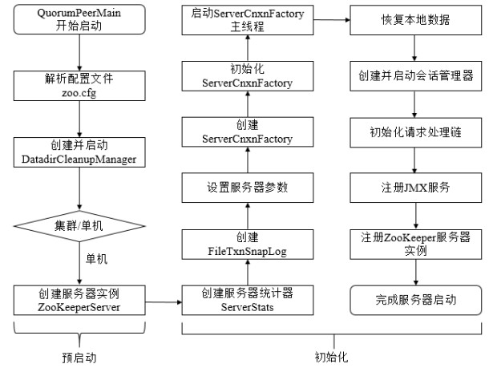

## 3.3 Server启动流程

ZooKeeper服务端有两种启动模式：单机版和集群版，这里以集群版为例简单分析一下该流程。具体如下图所示：


### 3.3.1 预启动
我们从QuorumPeerMain的main方法开始：
```Java
public static void main(String[] args) {
    QuorumPeerMain main = new QuorumPeerMain();
    try {
        main.initializeAndRun(args);
    } catch (Exception e) {
        ...
        System.exit(1);
    }
    System.exit(0);
}
protected void initializeAndRun(String[] args) throws ConfigException, IOException {
    //解析配置
    QuorumPeerConfig config = new QuorumPeerConfig();
    if (args.length == 1) {
        config.parse(args[0]);
    }

    //启动purge task定期清理快照文件
    DatadirCleanupManager purgeMgr = new DatadirCleanupManager(config
            .getDataDir(), config.getDataLogDir(), config
            .getSnapRetainCount(), config.getPurgeInterval());
    purgeMgr.start();

    if (args.length == 1 && config.servers.size() > 0) {
        //run as quorum
        runFromConfig(config);
    } else {
        //run as standalone
        ZooKeeperServerMain.main(args);
    }
}
```
预启动步骤如下：
1. 解析配置文件zoo.cfg
2. 创建并启动历史文件清理器DatadirCleanupManager
3. 判断当前是集群模式还是单机模式的启动

### 3.3.2 初始化
我们看一下初始化流程：
```Java
public void runFromConfig(QuorumPeerConfig config) throws IOException {
    ...
    try {
        //创建ServerCnxnFactory
        ServerCnxnFactory cnxnFactory = ServerCnxnFactory.createFactory();
        cnxnFactory.configure(config.getClientPortAddress(), config.getMaxClientCnxns());

        //初始化QuorumPeer
        quorumPeer = new QuorumPeer();
        quorumPeer.setClientPortAddress(config.getClientPortAddress());
        //创建数据管理器FileTxnSnaplog
        quorumPeer.setTxnFactory(new FileTxnSnapLog(new File(config.getDataLogDir()), new File(config.getDataDir())));
        quorumPeer.setQuorumPeers(config.getServers());
        quorumPeer.setElectionType(config.getElectionAlg());
        quorumPeer.setMyid(config.getServerId());
        quorumPeer.setTickTime(config.getTickTime());
        quorumPeer.setMinSessionTimeout(config.getMinSessionTimeout());
        quorumPeer.setMaxSessionTimeout(config.getMaxSessionTimeout());
        quorumPeer.setInitLimit(config.getInitLimit());
        quorumPeer.setSyncLimit(config.getSyncLimit());
        quorumPeer.setQuorumVerifier(config.getQuorumVerifier());
        quorumPeer.setCnxnFactory(cnxnFactory);
        //创建内存数据库ZKDatabase
        quorumPeer.setZKDatabase(new ZKDatabase(quorumPeer.getTxnFactory()));
        quorumPeer.setLearnerType(config.getPeerType());
        quorumPeer.setSyncEnabled(config.getSyncEnabled());
        quorumPeer.setQuorumListenOnAllIPs(config.getQuorumListenOnAllIPs());

        quorumPeer.start();
        quorumPeer.join();
    } catch (InterruptedException e) {
        ...
    }
}
//QuorumPeer.Java
public synchronized void start() {
    //恢复本地数据
    loadDataBase();
    //启动ServerCnxnFactory
    cnxnFactory.start();
    //开始Leader选举
    startLeaderElection();
    //启动QuorumPeer线程
    super.start();
}
```
初始化步骤如下：
1. 创建并初始化ServerCnxnFactory
2. 创建并初始化QuorumPeer实例
3. 创建ZooKeeper数据管理器FileTxnSnapLog
4. 创建内存数据库ZKDatabase
5. 恢复本地数据
6. 启动ServerCnxnFactory主线程
7. 开始Leader选举
8. 启动QuorumPeer线程

### 3.3.3 运行
接下来我们看一下QuorumPeer的run方法：
```Java
public void run() {
    ...
    try {
        //Main loop
        while (running) {
            switch (getPeerState()) {
                case LOOKING:
                    if (Boolean.getBoolean("readonlymode.enabled")) {
                        // Create read-only server but don't start it immediately
                        final ReadOnlyZooKeeperServer roZk = new ReadOnlyZooKeeperServer(
                                logFactory, this,
                                new ZooKeeperServer.BasicDataTreeBuilder(),
                                this.zkDb);

                        Thread roZkMgr = new Thread() {
                            public void run() {
                                try {
                                    // lower-bound grace period to 2 secs
                                    sleep(Math.max(2000, tickTime));
                                    if (QuorumPeer.ServerState.LOOKING.equals(getPeerState())) {
                                        roZk.startup();
                                    }
                                } catch (Exception e) {
                                    ...
                                }
                            }
                        };
                        try {
                            roZkMgr.start();
                            setBCVote(null);
                            setCurrentVote(makeLEStrategy().lookForLeader());
                        } catch (Exception e) {
                            LOG.warn("Unexpected exception", e);
                            setPeerState(QuorumPeer.ServerState.LOOKING);
                        } finally {
                            roZkMgr.interrupt();
                            roZk.shutdown();
                        }
                    } else {
                        try {
                            setBCVote(null);
                            setCurrentVote(makeLEStrategy().lookForLeader());
                        } catch (Exception e) {
                            setPeerState(QuorumPeer.ServerState.LOOKING);
                        }
                    }
                    break;
                case OBSERVING:
                    try {
                        setObserver(makeObserver(logFactory));
                        observer.observeLeader();
                    } finally {
                        observer.shutdown();
                        setObserver(null);
                        setPeerState(QuorumPeer.ServerState.LOOKING);
                    }
                    break;
                case FOLLOWING:
                    try {
                        setFollower(makeFollower(logFactory));
                        follower.followLeader();
                    } finally {
                        follower.shutdown();
                        setFollower(null);
                        setPeerState(QuorumPeer.ServerState.LOOKING);
                    }
                    break;
                case LEADING:
                    try {
                        setLeader(makeLeader(logFactory));
                        leader.lead();
                        setLeader(null);
                    } finally {
                        if (leader != null) {
                            leader.shutdown("Forcing shutdown");
                            setLeader(null);
                        }
                        setPeerState(QuorumPeer.ServerState.LOOKING);
                    }
                    break;
            }
        }
    } finally {
        ...
    }
}
```
根据当前节点的状态来启动不同的流程：
* 如果是Looking状态，则调用FastLeaderElection::lookForLeader来发起选举流程
* 如果是OBSERVING状态，则开始Observer流程
* 如果是FOLLOWING状态，则开始Follower流程
* 如果是LEADING状态，则开始Leader流程
