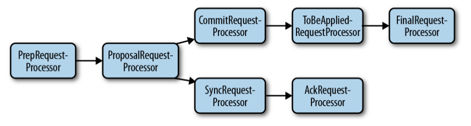
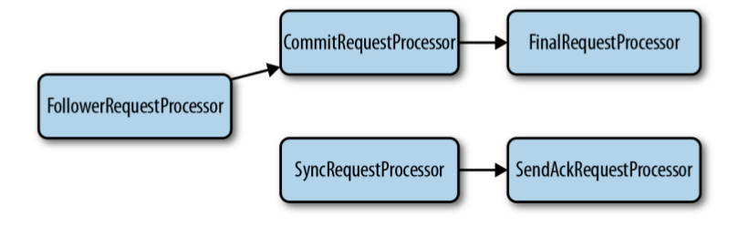

## 3.4 Server详解
我们知道，在ZooKeeper集群中，分别有Leader、Follower和Observer三种类型的服务器角色。本节我们将详细分析一下这三种服务器角色的技术内幕。

### 3.4.1 Leader
Leader服务器是ZooKeeper集群工作机制的核心，其主要工作有以下两个：
* 事务请求的唯一调度和处理者，保证集群事务处理的顺序性
* 集群内部各服务器的调度者

#### QuorumPeer线程
前面说过，Leader选举完成之后，Peer确认了自己是Leader的身份，在QuorumPeer的主线程中执行Leader的逻辑，即Leader.lead()方法，具体代码如下所示：
```Java
void lead() throws IOException, InterruptedException {
    self.end_fle = System.currentTimeMillis();
    self.start_fle = 0;
    self.end_fle = 0;

    try {
        self.tick = 0;
        //加载数据
        zk.loadData();

        leaderStateSummary = new StateSummary(self.getCurrentEpoch(), zk.getLastProcessedZxid());

        //接受Learner的连接请求
        cnxAcceptor = new LearnerCnxAcceptor();
        cnxAcceptor.start();

        readyToStart = true;
        //启用新的epoch
        long epoch = getEpochToPropose(self.getId(), self.getAcceptedEpoch());

        zk.setZxid(ZxidUtils.makeZxid(epoch, 0));
        synchronized(this){
            lastProposed = zk.getZxid();
        }

        //发送NewLeader包
        newLeaderProposal.packet = new QuorumPacket(NEWLEADER, zk.getZxid(), null, null);
        waitForEpochAck(self.getId(), leaderStateSummary);
        self.setCurrentEpoch(epoch);
        try {
            waitForNewLeaderAck(self.getId(), zk.getZxid(), LearnerType.PARTICIPANT);
        } catch (InterruptedException e) {
            ...
        }
        
        //初始化sessionTracker和requestProcessor，开始对外提供服务
        startZkServer();

        String initialZxid = System.getProperty("zookeeper.testingonly.initialZxid");
        if (initialZxid != null) {
            long zxid = Long.parseLong(initialZxid);
            zk.setZxid((zk.getZxid() & 0xffffffff00000000L) | zxid);
        }

        if (!System.getProperty("zookeeper.leaderServes", "yes").equals("no")) {
            self.cnxnFactory.setZooKeeperServer(zk);
        }

        //每过一个tickTime/2，发送一个ping包
        boolean tickSkip = true;
        while (true) {
            Thread.sleep(self.tickTime / 2);
            if (!tickSkip) {
                self.tick++;
            }
            HashSet<Long> syncedSet = new HashSet<Long>();

            syncedSet.add(self.getId());

            for (LearnerHandler f : getLearners()) {
                if (f.synced() && f.getLearnerType() == LearnerType.PARTICIPANT) {
                    syncedSet.add(f.getSid());
                }
                f.ping();
            }

          if (!tickSkip && !self.getQuorumVerifier().containsQuorum(syncedSet)) {
                shutdown("Not sufficient followers synced, only synced with sids: [ " + getSidSetString(syncedSet) + " ]");
                return;
          }
          tickSkip = !tickSkip;
        }
    } finally {
        zk.unregisterJMX(this);
    }
}
```
简单看一下该方法：
* 首先loadData()方法，从磁盘中恢复数据和session列表；
* 启动LearnerCnxAcceptor，为每个Follower的连接建立一个LearnerHandler，用于和Follower做交互；
* 启用新的epoch，zookeeper中使用zxid标示一个事务操作，其高32位是epoch，每次Leader切换加1；低32位为事务序列号，每个事务操作加1；
* 向所有的Follower发送一个NewLeader包，宣告Leader身份，并在initLimit时间内等待大多数的Follower完成和Leader的同步，并发送ACK包，表示Follower已经和Leader完成同步并可以对外提供服务；
* 然后调用startZkServer()方法（其最终调用zk.startup()方法）初始化sessionTracker和requestProcessor，开始对外提供服务；
* 最后每过一个tickTime/2就发送一个Ping包给所有的Follower。

#### LearnerHandler
我们知道，Leader和Learner（Follower和Observer）之间会维持一个长连接，并且有一个单独的LearnerHandler负责处理该Learner和Leader之间的交互。相关逻辑在LearnerHandler的run方法中，我们看一下相关代码：
```Java
public void run() {
    try {
        tickOfNextAckDeadline = leader.self.tick + leader.self.initLimit + leader.self.syncLimit;

        //从socket中读取数据
        ia = BinaryInputArchive.getArchive(new BufferedInputStream(sock.getInputStream()));
        bufferedOutput = new BufferedOutputStream(sock.getOutputStream());
        oa = BinaryOutputArchive.getArchive(bufferedOutput);
        QuorumPacket qp = new QuorumPacket();
        ia.readRecord(qp, "packet");
        
        //第一个包应该是FollowerInfo，其中包含了follower的sid和zxid
        if(qp.getType() != Leader.FOLLOWERINFO && qp.getType() != Leader.OBSERVERINFO){
            return;
        }
        byte learnerInfoData[] = qp.getData();
        if (learnerInfoData != null) {
            if (learnerInfoData.length == 8) {
                ByteBuffer bbsid = ByteBuffer.wrap(learnerInfoData);
                this.sid = bbsid.getLong();
            } else {
                LearnerInfo li = new LearnerInfo();
                ByteBufferInputStream.byteBuffer2Record(ByteBuffer.wrap(learnerInfoData), li);
                this.sid = li.getServerid();
                this.version = li.getProtocolVersion();
            }
        } else {
            this.sid = leader.followerCounter.getAndDecrement();
        }

        if (qp.getType() == Leader.OBSERVERINFO) {
            learnerType = LearnerType.OBSERVER;
        }
        
        long lastAcceptedEpoch = ZxidUtils.getEpochFromZxid(qp.getZxid());

        long peerLastZxid;
        StateSummary ss = null;
        long zxid = qp.getZxid();
        //生成新的epoch
        long newEpoch = leader.getEpochToPropose(this.getSid(), lastAcceptedEpoch);

        ...
        //回复LeaderInfo包，其中包含新的epoch
        byte ver[] = new byte[4];
        ByteBuffer.wrap(ver).putInt(0x10000);
        QuorumPacket newEpochPacket = new QuorumPacket(Leader.LEADERINFO, ZxidUtils.makeZxid(newEpoch, 0), ver, null);
        oa.writeRecord(newEpochPacket, "packet");
        bufferedOutput.flush();
        //等待AckEpoch包
        QuorumPacket ackEpochPacket = new QuorumPacket();
        ia.readRecord(ackEpochPacket, "packet");
        if (ackEpochPacket.getType() != Leader.ACKEPOCH) {
            return;
        }
        ByteBuffer bbepoch = ByteBuffer.wrap(ackEpochPacket.getData());
        ss = new StateSummary(bbepoch.getInt(), ackEpochPacket.getZxid());
        leader.waitForEpochAck(this.getSid(), ss);
        
        //获取follower需要同步的数据信息
        peerLastZxid = ss.getLastZxid();

        //默认SNAP方式同步数据
        int packetToSend = Leader.SNAP;
        
        long zxidToSend = 0;
        long leaderLastZxid = 0;
        long updates = peerLastZxid;
        //同步过程中，是需要申请读写锁的，此时是没法处理客户端事务请求的
        ReentrantReadWriteLock lock = leader.zk.getZKDatabase().getLogLock();
        ReentrantReadWriteLock.ReadLock rl = lock.readLock();
        try {
            rl.lock();
            final long maxCommittedLog = leader.zk.getZKDatabase().getmaxCommittedLog();
            final long minCommittedLog = leader.zk.getZKDatabase().getminCommittedLog();

            LinkedList<Proposal> proposals = leader.zk.getZKDatabase().getCommittedLog();

            if (peerLastZxid == leader.zk.getZKDatabase().getDataTreeLastProcessedZxid()) {
                //如果lastZxid相同，则说明数据本身是同步的
                packetToSend = Leader.DIFF;
                zxidToSend = peerLastZxid;
            } else if (proposals.size() != 0) {
                if ((maxCommittedLog >= peerLastZxid) && (minCommittedLog <= peerLastZxid)) {
                    //如果peerLastZxid在maxCommittedLog和minCommittedLog之间，则以Diff方法同步数据
                    long prevProposalZxid = minCommittedLog;
                    boolean firstPacket = true;
                    packetToSend = Leader.DIFF;
                    zxidToSend = maxCommittedLog;
                    for (Proposal propose: proposals) {
                        if (propose.packet.getZxid() <= peerLastZxid) {
                            prevProposalZxid = propose.packet.getZxid();
                            continue;
                        } else {
                            if (firstPacket) {
                                firstPacket = false;
                                if (prevProposalZxid < peerLastZxid) {
                                    packetToSend = Leader.TRUNC;
                                    zxidToSend = prevProposalZxid;
                                    updates = zxidToSend;
                                }
                            }
                            queuePacket(propose.packet);
                            QuorumPacket qcommit = new QuorumPacket(Leader.COMMIT, propose.packet.getZxid(), null, null);
                            queuePacket(qcommit);
                        }
                    }
                } else if (peerLastZxid > maxCommittedLog) {
                    //发送Trunc命令
                    packetToSend = Leader.TRUNC;
                    zxidToSend = maxCommittedLog;
                    updates = zxidToSend;
                }
            }
            leaderLastZxid = leader.startForwarding(this, updates);
        } finally {
            rl.unlock();
        }
        
        //发送NewLeader数据包，标明完成一个交互流程
        QuorumPacket newLeaderQP = new QuorumPacket(Leader.NEWLEADER, ZxidUtils.makeZxid(newEpoch, 0), null, null);
        if (getVersion() < 0x10000) {
            oa.writeRecord(newLeaderQP, "packet");
        } else {
            queuedPackets.add(newLeaderQP);
        }
        bufferedOutput.flush();
        //Need to set the zxidToSend to the latest zxid
        if (packetToSend == Leader.SNAP) {
            zxidToSend = leader.zk.getZKDatabase().getDataTreeLastProcessedZxid();
        }
        oa.writeRecord(new QuorumPacket(packetToSend, zxidToSend, null, null), "packet");
        bufferedOutput.flush();

        //if we are not truncating or sending a diff just send a snapshot
        if (packetToSend == Leader.SNAP) {
            // Dump data to peer
            leader.zk.getZKDatabase().serializeSnapshot(oa);
            oa.writeString("BenWasHere", "signature");
        }
        bufferedOutput.flush();

        //开始发送数据包
        new Thread() {
            public void run() {
                Thread.currentThread().setName("Sender-" + sock.getRemoteSocketAddress());
                try {
                    sendPackets();
                } catch (InterruptedException e) {
                    LOG.warn("Unexpected interruption",e);
                }
            }
        }.start();

        //Have to wait for the first ACK, wait until the leader is ready, and only then we can start processing messages
        qp = new QuorumPacket();
        ia.readRecord(qp, "packet");
        if(qp.getType() != Leader.ACK){
            LOG.error("Next packet was supposed to be an ACK");
            return;
        }
        leader.waitForNewLeaderAck(getSid(), qp.getZxid(), getLearnerType());
        ...
        
        //发送upTodate告诉peer完成数据同步，可以开始对外服务
        queuedPackets.add(new QuorumPacket(Leader.UPTODATE, -1, null, null));

        while (true) {
            qp = new QuorumPacket();
            ia.readRecord(qp, "packet");

            long traceMask = ZooTrace.SERVER_PACKET_TRACE_MASK;
            if (qp.getType() == Leader.PING) {
                traceMask = ZooTrace.SERVER_PING_TRACE_MASK;
            }
            tickOfNextAckDeadline = leader.self.tick + leader.self.syncLimit;

            ByteBuffer bb;
            long sessionId;
            int cxid;
            int type;

            switch (qp.getType()) {
                case Leader.ACK:
                    syncLimitCheck.updateAck(qp.getZxid());
                    leader.processAck(this.sid, qp.getZxid(), sock.getLocalSocketAddress());
                    break;
                case Leader.PING:
                    // Process the touches
                    ByteArrayInputStream bis = new ByteArrayInputStream(qp.getData());
                    DataInputStream dis = new DataInputStream(bis);
                    while (dis.available() > 0) {
                        long sess = dis.readLong();
                        int to = dis.readInt();
                        leader.zk.touch(sess, to);
                    }
                    break;
                case Leader.REVALIDATE:
                    bis = new ByteArrayInputStream(qp.getData());
                    dis = new DataInputStream(bis);
                    long id = dis.readLong();
                    int to = dis.readInt();
                    ByteArrayOutputStream bos = new ByteArrayOutputStream();
                    DataOutputStream dos = new DataOutputStream(bos);
                    dos.writeLong(id);
                    boolean valid = leader.zk.touch(id, to);
                    if (valid) {
                        try {
                            leader.zk.setOwner(id, this);
                        } catch (SessionExpiredException e) {
                            ...
                        }
                    }
                    dos.writeBoolean(valid);
                    qp.setData(bos.toByteArray());
                    queuedPackets.add(qp);
                    break;
                case Leader.REQUEST:
                    bb = ByteBuffer.wrap(qp.getData());
                    sessionId = bb.getLong();
                    cxid = bb.getInt();
                    type = bb.getInt();
                    bb = bb.slice();
                    Request si;
                    if(type == OpCode.sync){
                        si = new LearnerSyncRequest(this, sessionId, cxid, type, bb, qp.getAuthinfo());
                    } else {
                        si = new Request(null, sessionId, cxid, type, bb, qp.getAuthinfo());
                    }
                    si.setOwner(this);
                    leader.zk.submitRequest(si);
                    break;
                default:
                    LOG.warn("unexpected quorum packet, type: {}", packetToString(qp));
                    break;
            }
        }
    } catch (IOException e) {
        ...
    } catch (InterruptedException e) {
        ...
    } finally {
        shutdown();
    }
}
```
这里以Follower为例简单说明一下该方法的逻辑：
* 当Follower和Leader建立连接后，会首先向Leader发送一个FollowerInfo命令，表明此Follower此前已经接受过的epoch，当Leader收到大多数Follower的FollowerInfo后，从中选出一个最大的epoch，+1作为当前的epoch，然后通过LeaderInfo命令通知到各Follower。
* 当Follower收到LeaderInfo后，首先设置epoch，然后通过发送AckEpoch命令告诉Leader自己的zxid。
* 当Leader收到AckEpoch后，根据其中的zxid，开始和Follower同步数据，同步数据有三种方式：Snap、Diff和Trunc，具体这里不再详述，需要注意的是同步过程是需要对committedLog加锁的，此时Leader是无法处理客户端的事务请求的。
* 同步完成后，Leader会发送upToDate命令告诉Follower开始对外提供服务。之后则是循环处理和Follower之间交互的包：ACK包：Follower接收到Leader的Proposal消息后，记录事务日志，然后会送ACK包给Leader；PING包：用于和Follower同步session信息；REQUEST包：Follower转发过来的事务请求。

Learner和Leader之间的交互主要包括两方面：
* 刚选完Leader后，Learner需要和Leader同步数据；
* 同步完数据后，Learner可以正常对外提供服务，此时主要是向Leader转发事务请求和响应Leader发起的事务请求。

#### NIOServerCnxnFactory
该类主要负责Server和Client之间的交互，主要包括会话连接请求和数据读写请求。之后我们会详细分析客户端请求处理，这里就不再详述，只简单看一下其run()方法：
```Java
public void run() {
    while (!ss.socket().isClosed()) {
        try {
            selector.select(1000);
            Set<SelectionKey> selected;
            synchronized (this) {
                selected = selector.selectedKeys();
            }
            ArrayList<SelectionKey> selectedList = new ArrayList<SelectionKey>(selected);
            Collections.shuffle(selectedList);
            for (SelectionKey k : selectedList) {
                if ((k.readyOps() & SelectionKey.OP_ACCEPT) != 0) {
                    //处理会话连接请求
                    SocketChannel sc = ((ServerSocketChannel) k.channel()).accept();
                    InetAddress ia = sc.socket().getInetAddress();
                    int cnxncount = getClientCnxnCount(ia);
                    if (maxClientCnxns > 0 && cnxncount >= maxClientCnxns){
                        sc.close();
                    } else {
                        sc.configureBlocking(false);
                        SelectionKey sk = sc.register(selector, SelectionKey.OP_READ);
                        NIOServerCnxn cnxn = createConnection(sc, sk);
                        sk.attach(cnxn);
                        addCnxn(cnxn);
                    }
                } else if ((k.readyOps() & (SelectionKey.OP_READ | SelectionKey.OP_WRITE)) != 0) {
                    //处理数据读写请求
                    NIOServerCnxn c = (NIOServerCnxn) k.attachment();
                    c.doIO(k);
                }
            }
            selected.clear();
        } catch (RuntimeException e) {
            ...
        } catch (Exception e) {
            ...
        }
    }
    closeAll();
}
```

#### Processor链
对于Leader来说，其LeaderZooKeeperServer.setupRequestProcessors()方法设置了Leader用到的processors，具体代码如下所示：
```Java
protected void setupRequestProcessors() {
    RequestProcessor finalProcessor = new FinalRequestProcessor(this);
    RequestProcessor toBeAppliedProcessor = new Leader.ToBeAppliedRequestProcessor(finalProcessor, getLeader().toBeApplied);
    commitProcessor = new CommitProcessor(toBeAppliedProcessor, Long.toString(getServerId()), false);
    commitProcessor.start();
    ProposalRequestProcessor proposalProcessor = new ProposalRequestProcessor(this, commitProcessor);
    proposalProcessor.initialize();
    firstProcessor = new PrepRequestProcessor(this, proposalProcessor);
    ((PrepRequestProcessor)firstProcessor).start();
}
public ProposalRequestProcessor(LeaderZooKeeperServer zks, RequestProcessor nextProcessor) {
    this.zks = zks;
    this.nextProcessor = nextProcessor;
    AckRequestProcessor ackProcessor = new AckRequestProcessor(zks.getLeader());
    syncProcessor = new SyncRequestProcessor(zks, ackProcessor);
}
```
其具体结构如下图所示：


接下来，我们逐个讲解一下这些Processor：
* PrepRequestProcessor：Leader的预处理器，该处理器主要是用于处理客户端的事务请求，对其进行一系列预处理：创建请求头、请求体、会话检查和ACL检查等。
* ProposalRequestProcessor：Leader的事务投票处理器，对于非事务请求，直接将请求转交到CommitProcessor处理器；对于事务请求，除了将请求转交给CommitProcessor，还会创建Proposal提议，并发送给所有的Follower来发起一次事务投票，同时还会将请求转交给SyncRequestProcessor进行事务日志的记录。
* SyncRequestProcessor：事务日志记录处理器。
* AckRequestProcessor：Leader特有的处理器，其负责在SyncRequestProcessor完成事务日志记录后，向Proposal的投票收集器发送ACK反馈，以通知投票收集器当前服务器已完成该Proposal的事务日志记录。
* CommitProcessor：事务提交处理器：对于非事务请求，直接转交给下一个处理器；事务请求，则会等待集群对该Proposal的投票直到该Proposal可以被提交。利用该处理器，每个服务器都可以保证对事务请求的顺序处理。
* ToBeAppliedRequestProcessor：该处理器有一个toBeApplied队列，用来存储已经被CommitProcessor处理过的可以提交的Proposal。其将这些请求逐个交付给FinalRequestProcessor进行处理，等到FinalRequestProcessor处理完该请求后，再将其从toBeApplied队列中删除。
* FinalRequestProcessor：最后一个处理器，该处理器主要是创建对客户端请求的响应，对于事务请求，其将事务应用到内存数据库中。

### 3.4.2 Follower
Follower是ZooKeeper集群状态的跟随者，其主要工作有以下两个：
* 处理客户端非事务请求，并转发事务请求到Leader服务器；
* 参与事务请求Proposal的投票。

#### QuorumPeer线程
Leader选举完成之后，Peer确认了自己是Follower的身份，在QuorumPeer的主线程中执行Follower的逻辑，即Follower.followLeader()方法，具体代码如下所示：
```Java
void followLeader() throws InterruptedException {
    self.end_fle = System.currentTimeMillis();
    self.start_fle = 0;
    self.end_fle = 0;
    
    try {
        InetSocketAddress addr = findLeader();            
        try {
            //和Leader建立连接
            connectToLeader(addr);
            //向Leader发送FollowerInfo包，获取新的epoch
            long newEpochZxid = registerWithLeader(Leader.FOLLOWERINFO);

            long newEpoch = ZxidUtils.getEpochFromZxid(newEpochZxid);
            if (newEpoch < self.getAcceptedEpoch()) {
                throw new IOException("Error: Epoch of leader is lower");
            }
            //和Leader同步数据
            syncWithLeader(newEpochZxid);                
            QuorumPacket qp = new QuorumPacket();
            while (self.isRunning()) {
                readPacket(qp);
                processPacket(qp);
            }
        } catch (IOException e) {
            ...
            // clear pending revalidations
            pendingRevalidations.clear();
        }
    }
}
```
简单分析一下该方法，主要包括以下流程：
* 和Leader建立连接；
* 向Leader发送FollowerInfo包，并附带上自己之前的epoch，等待Leader的LeaderInfo包，并从中获取到本次的epoch；然后向Leader发送AckEpoch，其中包含自己最新的zxid，用于接下来的数据同步；
* 然后开始调用syncWithLeader方法开始和Leader同步数据，同步完成后调用zk.startup()方法初始化sessionTracker和requestProcessor，开始对外提供服务；
* 最后循环处理和Leader之间的交互数据包：Ping包、Proposal包和Commit包。

#### NIOServerCnxnFactory
这里的逻辑和Leader相同，这里就不再详述。

#### Processor链
对于Follower来说，其FollowerZooKeeperServer.setupRequestProcessors()方法中设置了Follower用到的processors，具体代码如下所示：
```Java
protected void setupRequestProcessors() {
    RequestProcessor finalProcessor = new FinalRequestProcessor(this);
    commitProcessor = new CommitProcessor(finalProcessor, Long.toString(getServerId()), true);
    commitProcessor.start();
    firstProcessor = new FollowerRequestProcessor(this, commitProcessor);
    ((FollowerRequestProcessor) firstProcessor).start();
    syncProcessor = new SyncRequestProcessor(this, new SendAckRequestProcessor((Learner)getFollower()));
    syncProcessor.start();
}
```
其具体结构如下所示：


从以上代码我们可以看出来：Follower有两个处理器链：FollowerRequestProcessor->CommitProcessor->FinalRequestProcessor和SyncRequestProcessor->SendAckRequestProcessor，其中前者主要用于处理客户端请求，后者用于处理Leader发起的Proposal。
* FollowerRequestProcessor：Follower的第一个Processor，它的主要作用就是把读操作发送到后面的processor来处理，把写操作封装成为Request请求转发给Leader来处理。
* SendAckRequestProcessor：与AckRequestProcessor一样，其承担着事务日志记录反馈的角色，在完成事务日志记录后，会向Leader发送ACK消息。两者的区别在于AckRequestProcessor本身在Leader服务器上，其ACk反馈是一个本地操作；而SendAckRequestProcessor实在Follower服务器上，其需要以ACK消息的形式进行反馈。
