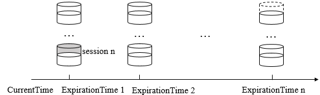

## 3.5 会话管理

### 3.5.1 概述
会话（Session）是ZooKeeper中最重要的概念之一，客户端与服务端之间的任何交互操作都与会话息息相关，这其中就包括临时节点的生命周期、客户端请求的顺序执行以及Watcher通知机制等。在Java中，ZooKeeper的连接与会话就是客户端通过实例化ZooKeeper对象来实现客户端与服务器创建并保持TCP连接的过程。

#### 会话状态
在ZooKeeper客户端与服务端成功完成连接创建后，就建立了一个会话。ZooKeeper会话在整个生命周期中，会在不同的会话状态之间进行切换，这些状态一般可以分为五种，如下：
* CONNECTING
* CONNECTED
* RECONNECTING
* RECONNECTED
* CLOSE

一旦客户端开始创建ZooKeeper对象，那么客户端状态就会变成CONNECTING，同时开始连接服务器，成功连接上服务器后，客户端状态将变更为CONNECTED。当客户端与服务器之间的连接会出现断开时，客户端会自动进行重连操作，此时其状态再次变为CONNECTING，直到重新连接上服务器后，客户端状态又会再次转变成CONNECTED。因此，通常情况下，在ZooKeeper运行期间，客户端的状态总是介于CONNECTING和CONNECTED两者之一。因此在使用ZooKeeper时注意避免在connecting时对zookeeper进行读写。

#### Session
Session是ZooKeeper中的会话实体，代表了一个客户端会话。其包含以下4个基本属性：
* sessionID ：会话ID，用来唯一标识一个会话，每次客户端创建新会话的时候，ZooKeeper都会为其分配一个全局唯一的sessionID
* TimeOut ：会话超时时间。客户端在构造ZooKeeper实例的时候，会配置一个sessionTimeout参数用于指定会话的超时时间。ZooKeeper客户端向服务器发送这个超时时间后，服务器会根据自己的超时时间限制最终确定会话的超时时间
* TickTime ：下次会话超时时间点。为了便于ZooKeeper对会话实行“分桶策略”管理，一种高效的会话的超时检查与清理策略，ZooKeeper会为每个会话标记一个下次会话超时时间点。TickTime是一个13位的long型数据，其值接近于当前时间加上TimeOut，但不完全相等
* isClosing ：该属性用于标记一个会话是否已经被关闭。通常当服务端检测到一个会话已经超时失效的时候，会将该会话的isClosing属性标记为“已关闭”，这样就能确保不再处理来自该会话的新请求了

sessionID用来唯一标识一个会话，因此ZooKeeper必须保证sessionID的全局唯一性。在每次客户端向服务端发起“会话创建”请求时，服务端都会为其分配一个sessionID，现在我们就来看看sessionID究竟是如何生成的。在SessionTracker初始化的时候，会调用initializeNextSession方法来生成一个初始化的sessionID，具体代码如下所示：
```Java
public static long initializeNextSession(long id) {
    long nextSid = 0;
	nextSid = (System.currentTimeMillis() << 24) >> 8;
	nextSid =  nextSid | (id <<56);
	return nextSid;
}
```
其中的id表示配置在myid文件中的值，通常是一个整数，如1、2、3。该算法的高8位确定了所在机器，后56位使用当前时间的毫秒表示进行随机。

#### SessionTracker
SessionTracker是ZooKeeper服务端的会话管理器，负责会话的创建、管理和清理等工作。可以说，整个会话的生命周期都离不开SessionTracker的管理。每一个会话在SessionTracker内部都保留了三份，具体如下：
* sessionsById：这是一个`HashMap<Long, Sessionlmpl>`类型的数据结构，用于根据sessionID来管理Session实体
* sessionsWithTimeout：这是一个`ConcurrentHashMaps<Long, Integer>`类型的数据结构，用于根据sessionID来管理会话的超时时间。该数据结构和ZooKeeper内存数据库相连通，会被定期持久化到快照文件中去
* sessionSets：这是一个`HashMap<Long, SessionSet>`类型的数据结构，用于根据下次会话超时时间点来归档会话，便于进行会话管理和超时检査

### 3.5.2 会话创建
下一节我们会详细分析一下ZooKeeper服务端如何处理客户端的“会话创建”请求，这里我们只简单看一下相关方法：
```Java
public void processConnectRequest(ServerCnxn cnxn, ByteBuffer incomingBuffer) throws IOException {
    BinaryInputArchive bia = BinaryInputArchive.getArchive(new ByteBufferInputStream(incomingBuffer));
    //解码ConnectRequest
    ConnectRequest connReq = new ConnectRequest();
    connReq.deserialize(bia, "connect");

    //判读是否是readOnly客户端
    boolean readOnly = false;
    try {
        readOnly = bia.readBool("readOnly");
        cnxn.isOldClient = false;
    } catch (IOException e) {
        ...
    }
    if (readOnly == false && this instanceof ReadOnlyZooKeeperServer) {
        throw new CloseRequestException(msg);
    }

    //检查客户端zxid
    if (connReq.getLastZxidSeen() > zkDb.dataTree.lastProcessedZxid) {
        throw new CloseRequestException(msg);
    }
    //协商sessionTimeout
    int sessionTimeout = connReq.getTimeOut();
    byte passwd[] = connReq.getPasswd();
    int minSessionTimeout = getMinSessionTimeout();
    if (sessionTimeout < minSessionTimeout) {
        sessionTimeout = minSessionTimeout;
    }
    int maxSessionTimeout = getMaxSessionTimeout();
    if (sessionTimeout > maxSessionTimeout) {
        sessionTimeout = maxSessionTimeout;
    }
    cnxn.setSessionTimeout(sessionTimeout);

    // We don't want to receive any packets until we are sure that the session is setup
    cnxn.disableRecv();

    //判断是否需要重新创建会话
    long sessionId = connReq.getSessionId();
    if (sessionId != 0) {
        long clientSessionId = connReq.getSessionId();
        serverCnxnFactory.closeSession(sessionId);
        cnxn.setSessionId(sessionId);
        reopenSession(cnxn, sessionId, passwd, sessionTimeout);
    } else {
        createSession(cnxn, passwd, sessionTimeout);
    }
}
long createSession(ServerCnxn cnxn, byte passwd[], int timeout) {
    //向SessionTracker注册该会话，并生成sessionID
    long sessionId = sessionTracker.createSession(timeout);
    //生成会话密钥
    Random r = new Random(sessionId ^ superSecret);
    r.nextBytes(passwd);
    ByteBuffer to = ByteBuffer.allocate(4);
    to.putInt(timeout);
    cnxn.setSessionId(sessionId);
    //接下来将该请求交给Processor处理
    submitRequest(cnxn, sessionId, OpCode.createSession, 0, to, null);
    return sessionId;
}
//SessionTrackerImpl.Java
synchronized public long createSession(int sessionTimeout) {
    addSession(nextSessionId, sessionTimeout);
    return nextSessionId++;
}
synchronized public void addSession(long id, int sessionTimeout) {
    //注册session
    sessionsWithTimeout.put(id, sessionTimeout);
    if (sessionsById.get(id) == null) {
        SessionImpl s = new SessionImpl(id, sessionTimeout, 0);
        sessionsById.put(id, s);
    }
    //激活session
    touchSession(id, sessionTimeout);
}
synchronized public boolean touchSession(long sessionId, int timeout) {
    SessionImpl s = sessionsById.get(sessionId);
    // Return false, if the session doesn't exists or marked as closing
    if (s == null || s.isClosing()) {
        return false;
    }
    long expireTime = roundToInterval(System.currentTimeMillis() + timeout);
    if (s.tickTime >= expireTime) {
        // Nothing needs to be done
        return true;
    }
    SessionSet set = sessionSets.get(s.tickTime);
    if (set != null) {
        set.sessions.remove(s);
    }
    s.tickTime = expireTime;
    set = sessionSets.get(s.tickTime);
    if (set == null) {
        set = new SessionSet();
        sessionSets.put(expireTime, set);
    }
    set.sessions.add(s);
    return true;
}
```
简单总结一下：在ZooKeeper服务端，首先将会由NIOServerCnxn来负责接收来自客户端的“会话创建”请求，并反序列化出ConnectRequest请求，然后协商超时时间，生成sessionID和会话密钥，并将其注册到sessionsById和sessionsWithTimeout中去，同时进行会话的激活。然后该“会话请求”还会在ZooKeeper服务端的各个请求处理器之间进行顺序流转，最终完成会话的创建。

### 3.5.3 会话管理
接下来我们看一下，ZooKeeper服务端是如何管理这些会话的。

#### 分桶策略
ZooKeeper的会话管理主要是由SessionTracker负责的，其采用了一种特殊的会话管理方式，我们称之为“分桶策略”。所谓分桶策略，是指将类似的会话放在同一区块中进行管理，以便于ZooKeeper对会话进行不同区块的隔离处理以及同一区块的统一处理，如下图所示。



在上图中，我们可以看到，ZooKeeper将所有的会话都分配在了不同的区块之中，分配的原则是每个会话的“下次超时时间点”（ExpirationTime)。ExpirationTime是指该会话最近一次可能超时的时间点，对于一个新创建的会话而言，其会话创建完毕后，ZooKeeper就会为其计算ExpirationTime，其计算公式如下：
```
ExpirationTime_ = CurrentTime + SessionTimeout
ExpirationTime = (ExpirationTime_/ExpirationInterval +1) x Expirationlnterval
```
Leader服务器会定时地进行会话超时检查，其时间间隔是ExpirationInterval，默认值是tickTime的值（2000ms）。为了方便对多个会话同时进行超时检查，所以ExpirationTime总是ExpirationInterval的整数倍。

#### 会话激活
为了保持会话的有效性，客户端会在会话超时时间内向服务端发送Ping请求来激活该会话，服务端收到该请求后执行touchSession方法来激活该会话，相关代码如下所示：
```Java
synchronized public boolean touchSession(long sessionId, int timeout) {
    SessionImpl s = sessionsById.get(sessionId);
    //检查会话是否已经关闭
    if (s == null || s.isClosing()) {
        return false;
    }
    //计算新的超时时间
    long expireTime = roundToInterval(System.currentTimeMillis() + timeout);
    if (s.tickTime >= expireTime) {
        return true;
    }
    //迁移会话
    SessionSet set = sessionSets.get(s.tickTime);
    if (set != null) {
        set.sessions.remove(s);
    }
    s.tickTime = expireTime;
    set = sessionSets.get(s.tickTime);
    if (set == null) {
        set = new SessionSet();
        sessionSets.put(expireTime, set);
    }
    set.sessions.add(s);
    return true;
}
```
简单说明一下该方法：
* 检验该会话是否已经被关闭：如果该会话已经被关闭，那么不再继续激活该会话。
* 计算该会话新的超时时间ExpirationTime_New。
* 迁移会话：将该会话从老的区块中取出，放入ExpirationTime_New对应的新区块中，如图下图所示：


#### 会话超时检查
在ZooKeeper中，会话超时检查同样是由SessionTracker负责的。SessionTracker中有一个单独的线程专门进行会话超时检查，其工作机制非常简单：逐个依次地对会话桶中剩下的会话进行检查清理。具体代码如下所示：
```Java
synchronized public void run() {
    try {
        while (running) {
            currentTime = System.currentTimeMillis();
            if (nextExpirationTime > currentTime) {
                this.wait(nextExpirationTime - currentTime);
                continue;
            }
            SessionSet set;
            set = sessionSets.remove(nextExpirationTime);
            if (set != null) {
                for (SessionImpl s : set.sessions) {
                    //标记会话已关闭
                    setSessionClosing(s.sessionId);
                    //清理该会话
                    expirer.expire(s);
                }
            }
            nextExpirationTime += expirationInterval;
        }
    } catch (InterruptedException e) {
        handleException(this.getName(), e);
    }
}
```
简单说明一下该方法：由于SessionTracker是以ExpirationInterval的倍数作为时间点来分布会话的，因此只需要在这些指定的时间点上进行检查即可，这样大大提高了会话检查的效率。

### 3.5.4 会话清理
当SessionTracker的会话超时检查线程整理出一些已经过期的会话后，那么就要开始进行会话清理了。看一下相关代码：
```Java
public void expire(Session session) {
    long sessionId = session.getSessionId();
    close(sessionId);
}
private void close(long sessionId) {
    submitRequest(null, sessionId, OpCode.closeSession, 0, null, null);
}
```
这里以发起closeSession请求的方式关闭会话，我们之后会详述ZooKeeper事务请求处理的流程。这里只简单说明一下会话清理的相关工作：会话清理主要是需要清理相关的临时节点，然后将该会话从SessionTracker中删除，最后关闭对应的NIOServerCnxn连接。

### 3.5.5 重连与异常处理
在ZooKeeper中，客户端与服务端之间维持的是一个长连接，在sessionTimeout时间内，服务端会不断地检测该客户端是否还处于正常连接——服务端会将客户端的每次操作视为一次有效的心跳检测来反复地进行会话激活。因此在正常情况下，客户端会话是一直有效的。然而当客户端与服务端之间的连接断开后，用户在客户端可能主要会看到两类异常：CONNECTION_LOSS和SESSION_EXPIRED。那么该如何正确处理CONNECTION_LOSS和SESSION_EXPIRED呢？

#### 连接断开：CONNECTION_LOSS
有时会因为网络问题导致客户端与服务器断开连接，即CONNECTION_LOSS。在这种情况下，ZooKeeper客户端会自动从地址列表中选取新的地址并尝试重连，直到最终成功连接上服务器。那么如果客户端在进行数据读写时，正好出现了CONNECTION_LOSS，那么客户端会立即收到None-Disconnected通知，同时会抛出ConnectionLossException异常。在这种情况下，我们需要做的是catch住该异常，然后等待ZooKeeper的客户端自动完成重连，重连成功后客户端会收到None-SyncConnected通知，之后重试刚才的操作即可（由于ZooKeeper的操作是幂等的，所以重试不会带来问题）。

#### 会话失效：SESSION_EXPIRED
SESSION_EXPIRED是指会话过期，通常发生在CONNECTION_LOSS期间。客户端和服务器连接断幵之后，由于重连耗时过长，超过了会话超时时间（sessionTimeout），那么服务器认为这个会话已经结束了，就会开始进行会话清理。但是另一方面，该客户端本身不知道会话已经失效，并且其客户端状态还是DISCONNECTED。之后，如果客户端重新连接上了服务器，服务器会告诉客户端该会话已经失效（SESSION_EXPIRED)。在这种情况下，应用需要重新实例化一个ZooKeeper对象，并且根据情况决定是否需要恢复临时数据。

#### 会话转移：SESSION_MOVED
会话转移是指客户端会话从一台服务器转移到了另一台服务器上。正如上文中提到，假设客户端C1和服务器S1之间的连接断开后，如果通过尝试重连后，成功连接上了新的服务器S2并且延续了有效会话，那么就可以认为会话从S1转移到了S2上。

会话转移会导致请求会被覆盖，假设我们的ZooKeeper服务器集群有三台机器：S1、S2和S3。在开始的时候，客户端C1与服务器S1建立连接且维持着正常的会话，某一个时刻，C1向服务器发送了一个请求R1：`setData ('/$7_4_4/session_moved', 1)`，但是在请求发送到服务器之前，客户端和服务器恰好发生了连接断开，并且在很短的时间内重新连接上了服务器S2。之后，C1又向服务器S2发送了一个请求R2：`setData ('/$7_4_4/session_moved', 2)`。这个时候，S2能够正确地处理请求R2，但是请求R1最终也到达了服务器S1，S1处理了请求R1，于是，对于客户端C1来说，它的第2次请求R2就被请求R1覆盖了。

当然，上面这个问题非常罕见，只有在C1和S1之间的网路非常慢的情况下才会发生，一旦发生这个问题，将会产生非常严重的后果。

因此，在3.2.0版本之后，ZooKeeper明确提出了会话转移的概念，同时封装了SessionMovedException异常。之后，在处理客户端请求的时候，会首先检查会话的所有者（Owner），如果客户端请求的会话Owner不是当前服务器的话，那么就会直接抛出SessionMovedException异常。当然，由于客户端已经和这个服务器断开了连接，因此无法收到这个异常。只有多个客户端使用相同的sessionId/sessionPasswd创建会话时，才会收到这样的异常。因为一旦有一个客户端会话创建成功，那么ZooKeeper服务器就会认为该sessionId对应的那个会话已经发生了转移，于是，等到第二个客户端连接上服务器后，就被认为是“会话转移”的情况了。
