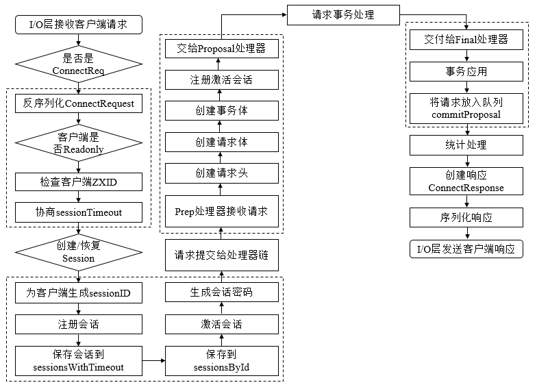
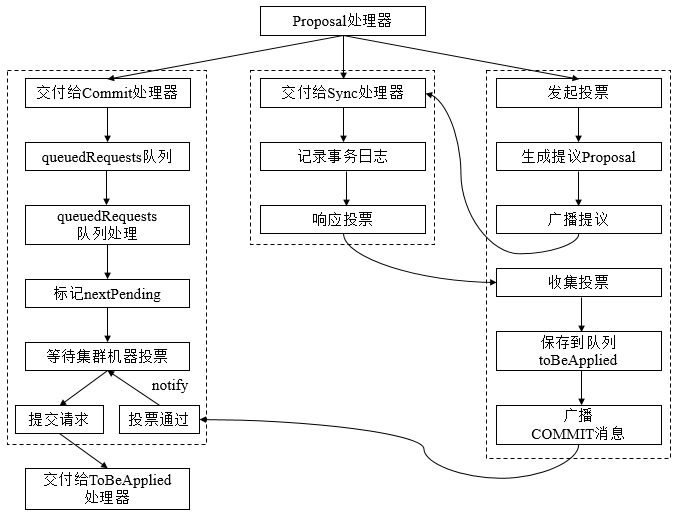

## 3.7 事务请求处理

本节我们以会话创建请求为例看一下ZooKeeper服务端对于事务请求的处理。其大体可以分为六个环节：
* 请求接收
* 会话创建
* 预处理
* 事务处理
* 事务应用
* 会话响应

其大体流程如下图所示：


#### 请求接收
前面我们说过，NIOServerCnxnFactory主要负责Server和Client之间的交互，我们看一下其run方法：
```Java
public void run() {
    while (!ss.socket().isClosed()) {
        try {
            selector.select(1000);
            Set<SelectionKey> selected;
            synchronized (this) {
                selected = selector.selectedKeys();
            }
            ArrayList<SelectionKey> selectedList = new ArrayList<SelectionKey>(selected);
            Collections.shuffle(selectedList);
            for (SelectionKey k : selectedList) {
                if ((k.readyOps() & SelectionKey.OP_ACCEPT) != 0) {
                    //处理客户端连接
                    SocketChannel sc = ((ServerSocketChannel) k.channel()).accept();
                    InetAddress ia = sc.socket().getInetAddress();
                    int cnxncount = getClientCnxnCount(ia);
                    if (maxClientCnxns > 0 && cnxncount >= maxClientCnxns){
                        sc.close();
                    } else {
                        sc.configureBlocking(false);
                        SelectionKey sk = sc.register(selector, SelectionKey.OP_READ);
                        NIOServerCnxn cnxn = createConnection(sc, sk);
                        sk.attach(cnxn);
                        addCnxn(cnxn);
                    }
                } else if ((k.readyOps() & (SelectionKey.OP_READ | SelectionKey.OP_WRITE)) != 0) {
                    //处理客户端请求
                    NIOServerCnxn c = (NIOServerCnxn) k.attachment();
                    c.doIO(k);
                }
            }
            selected.clear();
        } catch (RuntimeException e) {
            ...
        } catch (Exception e) {
            ...
        }
    }
    closeAll();
}
```
当客户端连接请求到达时，首先调用createConnection方法创建连接NIOServerCnxn，然后调用addCnxn方法将该连接保存到cnxns中。接下来我们看一下Server端如何处理客户端数据请求doIO方法，我们看一下其readPayload方法：
```Java
private void readPayload() throws IOException, InterruptedException {
    ...
    if (incomingBuffer.remaining() == 0) { // have we read length bytes?
        packetReceived();
        incomingBuffer.flip();
        if (!initialized) {
            //处理会话连接请求
            readConnectRequest();
        } else {
            readRequest();
        }
        lenBuffer.clear();
        incomingBuffer = lenBuffer;
    }
}

private void readConnectRequest() throws IOException, InterruptedException {
    if (zkServer == null) {
        throw new IOException("ZooKeeperServer not running");
    }
    zkServer.processConnectRequest(this, incomingBuffer);
    initialized = true;
}

public void processConnectRequest(ServerCnxn cnxn, ByteBuffer incomingBuffer) throws IOException {
    BinaryInputArchive bia = BinaryInputArchive.getArchive(new ByteBufferInputStream(incomingBuffer));
    //解码ConnectRequest
    ConnectRequest connReq = new ConnectRequest();
    connReq.deserialize(bia, "connect");
    
    //判读是否是readOnly客户端
    boolean readOnly = false;
    try {
        readOnly = bia.readBool("readOnly");
        cnxn.isOldClient = false;
    } catch (IOException e) {
        ...
    }
    if (readOnly == false && this instanceof ReadOnlyZooKeeperServer) {
        throw new CloseRequestException(msg);
    }
    
    //检查客户端zxid
    if (connReq.getLastZxidSeen() > zkDb.dataTree.lastProcessedZxid) {
        throw new CloseRequestException(msg);
    }
    //协商sessionTimeout
    int sessionTimeout = connReq.getTimeOut();
    byte passwd[] = connReq.getPasswd();
    int minSessionTimeout = getMinSessionTimeout();
    if (sessionTimeout < minSessionTimeout) {
        sessionTimeout = minSessionTimeout;
    }
    int maxSessionTimeout = getMaxSessionTimeout();
    if (sessionTimeout > maxSessionTimeout) {
        sessionTimeout = maxSessionTimeout;
    }
    cnxn.setSessionTimeout(sessionTimeout);
    
    // We don't want to receive any packets until we are sure that the
    // session is setup
    cnxn.disableRecv();
    
    //判断是否需要重新创建回话
    long sessionId = connReq.getSessionId();
    if (sessionId != 0) {
        long clientSessionId = connReq.getSessionId();
        serverCnxnFactory.closeSession(sessionId);
        cnxn.setSessionId(sessionId);
        reopenSession(cnxn, sessionId, passwd, sessionTimeout);
    } else {
        createSession(cnxn, passwd, sessionTimeout);
    }
}
```
再简单回顾一下请求接收的流程：
1. I/O层接收来自客户端的请求：在ZooKeeper中，NIOServerCnxn实例维护每一个客户端连接，其负责统一接收来自客户端的所有请求，并将请求内容从底层网络I/O中完整地读取出来。
2. 判断是否是客户端“会话创建”请求。
3. 反序列化ConnectRequest请求。
4. 判断是否是Readonly客户端：在ZooKeeper中，如果当前ZooKeeper服务器是以Readonly模式启动的，那么所有来自非Readonly型客户端的请求将无法被处理。
5. 检查客户端ZXID：在正常情况下，服务端的ZXID大于客户端的ZXID，因此如果发现客户端的ZXID值大于服务端的ZXID值，那么服务端将不接受该客户端的“会话创建”请求。
6. 协商sessionTimeout。
7. 判断是否需要重新创建会话：服务端根据客户端请求中是否包含sessionID来判断该客户端是否需要重新创建会话。

#### 会话创建
接下来我们看一下会话创建流程，从createSession方法开始：
```Java
long createSession(ServerCnxn cnxn, byte passwd[], int timeout) {
    //向SessionTracker注册该会话，并生成sessionID
    long sessionId = sessionTracker.createSession(timeout);
    //生成会话密钥
    Random r = new Random(sessionId ^ superSecret);
    r.nextBytes(passwd);
    ByteBuffer to = ByteBuffer.allocate(4);
    to.putInt(timeout);
    cnxn.setSessionId(sessionId);
    //接下来将该请求交给Processor处理
    submitRequest(cnxn, sessionId, OpCode.createSession, 0, to, null);
    return sessionId;
}
//SessionTrackerImpl.Java
synchronized public long createSession(int sessionTimeout) {
    addSession(nextSessionId, sessionTimeout);
    return nextSessionId++;
}
synchronized public void addSession(long id, int sessionTimeout) {
    //注册session
    sessionsWithTimeout.put(id, sessionTimeout);
    if (sessionsById.get(id) == null) {
        SessionImpl s = new SessionImpl(id, sessionTimeout, 0);
        sessionsById.put(id, s);    
    }
    //激活session     
    touchSession(id, sessionTimeout);
}
synchronized public boolean touchSession(long sessionId, int timeout) {
    SessionImpl s = sessionsById.get(sessionId);
    // Return false, if the session doesn't exists or marked as closing
    if (s == null || s.isClosing()) {
        return false;
    }
    long expireTime = roundToInterval(System.currentTimeMillis() + timeout);
    if (s.tickTime >= expireTime) {
        // Nothing needs to be done
        return true;
    }
    SessionSet set = sessionSets.get(s.tickTime);
    if (set != null) {
        set.sessions.remove(s);
    }
    s.tickTime = expireTime;
    set = sessionSets.get(s.tickTime);
    if (set == null) {
        set = new SessionSet();
        sessionSets.put(expireTime, set);
    }
    set.sessions.add(s);
    return true;
}
```
简单回顾一下会话创建的流程：
1. 为客户端生成sessionID：每个ZooKeeper服务器在启动的时候，都会初始化一个会话管理器（SessionTracker)，同时初始化sessionID，我们将其称为“基准sessionID”。因此针对每个客户端，只需要在这个“基准sessionID”的基础上进行逐个递增就可以了。
2. 注册会话：创建会话最重要的工作就是向SessionTracker中注册该会话。SessionTracker中维护了两个比较重要的数据结构，分别是sessionsWithTimeout和sessionsById。前者根据sessionID保存了所有会话的超时时间，而后者则是根据sessionID保存了所有会话实体。
3. 激活会话：向SessionTracker注册完会话后，接下来还需要对会话进行激活操作。激活会话过程涉及ZooKeeper会话管理的分桶策略，激活会话的核心是为会话安排一个区块，以便会话清理程序能够快速高效地进行会话清理。
4. 生成会话密码：服务端在创建一个客户端会话的时候，会同时为客户端生成一个会话密码，连同sessionID一起发送给客户端，作为会话在集群中不同机器间转移的凭证。

#### Proccessor处理
接下来我们看一下Processor对请求的处理，前面我们说过Leader中第一个Processor是PrepRequestProcessor，而Follower中第一个Processor是FollowerRequestProcessor，由于会话创建请求是事务请求，该Processor会将其转交给Leader处理。所以我们这里简单看一下RrepReqeustProcessor的处理逻辑：
1. 创建请求事务头：对于事务请求，ZooKeeper首先会为其创建请求事务头，服务端后续的请求处理器都基于该请求头来识别当前请求是否是事务请求。请求事务头包含了一个事务请求最基本的一些信息，包括sessionID、ZXID、CXID和请求类型等。
2. 创建请求事务体：对于事务请求，ZooKeeper还会为其创建请求的事务体。
3. 注册与激活会话：此处的注册与激活会话过程，和上面的注册激活流程是重复的，不过并不会引起其他的问题。此处进行会话注册与激活的目的是处理由Follower服务器转发过来的会话创建请求。在这种情况下，其实尚未在Leader的SessionTracker中进行会话的注册，因此需要在此处进行一次注册与激活。

完成对请求的预处理后，PrepRequestProcessor处理器会将请求交付给自己的下一级处理器：ProposalRequestProcessor。从ProposalRequestProcessor处理器开始，事务请求的处理将会进入三个子处理流程，分别是Sync流程、Proposal流程和Commit流程。如下图所示：



##### Sync流程
所谓Sync流程，其核心就是使用SyncRequestProcessor处理器记录事务日志的过程。ProposalRequestProcessor处理器在接收到一个上级处理器流转过来的请求后，首先会判断该请求是否是事务请求，如果是事务清求，则会通过事务日志的形式将其记录下来。Leader服务器和Follower服务器的请求处理链路中都会有这个处理器，两者在事务日志的记录功能上是完全一致的。

完成事务日志记录后，每个服务器都会向Leader服务器发送ACK消息（Leader是通过AckRequestProcessor，而Follower服务器是通过SendAckRequestProcessor），表明自身完成了事务日志的记录，以便Leader服务器统计每个事务请求的投票情况。

##### Proposal流程
在ZooKeeper的实现中，每一个事务请求都需要集群中过半机器投票认可才能被真正应用到ZooKeeper的内存数据库中去，这个投票与统计过程被称为“Proposal流程”。该流程具体过程如下所示：
1. 发起投票：如果当前请求是事务请求，那么Leader服务器就会发起一轮事务投票。在发起事务投票之前，首先会检查当前服务端的ZXID是否可用。
2. 生成提议Proposal：如果当前服务端的ZXID可用，那么就可以开始事务投票了。ZooKeeper会将之前创建的请求头和事务体，以及ZXID和请求本身序列化到Proposal对象中。
3. 广播提议：生成Proposal后，Leader服务器会以ZXID作为标识，将该提议放入投票箱outstandingProposals中，同时会将该提议广播给所有的Follower服务器。
4. 收集ACK反馈：Follower服务器在接收到Leader发来的这个提议后，会进入Sync流程来进行事务日志的记录，一旦日志记录完成后，就会发送ACK消息给Leader服务器，Leader服务器根据这些ACK消息来统计每个提议的投票情况。当一个提议获得了集群中过半机器的投票，那么就认为该提议通过，接下去就可以进入提议的Commit阶段了。
5. 将请求放入toBeApplied队列：在该提议被提交之前，ZooKeeper首先会将其放入toBeApplied队列中去。
6. 广播COMMIT消息：一旦ZooKeeper确认一个提议已经可以被提交了，那么Leader服务器就会向Follower和Observer服务器发送COMMIT消息，以便所有服务器都能够提交该提议。这里需要注意的是，由于Observer服务器并未参加之前的提议投票，因此Observer服务器尚未保存任何关于该提议的信息，所以在广播COMMIT消息的时候，需要区别对待，Leader会向其发送一种被称为“INTORM”的消息，该消息体中包含了当前提议的内容。而对于Follower服务器，由于已经保存了所有关于该提议的信息，因此Leader服务器只需要向其发送ZXID即可。

##### Commit流程
1. 将请求交付给CommitProcessor处理器：CommitProcessor处理器在收到请求后，并不会立即处理，而是会将其放入queuedRequests队列中。
2. 处理queuedRequests队列请求：CommitProcessor处理器会有一个单独的线程来处理从上一级处理器流转下来的请求。当检测到queuedRequests队列中已经有新的请求进来，就会逐个从队列中取出请求进行处理。
3. 标记nextPending：如果从queuedRequests队列中取出的请求是一个事务请求，那么就需要进行集群中各服务器之间的投票处理，同时需要将nextPending标记为当前请求。标记nextPending的作用，一方面是为了确保事务请求的顺序性，另一方面也是便于CommitProcessor处理器检测当前集群中是否正在进行事务请求的投票。
4. 等待Proposal投票：在Commit流程处理的同时，Leader已经根据当前事务请求生成了一个提议Proposal，并广播给了所有的Follower服务器。因此，此时Commit流程需要等待，直到投票结束。
5. 投票通过：如果一个提议已经获得了过半机器的投票认可，那么将会进入请求提交阶段。ZooKeeper会将该请求放入committedRequests队列中，同时唤醒Commit流程。
6. 提交请求：一旦发现committedRequests队列中已经有可以提交的请求了，那么Commit流程就会开始提交请求。当然在提交以前，为了保证事务请求的顺序执行，Commit流程还会对比之前标记的nextPending和committedRequests队列中第一个请求是否一致。如果检查通过，那么Commit流程就会将该请求放入toProcess队列中，然后交付给下一个请求处理器：FinalRequestProcessor。

FinalRequestProcessor处理器会首先检查outstandingChanges队列中请求的有效性，如果发现这些请求已经落后于当前正在处理的请求，那么直接从outstandingChanges队列中移除。在之前的请求链中，我们仅仅是将该事务请求记录到了事务日志中去，而内存数据库中的状态尚未变更。因此在这个环节，我们需要将事务变更应用到内存数据库中。但对于“会话创建”这类事务请求，ZooKeeper做了特殊处理。因为在ZooKeeper内存中，会话的管理都是由SessionTracker负责的，而在会话创建的步骤9中，ZooKeeper已经将会话信息注册到了SessionTracker中，因此此处无须对内存数据库做任何处理，只需要再次向SessionTracker进行会话注册即可。一旦完成事务请求的内存数据库应用，就可以将该请求放入commitProposal队列中。commitProposal队列用来保存最近被提交的事务请求，以便集群间机器进行数据的快速同步。

#### 会话响应
客户端请求在经过ZooKeeper服务端处理链路的所有请求处理器的处理后，就进入最后的会话响应阶段了。会话响应阶段非常简单，这里就不再详述。