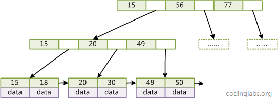
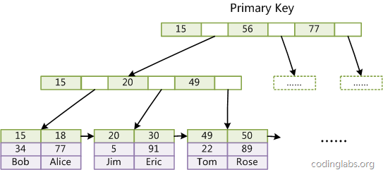
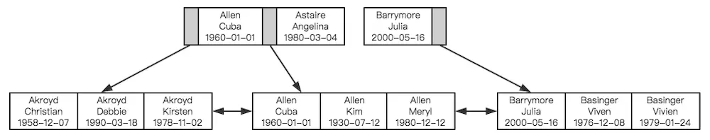

## 7.2 索引详解

### 7.2.1 索引简介
MySQL官方对索引的定义为：索引是帮助MySQL高效获取数据的数据结构。我们知道，查询是数据库的最主要功能，所以数据库系统的设计者会从查询算法的角度进行优化。比较常见的查找算法是顺序查找、二分查找、BST查找和哈希查找等。而每种查找算法都只能应用于特定的数据结构之上，例如二分查找要求被检索数据有序，而BST查找只能应用于二叉查找树上，哈希查找只能应用于哈希表。

但是数据本身的组织结构不可能完全满足各种查找要求（比如不可能同时将两列都按顺序进行组织），所以在数据之外，数据库系统还维护着满足特定查找算法的数据结构，这些数据结构以某种方式引用数据，这样就可以在这些数据结构上实现快速的查找算法，即索引。

看一个例子：


上图展示了一种可能的索引方式。左边是数据表，一共有两列七条记录，最左边的是数据记录的物理地址（注意逻辑上相邻的记录在磁盘上不一定物理相邻）。为了加快Col2的查找，可以维护一个右边所示的二叉查找树，每个节点分别包含索引键值和一个指向对应数据记录物理地址的指针，这样就可以运用二叉查找在O(log2n)的复杂度内获取到相应数据。

### 7.2.2 索引数据结构
索引是在MySQL的存储引擎层中实现的，而不是在服务层实现的。所以每种存储引擎的索引可能并不相同，也不是所有的存储引擎都支持所有的索引类型。这里我们主要讨论一下B-Tree索引。

#### B+Tree
在介绍B-Tree索引之前，我们先来看一下相关数据结构：B+Tree，B+Tree是一种多叉平衡树，如下图所示：


这里我们简单说一下其具体结构，浅蓝色的块我们称之为一个磁盘块，可以看到每个磁盘块包含几个数据项（深蓝色所示）和指针（黄色所示），如磁盘块1包含数据项17和35，包含指针P1、P2、P3。而P1表示小于17的磁盘块，P2表示在17和35之间的磁盘块，P3表示大于35的磁盘块。真实的数据存在于叶子节点即3、5、9、10、13、15、28、29、36、60、75、79、90、99。非叶子节点不存储真实的数据，只存储指引搜索方向的数据项，如17、35并不真实存在于数据表中。

如果要查找数据项29，那么首先会把磁盘块1由磁盘加载到内存，此时发生一次IO，在内存中用二分查找确定29在17和35之间，锁定磁盘块1的P2指针，内存时间因为非常短（相比磁盘的IO）可以忽略不计，通过磁盘块1的P2指针的磁盘地址把磁盘块3由磁盘加载到内存，发生第二次IO，29在26和30之间，锁定磁盘块3的P2指针，通过指针加载磁盘块8到内存，发生第三次IO，同时内存中做二分查找找到29，结束查询，总计三次IO。真实的情况是，3层的b+树可以表示上百万的数据，如果上百万的数据查找只需要三次IO，性能提高将是巨大的，如果没有索引，每个数据项都要发生一次IO，那么总共需要百万次的IO，显然成本非常非常高。

最后我们看一下B+Tree性质：
* 通过上面的分析，我们知道IO次数取决于B+Tree的高度h，假设当前数据表的数据为N，每个磁盘块的数据项的数量是m，则有h=log(m+1)N，当数据量N一定的情况下，m越大，h越小；而m=磁盘块的大小/数据项的大小，磁盘块的大小也就是一个数据页的大小，是固定的，如果数据项占的空间越小，数据项的数量越多，树的高度越低。这就是为什么B+树要只把数据放到叶子节点，而索引字段尽量的小。
* 当B+Tree的数据项是复合的数据结构（联合索引），比如(name,age,sex)的时候，B+数是按照从左到右的顺序来建立搜索树的，比如查询(Jack,20,F)这样的数据时，B+树会首先比较name来确定下一步的搜索方向，如果name相同再依次比较age和sex，最后得到检索的数据。但查询(20,F)这样的数据时，B+树就不知道首先该查哪个节点，因为建立搜索树的时候name就是第一个比较因子，必须要先根据name来搜索才能知道下一步去哪里查询。而查询(Jack,F)这样的数据时，B+树可以用name来指定搜索方向，但下一个字段age的缺失，所以只能把名字等于Jack的数据都找到，然后再匹配性别是F的数据了，这个是非常重要的性质，即索引的最左前缀匹配特性。

#### B-Tree索引
接下来我们看一下B-Tree索引，一般在数据库系统或B-Tree索引都在B+Tree的基础上进行了优化，增加了顺序访问指针。如下图所示：



在B+Tree的每个叶子节点增加一个指向相邻叶子节点的指针，就形成了带有顺序访问指针的B+Tree。做这个优化的目的是为了提高区间访问的性能，例如如果要查询key为从18到49的所有数据记录，当找到18后，只需顺着节点和指针顺序遍历就可以一次性访问到所有数据节点，极大提到了区间查询效率。

我们首先回顾一下典型的mysql查询语句：
```sql
SELECT * 
FROM table
WHERE condition
ORDER BY col
LIMIT offset, num;
```
其中WHERE和ORDER BY子句可以使用索引来优化。我们首先看一下WHERE子句：
* 等值匹配：可用于= != <> IN NOT IN等查询语句的优化
* 范围匹配：可用于 > >= < <= BTEWEEN AND等范围查询语句的优化
* 最左前缀匹配：对于name like bai%这种后模糊匹配的查询，是可以利用name字段上建立的索引来优化查询的，但是对于name like %bai这种前模糊匹配的查询则不能使用索引的
* 联合索引匹配：

排序操作也是可以使用索引来进行，这样可以大大提高排序的速度，要使用索引来排序需要满足以下两点即可：
* ORDER BY子句后的列顺序要与联合索引的列顺序一致，且所有排序列的排序方向需要一致（递增或者递减）
* 所查询的字段值需要包含在索引列中，即满足覆盖索引

通过例子来具体分析，在user_info表上创建一个联合索引`ALTER TABLE user_info ADD INDEX index_user(user_name, city, age);`，我们先看一些可以使用到索引排序的例子：
```sql
SELECT user_name, city, age FROM user_info ORDER BY user_name;
SELECT user_name, city, age FROM user_info ORDER BY user_name, city;
SELECT user_name, city, age FROM user_info ORDER BY user_name DESC, city DESC;
SELECT user_name, city, age FROM user_info WHERE user_name = 'Jack' ORDER BY city;
```
最后一个特殊一点：如果where查询条件为索引列的第一列，且为常量条件，那么该排序也是可以使用索引的。

接下来我们看一些无法使用索引排序的案例
```sql
//sex不在索引列中
SELECT user_name, city, age FROM user_info ORDER BY user_name, sex;
//排序列的方向不一致
SELECT user_name, city, age FROM user_info ORDER BY user_name ASC, city DESC;
//所要查询的字段列sex没有包含在索引列中
SELECT user_name, city, age, sex FROM user_info ORDER BY user_name;
//where查询条件后的user_name为范围查询
SELECT user_name, city, age FROM user_info WHERE user_name LIKE 'Jack%' ORDER BY city;
```

而多表连接查询时，只有当ORDER BY后的排序字段都是第一个表中的索引列（需要满足以上索引排序的两个规则）时，方可使用索引排序。如：再创建一个用户的扩展表user_info_ext，并建立uid的索引。
```sql
CREATE TABLE user_info_ext(
    id int AUTO_INCREMENT PRIMARY KEY,
    uid int NOT NULL,
    u_password VARCHAR(64) NOT NULL
) ENGINE=InnoDB DEFAULT CHARSET=utf8;

ALTER TABLE user_info_ext ADD INDEX index_user_ext(uid);
```
则以下两个查询排序，第一个可以走索引排序，第二个不会走索引排序：
```sql
//走索引排序
SELECT user_name, city, age FROM user_info u LEFT JOIN user_info_ext ue ON u.id = ue.uid ORDER BY u.user_name;
//不走索引排序
SELECT user_name, city, age FROM user_info u LEFT JOIN user_info_ext ue ON u.id = ue.uid ORDER BY ue.uid;
```

#### 聚集索引&非聚集索引
##### 聚集索引 
聚集索引并不是一种单独的索引类型，而是一种数据存储方式，InnoDB的聚集索引实际上是将主键与数据行存放在同一个文件中。而普通索引(二级索引)存放的是主键的值，所以使用普通索引查询时需要两次查询：首先找到对应的主键值，然后再根据主键值去聚集索引中查询到对应的数据。如下图所示：




InnoDB将主键与数据聚集在一起的方式，使得按主键顺序的插入和查询效率会很高，但是更新主键的字段或者不按主键的顺序插入数据的代价会比较高，所以主键的选取很重要（使用AUTO INCREMENT字段或者应用程序生成的顺序递增字段要比无序的UUID好的多）。而二级索引会保存主键的值，所以主键的值不要太大。

##### 非聚集索引 
非聚集索引的索引与数据是存在在不同文件的，对于MyISAM引擎的一张表，会有三种文件:FRM(表结构)、MYD（数据，就是数据库中的每个行）、MYI（索引）。MySQL使用索引查询数据时，先到MYI文件中找出数据存储的位置指针，然后再到MYD文件中读取数据。如下图所示：


### 7.2.4 高效索引策略
通过上文，相信你对B+Tree的数据结构已经有了大致的了解，但MySQL中索引是如何组织数据的存储呢？以一个简单的示例来说明，假如有如下数据表：
```sql
CREATE TABLE People(
    last_name varchar(50) not null,
    first_name varchar(50) not null,
    dob date not null,
    gender enum(`m`,`f`) not null,
    key(last_name,first_name,dob)
);
```
对于表中每一行数据，索引中包含了last_name、first_name、dob列的值，下图展示了索引是如何组织数据存储的。



可以看到，索引首先根据第一个字段来排列顺序，当last_name相同，则根据first_name，最后根据第三个字段dob来排序，正是因为这个原因，才有了索引的“最左原则”。

#### 非独立的列
“独立的列”是指索引列不能是表达式的一部分，也不能是函数的参数。比如：`select * from where id + 1 = 5;`，我们很容易看出其等价于 id = 4，但是MySQL无法自动解析这个表达式，使用函数是同样的道理。

#### 前缀索引
对于字符列，可以使用列的前缀代替整个列作为索引key，当前缀长度合适时，可以做到既使得前缀索引的选择性接近全列索引，同时大大节约索引空间。对于BLOB、TEXT、或者很长的VARCHAR类型的列，必须使用前缀索引。

#### 多列条件和联合索引
当查询条件为多个时，在多个列上建立独立的索引并不能提高查询性能，在老版本，比如MySQL5.0之前就会随便选择一个索引，而新的版本会采用索引合并的策略。举个简单的例子，在一张电影演员表中，在actor_id和film_id两个列上都建立了独立的索引，然后有如下查询：`select film_id,actor_id from film_actor where actor_id = 1 or film_id = 1;`老版本的MySQL会随机选择一个索引，但新版本做如下的优化：
```sql
select film_id,actor_id from film_actor where actor_id = 1  
union all 
select film_id,actor_id from film_actor where film_id = 1 and actor_id <> 1
```
当出现多个索引做相交操作时（多个AND条件），通常来说一个包含所有相关列的索引要优于多个独立索引。
当出现多个索引做联合操作时（多个OR条件），对结果集的合并、排序等操作需要耗费大量的CPU和内存资源，特别是当其中的某些索引的选择性不高，需要返回合并大量数据时，查询成本更高。所以这种情况下还不如走全表扫描。

因此explain时如果发现有索引合并时（Extra字段出现Using union），我们应该考虑索引是否合适，是不是建立一个包含所有相关列的联合索引更适合。

前面我们提到过索引如何组织数据存储的，从图中可以看到联合索引时，索引的顺序对于查询是至关重要的，很明显应该把选择性更高的字段放到索引的前面。索引选择性是指不重复的索引值和数据表的总记录数的比值，选择性越高查询效率越高。唯一索引的选择性是1，这是最好的索引选择性，性能也是最好的。

执行下面的查询，越接近1，则说明该字段的选择性越好，则放在前面更合适。
```sql
select count(distinct actor_id)/count(*) as actor_id_selectivity,
       count(distinct film_id)/count(*) as film_id_selectivity
from film_actor;
```

#### 避免多个范围条件
实际开发中，我们会经常使用多个范围条件，比如想查询某个时间段内登录过的用户：
```sql
select user.* from user where login_time > '2017-04-01' and age between 18 and 30;
```
这个查询有一个问题：它有两个范围条件，login_time列和age列，MySQL可以使用login_time列的索引或者age列的索引，但无法同时使用它们。

#### 覆盖索引
如果一个索引包含所有需要查询字段的值，我们就称之为覆盖索引，覆盖索引能够极大的提高性能，其不需要再回表查询相关数据。当发起一个被索引覆盖的查询时，在EXPLAIN的Extra列可以看到“Using index”的信息。

#### 冗余和重复索引
冗余索引是指在相同的列上按照相同的顺序创建的相同类型的索引，应当尽量避免这种索引，发现后立即删除。比如有一个索引(A,B)，再创建索引(A)就是冗余索引。冗余索引经常发生在为表添加新索引时，比如有人新建了索引(A,B)，但这个索引不是扩展已有的索引(A)。
大多数情况下都应该尽量扩展已有的索引而不是创建新索引。但有极少情况下出现性能方面的考虑需要冗余索引，比如扩展已有索引而导致其变得过大，从而影响到其他使用该索引的查询。

### 7.2.4 索引操作
#### 创建 
在执行CREATE TABLE语句时可以创建索引，也可以单独用CREATE INDEX或ALTER TABLE来为表增加索引。
```sql
//CREATE TABLE
CREATE TABLE  table_name( 
column_name data_type,
...... 
[UNIQUE|FULLTEXT|SPATIAL] {INDEX|KEY} index_name [USING {BTREE | HASH}] (col_name [(length)] [ASC | DESC]...)
);

//ALTER TABLE
ALTER TABLE table_name ADD [UNIQUE|FULLTEXT|SPATIAL] INDEX index_name [USING {BTREE | HASH}] (col_name [(length)] [ASC | DESC]...)
ALTER TABLE table_name ADD PRIMARY KEY (col_name [(length)] [ASC | DESC]..)

//CREATE INDEX
CREATE [UNIQUE|FULLTEXT|SPATIAL] INDEX index_name [USING {BTREE | HASH}] ON tbl_name (col_name [(length)] [ASC | DESC]，...)
```
#### 删除
```sql
DROP INDEX index_name ON talbe_name
ALTER TABLE table_name DROP INDEX index_name
```