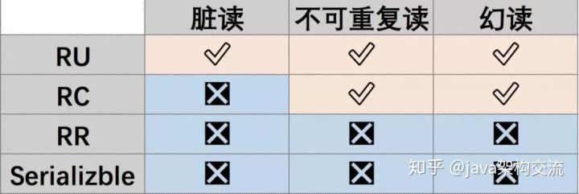
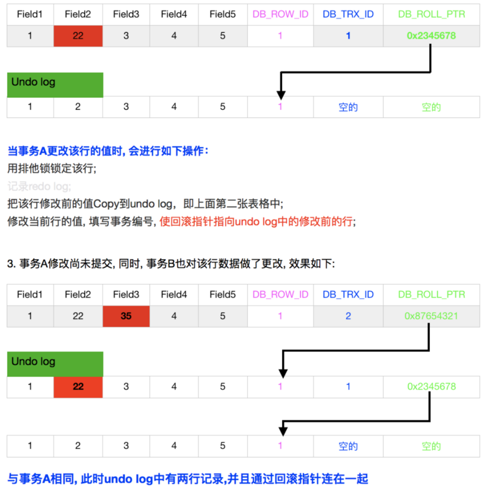

## 7.4 事务详解

### 7.4.1 事务
事务是数据库永恒不变的话题，事务有4个特性，即ACID：原子性，一致性，隔离性，持久性。
* 原子性（atomicity）：一个事务必须被视为一个不可分割的最小工作单元，整个事务中所有操作要么全部提交成功，要么全部失败回滚，对于一个事务来说，不可能只执行其中的一部分操作
* 一致性（consistency）：数据库总是从一个一致性的状态转换到另外一个一致性的状态。
* 隔离性（isolation）：一个事务所做的修改在最终提交以前，对其他事务是不可见的。
* 持久性（durability）：一旦事务提交，则其所做的修改就会永久保存到数据库中。

这四个特性，最重要的就是一致性，而一致性由原子性，隔离性，持久性来保证：
* 原子性由Undo Log保证，Undo Log会保存每次变更之前的记录，从而在发生错误时进行回滚。
* 隔离性由Lock和MVCC保证，这个比较复杂，我们之后会详细讨论。
* 持久性由Redo Log保证，每次真正修改数据之前，都会首先写到Redo Log中，只有Redo Log写入成功，才会真正的写入到磁盘中，如果提交之前断电，就可以通过Redo Log恢复记录。

关于隔离性，SQL标准定义了4种隔离级别：
* 未提交读（RU）:事务中的修改，即使没有提交，对其他事务也都是可见的，其他事务可以读取该事务未提交的数据，也被称为脏读（Dirty Read），这个级别会导致很多问题。
* 已提交读（RC）：Oracle的默认隔离级别，一个事务开始时，只能“看见”已经提交的事务所做的修改。即一个事务从开始直到提交之前，所做的任何修改对其他事务是不可见的。RC有时间也叫不可重复读（nonrepeatable read），因为一次事务中先后执行两次相同的查询，可能得到不同的结果。
* 可重复读（RR）：MySql的默认隔离级别，该级别保证在同一个事务中多次读取同样记录的结果一致，该级别会有幻读的可能。
* 串行化（serializable）：事务串行执行，一般不会采用。

每个级别都会解决不同的问题，具体如下图所示：



原理剖析：
* RU发生脏读的原因：RU是对每个更新语句的行记录进行加锁，而不是对整个事务进行加锁，所以会发生脏读。而RC和RR会对整个事务加锁。
* RC不能重复读的原因：RC是事务中每条Select语句都会生成一个新的Read View，所以每次读到的都是不同的。而RR是事务开启后会创建一个Read View，整个事务过程中会使用该Read view，所以从始至终都是使用同一个Read View。

### 7.4.2 锁
锁机制就是数据库为了保证数据的一致性而使各种共享资源在被并发访问变得有序所设计的一种规则。

按封锁类型分类（数据对象可以是表可以是数据行）：
* 排他锁（又称写锁，X锁）：会阻塞其他事务的读和写操作。
* 共享锁（又称读取，S锁）：会阻塞其他事务的写操作。

按封锁的数据粒度分类如下：
* 行级锁定（row-level）：行级锁的开销大，加锁慢，会出现死锁；但是锁定粒度最小，发生锁冲突的概率最低，并发度也最高。
* 表级锁定（table-level）：表级锁的开销小，加锁快，不会出现死锁；但是锁定粒度大，发生锁冲突的概率最高，并发度最低。

InnoDB的行锁是通过给索引上的索引项加锁来实现的，这一点MySQL与Oracle不同，后者是通过再数据块中，对相应数据行加锁来实现的。InnoDB这种行锁实现特点意味着：只有通过索引条件检索数据，InnoDB才使用行级锁，否则InnoDB将使用表锁，在实际开发中应当注意。

当我们用范围条件检索数据时，并请求共享或排他锁时，InnoDB会给符合范围条件的已有数据记录的索引项加锁；对于键值在条件范围内但并不存在的记录，叫做“间隙（GAP)”。InnoDB也会对这个“间隙”加锁，这种锁机制就是所谓的间隙锁。

例子：假如user_info表中只有101条记录，其user_id的值分别是1，2，...，100，则查询语句`Select * from  user_info where user_id >= 100 for update;`是一个范围查询，InnoDB不仅会对符合条件的user_id值为100的记录加锁，也会对user_id大于100（这些记录并不存在）的“间隙”加锁。

InnoDB使用间隙锁的目的有两个：
* 为了防止幻读（RR隔离级别下再通过GAP锁即可避免了幻读）
* 满足恢复和复制的需要：在Mysql中，一个事务未提交前，其他并发事务不能插入满足其锁定条件的任何记录，也就是不允许出现幻读

### 7.4.3 MVCC
首先我们看一下MVCC的基本原理是：MVCC的实现，通过保存数据在某个时间点的快照来实现的，这意味着一个事务无论运行多长时间，在同一个事务里能够看到数据一致的视图。根据事务开始的时间不同，同时也意味着在同一个时刻不同事务看到的相同表里的数据可能是不同的。

我们看一下MVCC的理想模型：在每一行数据中额外保存两个隐藏的列：当前行创建时的版本号和删除时的版本号（可能为空）。每开始一个新的事务，系统版本号都会自动递增。事务开始时刻的系统版本号会作为事务的版本号，用来和查询每行记录的版本号进行比较。这样事务在执行CRUD操作时，就通过版本号的比较来达到数据版本控制的目的。MVCC具体的操作如下：
* SELECT：DB会根据以下两个条件检查每行记录：（1）DB只查找版本早于当前事务版本的数据行（也就是，数据行的版本号小于或等于当前事务的版本号），这样可以确保事务读取的行，要么是在事务开始前已经存在的，要么是事务自身插入或者修改过的；（2）行的删除版本号要么未定义，要么大于当前事务版本号。这可以确保事务读取到的行，在事务开始之前未被删除。只有1和2同时满足的记录，才能做为查询结果。
* INSERT:DB为新插入的每一行保存当前系统版本号作为行版本号。
* DELETE:DB为删除的每一行保存当前系统版本号作为行删除标识。
* UPDATE:DB为插入一行新记录，保存当前系统版本号作为行版本号，同时保存当系统的版本号为原来的行作为删除标识。

保存这两个额外系统版本号，使大多数操作都可以不用加锁。

#### 当前读和快照读
InnoDB中的操作可以分为快照读(snapshot read)和当前读(current read)：
* 快照读(snapshot read)：简单的select操作（当然不包括`select ... lock in share mode, select ... for update`）
* 当前读(current read)：如下所示：
```sql
select ... lock in share mode
select ... for update
insert
update
delete
```
在RR级别下，快照读是通过MVCC和Undo Log来实现的，而当前读是通过加record lock(记录锁)和gap lock(间隙锁)来实现的。由于两种读的实现机制不同导致一个事务中同时穿插快照读和当前读，是会可能出现幻读的。比如事务B在事务A执行中insert了一条数据并提交，事务A再次查询，普通的select读仍然是undo中的旧版本数据，但是对该行记录执行update或者delete（当前读）却是可以成功的（这也是第二类更新丢失问题）。

#### InnoDB实现方式
InnoDB存储引擎在数据库每行数据的后面添加了三个字段：
* 6字节的事务ID(DB_TRX_ID)字段：用来标识本数据行最近一次修改(insert|update)的事务的事务id。至于delete操作，在InnoDB看来也不过是一次update操作，更新行中的一个特殊位将行标识为deleted，并非真正删除。
* 7字节的回滚指针(DB_ROLL_PTR)字段：指写入回滚段(rollback segment)的Undo Log record (撤销日志记录记录)。如果一行记录被更新，则Undo Log record包含“重建该行记录被更新之前内容”所必须的信息。
* 6字节的DB_ROW_ID字段：包含一个随着新行插入而单调递增的行ID，一般也就是主键ID。

InnoDB的MVCC就是用Undo Log链表实现：事务以排它锁的方式修改原始数据，把修改前的数据存放于Undo Log，通过回滚指针与数据关联，如果修改成功，什么都不做，如果修改失败，则恢复Undo Log中的数据。如下图所示：



####　总结
需要注意的是：MVCC只在RR和RC两个隔离级别下工作，RU总是读取到最新的数据行，不符合当前事务版本的数据行，而Serializable则会对所有读取的行加锁。

一般我们认为MVCC有下面几个特点：
* 每行数据都存在一个版本，每次数据更新时都更新该版本
* 修改时Copy出当前版本，然后随意修改，各个事务之间无干扰
* 保存时比较版本号，如果成功(commit)，则覆盖原记录，失败则放弃copy(rollback)
* 就是每行都有版本号，保存时根据版本号决定是否成功，听起来含有乐观锁的味道，因为这看起来正是，在提交的时候才能知道到底能否提交成功

而InnoDB实现MVCC的方式是：
* 事务以排他锁的形式修改原始数据
* 把修改前的数据存放于Undo Log，通过回滚指针与主数据关联
* 修改成功（commit）啥都不做，失败则恢复Undo Log中的数据（rollback）

二者最本质的区别是：当修改数据时是否要排他锁定。所以InnoDB的实现并不是纯粹的MVCC，其并没有实现核心的多版本共存，Undo Log中的内容只是串行化的结果，记录了多个事务的过程，不属于多版本共存。

理想的MVCC是难以实现的，当事务仅修改一行记录使用理想的MVCC模式是没有问题的，可以通过比较版本号进行提交或者回滚。但当事务影响到多行数据时，理想的MVCC就比较麻烦了：比如事务A执行理想的MVCC，修改Row1成功但修改Row2失败，此时需要回滚Row1，但因为Row1并没有被锁定，其数据可能又被事务B所修改，如果此时回滚Row1的内容，则会破坏事务B的修改结果，导致事务B违反ACID，这也正是所谓的第一类更新丢失的情况。也正是因为InnoDB使用的MVCC中结合了排他锁，所以不会出现第一类更新丢失，一般说更新丢失都是指第二类更新丢失。

理想MVCC难以实现的根本原因在于企图通过乐观锁代替两阶段段提交。在要求一致性的情况下，修改两行数据与修改两个分布式系统中的数据并无区别，而两阶段提交是目前这种场景保证一致性的唯一手段。两阶段提交的本质是锁定，乐观锁的本质是消除锁定，这二者是矛盾的。在MVCC方面，InnoDB只是提供了读的非阻塞。
