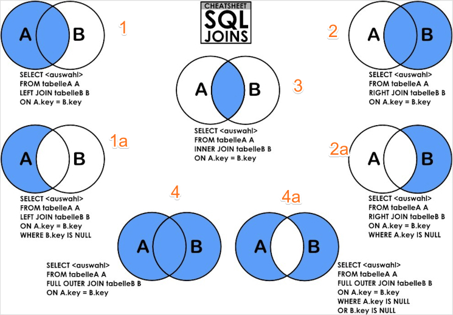
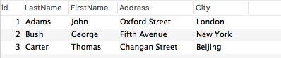
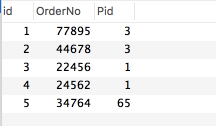
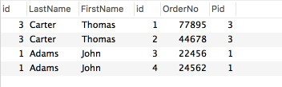
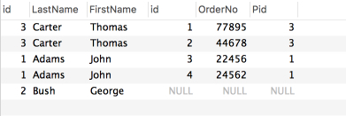
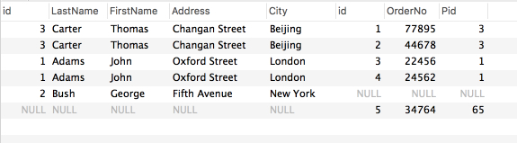

## 7.5 连接详解

### 连接
连接的主要作用是根据两个或多个表中的列之间的关系，获取存在于不同表中的数据。连接分为三类：内连接、外连接、全连接。



在分析这三类连接之前，我们先准备一下数据：
```sql
CREATE DATABASE join_test CHARSET UTF8;

CREATE TABLE `Persons` (
  `id` int(11) unsigned NOT NULL AUTO_INCREMENT,
  `lastName` char(16) NOT NULL DEFAULT '',
  `firstName` char(16) NOT NULL DEFAULT '',
  `address` varchar(128) NOT NULL DEFAULT '',
  `city` varchar(128) NOT NULL DEFAULT '',
  PRIMARY KEY (`id`)
) ENGINE=InnoDB DEFAULT CHARSET=utf8;

CREATE TABLE `Orders` (
  `id` int(11) unsigned NOT NULL AUTO_INCREMENT,
  `orderNo` int(11) NOT NULL DEFAULT '0',
  `pid` int(11) NOT NULL DEFAULT '0',
  PRIMARY KEY (`id`)
) ENGINE=InnoDB DEFAULT CHARSET=utf8;

INSERT INTO `Persons` (`lastName`, `firstName`, `address`, `city`)
VALUES
('Adams', 'John', 'Oxford Street', 'London'),
('Bush', 'George', 'Fifth Avenue', 'New York'),
('Carter', 'Thomas', 'Changan Street', 'Beijing');

INSERT INTO `Orders` (`orderNo`, `pid`)
VALUES (77895, 3), (44678, 3), (22456, 1), (24562, 1), (34764, 65);
```
则Persons表如下图所示：



Orders表如下图所示：



接下来我们简单来讨论一下这三种连接。

#### 内连接
内连接在SQL中是JOIN|INNER JOIN；在Mysql中这两者是等价的。内连接查询返回两个表中在ON后面指定的列条件相同时的行，内连接实际执行流程如下所示：
```sql
SELECT tbl1.col1, tbl2.col2
FROM tbl1 
INNER JOIN tbl2 
ON tbl1.col3 = tbl2.col3
WHERE tbl1.col1 IN(5, 6);

outer_iter = iterator over tbl1 where col1 IN(5, 6)
outer_row = outer_iter.next
while outer_row
    inner_iter = iterator over tbl2 where col3 = outer_row.col3
    inner_row = inner_iter.next
    while inner_row
        output(outer_row.col1, inner_row.col2)
        inner_row = inner_iter.next
    end
    outer_row = outer_iter.next
end
```

我们使用上述创建的数据测试一下，例如：
```sql
SELECT Persons.id, Persons.LastName, Persons.FirstName, Orders.id, Orders.OrderNo, Orders.Pid
FROM Persons
INNER JOIN Orders
ON Persons.id = Orders.Pid
```
查询的结果如下图所示：



总结：INNER JOIN会返回符合ON条件的所有行，A表中的记录a对应B表中的多个记录会以重复记录a的的方式对应不同的多条B表记录出现在结果集中，同样B表中的一条记录b对应A表中的多条记录时会以多条A表记录对应记录b的方式出现在结果集中。

#### 外连接
外连接分为左外连接LEFT JOIN和右外连接RIGHT JOIN。这两者之间是可以转换的，这里我们就以LEFT JOIN为例简单分析一下，其执行流程如下所示：
```sql
SELECT tbl1.col1, tbl2.col2
FROM tbl1 
LEFT OUTER JOIN tbl2 
ON tbl1.col3 = tbl2.col3
WHERE tbl1.col1 IN(5, 6);

outer_iter = iterator over tbl1 where col1 IN(5, 6)
outer_row = outer_iter.next
while outer_row
    inner_iter = iterator over tbl2 where col3 = outer_row.col3
    inner_row = inner_iter.next
    if inner_row {
        while inner_row
            output(outer_row.col1, inner_row.col2)
            inner_row = inner_iter.next
        end
    } else {
        output(outer_row.col1, null)
    }
    outer_row = outer_iter.next
end
```
从上述的执行流程，我们可以看到和JOIN之间的区别是，如果对于一个左表记录a，即使右表没有匹配的记录，仍然会返回该记录a，其对应的右表字段为NULL。我们使用上述创建的数据测试一下，例如：
```sql
SELECT Persons.id, Persons.LastName, Persons.FirstName, Orders.id,Orders.OrderNo,Orders.Pid
FROM Persons
LEFT JOIN Orders
ON Persons.id = Orders.Pid
```
查询的结果如下图所示：



#### 全连接
FULL JOIN全连接会从左表和右表那里返回所有的行。如果左表的记录在右表没有匹配或者右表的记录在左表没有匹配，这些记录仍然会列出，不存在的字段会以NULL补充。可以认为是LEFT JOIN和RIGHT JOIN操作的合集。 
```sql
SELECT Persons.id, Persons.LastName, Persons.FirstName, Orders.id,Orders.OrderNo,Orders.Pid
FROM Persons
RIGHT JOIN Orders
ON Persons.id = Orders.Pid
```
需要注意的是：mysql并不支持全连接，一般利用UNION联合查询代替，也就是左外连接和右外连接的联合查询。
```sql
SELECT * FROM t1
LEFT JOIN t2 ON t1.id = t2.id
UNION
SELECT * FROM t1
RIGHT JOIN t2 ON t1.id = t2.id
```
仍然是使用上述的数据测试一下，例如：
```sql
SELECT * FROM Persons
LEFT JOIN Orders ON Persons.id = Orders.Pid
UNION
SELECT * FROM Persons
RIGHT JOIN Orders ON Persons.id = Orders.Pid
```
查询的结果如下所示：



#### 总结
对于所有的连接类型而言，就是将满足ON匹配条件的对应记录都合成为一条记录出现在结果集中，对于两个表中的某条记录可能存在：一对多或者多对一的情况会在结果集中形成多条记录，只是该表中查询的字段信息相同而已。
* 对于内连接查询到的是一个符合ON匹配条件的在两个表中都存在记录的结果集
* 对于外连接，以左外连接为例，其结果是一个包含所有左表记录且符合ON匹配条件时的右表记录的结果集，如果左表的某条记录和右表的多条记录匹配，结果集中就存在同一个左表记录对应多个右表记录，如果左表的某条记录没有匹配的右表记录，则对应字段为NULL
* 对于全连接，就是把左表右表都包含在内，如果符合ON条件的匹配在结果集中形成一条记录，如果对左表或者右表中的某一条记录在对方表中不存在ON匹配时，就以单独一条记录出现在结果集中，对方表不存在的信息以NULL

### 自连接


