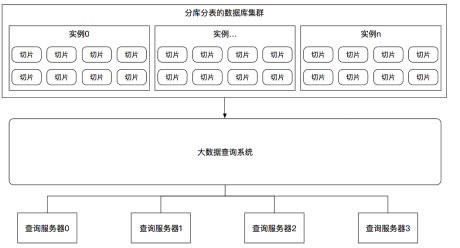

## 7.7 分库分表

### 7.7.1 简介
简单来说，数据的切分就是通过某种特定的条件，将我们存放在同一个数据库中的数据分散存放到多个数据库（主机）中，以达到分散单台设备负载的效果，即分库分表。

数据的切分根据其切分规则的类型，可以分为如下两种切分模式。
* 垂直切分：把单一的表拆分成多个表，并分散到不同的数据库（主机）上
* 水平切分：根据表中数据的逻辑关系，将同一个表中的数据按照某种条件拆分到多台数据库（主机）上

### 垂直切分  
一个数据库由多个表构成，每个表对应不同的业务，垂直切分是指按照业务将表进行分类，将其分布到不同的数据库上，这样就将数据分担到了不同的库上（专库专用）。例如电商系统有如下几张表： 
```
--------------+--------------+------------------
用户信息(User)+ 交易记录(Pay)+  商品(Commodity)|
--------------+--------------+------------------
```
垂直切分就是根据每个表的不同业务进行切分，比如User表、Pay表和Commodity表，将每个表切分到不同的数据库上。

垂直切分的优点如下：
* 拆分后业务清晰，拆分规则明确
* 系统之间进行整合或扩展很容易
* 按照成本、应用的等级、应用的类型等将表放到不同的机器上，便于管理
* 便于实现动静分离、冷热分离的数据库表的设计模式

垂直切分的缺点如下：
* 部分业务表无法关联（Join），只能通过接口方式解决，提高了系统的复杂度
* 受每种业务的不同限制，存在单库性能瓶颈，不易进行数据扩展和提升性能
* 事务处理复杂

垂直切分除了用于分解单库单表的压力，也用于实现冷热分离，也就是根据数据的活跃度进行拆分，因为对拥有不同活跃度的数据的处理方式不同。例如在微博系统的设计中，一个微博对象包括文章标题、作者、分类、创建时间等属性字段，这些字段的变化频率低，查询次数多，叫作冷数据。而博客的浏览量、回复数、点赞数等类似的统计信息，或者别的变化频率比较高的数据，叫作活跃数据或者热数据。

在设计数据库表结构时，就考虑垂直拆分，根据冷热分离、动静分离的原则，再根据使用的存储引擎的特点，对冷数据可以使用MyISAM，能更好地进行数据查询；对热数据可以使用InnoDB，有更快的更新速度，这样能够有效提升性能。

 其次对读多写少的冷数据可配置更多的从库来化解大量查询请求的压力；对于热数据，可以使用多个主库构建分库分表的结构。

最后对于一些特殊的活跃数据或者热点数据，也可以考虑使用Redis之类的缓存，等累计到一定的量后再更新数据库。例如在记录微博点赞数量的业务中，点赞数量被存储在缓存中，每增加1000个点赞，才写一次数据。

### 水平切分  
与垂直切分对比，水平切分不是将表进行分类，而是将其按照某个字段的某种规则分散到多个库中，在每个表中包含一部分数据，所有表加起来就是全量的数据。

这种切分方式根据单表的数据量的规模来切分，保证单表的容量不会太大，从而保证了单表的查询等处理能力，例如将用户的信息表拆分成User1、User2等，表结构是完全一样的。我们通常根据某些特定的规则来划分表，比如根据用户的ID来取模划分。

例如，在博客系统中，当读取博客的量很大时，就应该采取水平切分来减少每个单表的压力，并提升性能。

以微博表为例，当同时有100万个用户在浏览时，如果是单表，则单表会进行100万次请求，假如是单库，数据库就会承受100万次的请求压力；假如将其分为100个表，并且分布在10个数据库中，每个表进行1万次请求，则每个数据库会承受10万次的请求压力，虽然这不可能绝对平均，但是可以说明问题，这样压力就减少了很多，并且是成倍减少的。

水平切分的优点如下：
* 单库单表的数据保持在一定的量级，有助于性能的提高
* 切分的表的结构相同，应用层改造较少，只需要增加路由规则即可
* 提高了系统的稳定性和负载能力

水平切分的缺点如下：
* 切分后，数据是分散的，很难利用数据库的Join操作，跨库Join性能较差
* 拆分规则难以抽象
* 分片事务的一致性难以解决
* 数据扩容的难度和维护量极大

综上所述，垂直切分和水平切分的共同点如下：
* 存在分布式事务的问题
* 存在跨节点Join的问题
* 存在跨节点合并排序、分页的问题
* 存在多数据源管理的问题

在了解这两种切分方式的特点后，我们就可以根据自己的业务需求来选择，通常会同时使用这两种切分方式，垂直切分更偏向于业务拆分的过程，在技术上我们更关注水平切分的方案，之后我们会主要谈论水平切分方案中的技术和难题。

### 路由过程  
我们在设计表时需要确定对表按照什么样的规则进行分库分表。例如，当有新用户时，程序得确定将此用户的信息添加到哪个表中；同理，在登录时我们需要通过用户的账号找到数据库中对应的记录，所有这些都需要按照某一规则进行路由请求，因为请求所需要的数据分布在不同的分片表中。

针对输入的请求，通过分库分表规则查找到对应的表和库的过程叫作路由。例如，分库分表的规则是user_id % 4，当用户新注册了一个账号时，假设用户的ID是123，我们就可以通过123 % 4 = 3确定此账号应该被保存在User3表中。当ID为123的用户登录时，我们可通过123 % 4 = 3计算后，确定其被记录在User3中。

### 分片维度
对数据切片有不同的切片维度，可以参考Mycat提供的切片方式，这里只介绍两种最常用的切片维度。

#### 哈希分片
对数据的某个字段求哈希，再除以分片总数后取模，取模后相同的数据为一个分片，这样的将数据分成多个分片的方法叫作哈希分片。

按照哈希分片常常应用于数据没有时效性的情况，比如所有数据无论是在什么时间产生的，都需要进行处理或者查询，例如支付行业的客户要求可以对至少1年以内的交易进行查询和退款，那么1年以内的所有交易数据都必须停留在交易数据库中，否则就无法查询和退款。

如果这家公司在一年内能做10亿条交易，假设每个数据库分片能够容纳5000万条数据，则至少需要20个表才能容纳10亿条交易。在路由时，我们根据交易ID进行哈希取模来找到数据属于哪个分片，因此，在设计系统时要充分考虑如何设计数据库的分库分表的路由规则。

这种切片方式的好处是数据切片比较均匀，对数据压力分散的效果较好，缺点是数据分散后，对于查询需求需要进行聚合处理。

#### 范围分片
与按照哈希切片不同，这种方式是按照数据的取值范围将数据分布到不同的分片上。

例如交易系统中，不同时间的交易数据查询需求不同。比如距离现在1个季度的数据会访问频繁，距离现在两个季度的数据可能不会再有更新需求，距离现在3个季度的数据基本上没有查询需求。针对这种情况，可以通过按照时间进行切片，针对不同的访问频率使用不同档次的硬件资源来节省成本：假设距离现在1个季度的数据访问频率最高，我们就用更好的硬件来运行这个分片；假设距离现在3个季度的数据没有任何访问需求，我们就可以将其整体归档，以方便DBA操作。

在实际的生产实践中，按照哈希切片和范围切片都是常用的分库分表方式，并被广泛使用，有时可以结合使用这两种方式。例如：对交易数据先按照季度进行切片，然后对于某一季度的数据按照主键哈希进行切片。

### 读写分离
在实际应用中的绝大多数情况下读操作远大于写操作。MySQL提供了读写分离的机制，所有写操作必须对应到主库，读操作可以在主库和从库机器上进行。主库与从库的结构完全一样，一个主库可以有多个从库，甚至在从库下还可以挂从库，这种一主多从的方式可以有效地提高数据库集群的吞吐量。

在DBA领域一般配置主-主-从或者主-从-从两种部署模型。

所有写操作都先在主库上进行，然后异步更新到从库上，所以从主库同步到从库机器有一定的延迟，当系统很繁忙时，延迟问题会更加严重，从库机器数量的增加也会使这个问题更严重。

此外，主库是集群的瓶颈，当写操作过多时会严重影响主库的稳定性，如果主库挂掉，则整个集群都将不能正常工作。

根据以上特点，我们总结一些最佳实践如下：
* 当读操作压力很大时，可以考虑添加从库机器来分解大量读操作带来的压力，但是当从库机器达到一定的数量时，就需要考虑分库来缓解压力了
* 当写压力很大时，就必须进行分库操作了

可能会因为种种原因，集群中的数据库硬件配置等会不一样，某些性能高，某些性能低，这时可以通过程序控制每台机器读写的比重来达到负载均衡，这需要更加复杂的读写分离的路由规则。

### 分库分表引起的问题
分库分表按照某种规则将数据的集合拆分成多个子集合，数据的完整性被打破，因此在某种场景下会产生多种问题。

#### 扩容与迁移  
在分库分表后，如果涉及的分片已经达到了承载数据的最大值，就需要对集群进行扩容。扩容是很麻烦的，一般会成倍地扩容。通用的扩容方法包括如下5个步骤：
* 按照新旧分片规则，对新旧数据库进行双写。
* 将双写前按照旧分片规则写入的历史数据，根据新分片规则迁移写入新的数据库。
* 将按照旧的分片规则查询改为按照新的分片规则查询。
* 将双写数据库逻辑从代码中下线，只按照新的分片规则写入数据。
* 删除按照旧分片规则写入的历史数据。
 
这里，在第2步迁移历史数据时，由于数据量很大，通常会导致不一致，因此，先清洗旧的数据，洗完后再迁移到新规则的新数据库下，再做全量对比，对比后评估在迁移的过程中是否有数据的更新，如果有的话就再清洗、迁移，最后以对比没有差距为准。

如果是历史交易数据，则最好将动静数据分离，随着时间的流逝，某个时间点之前的数据是不会被更新的，我们就可以拉长双写的时间窗口，这样在足够长的时间流逝后，只需迁移那些不再被更新的历史数据即可，就不会在迁移的过程中由于历史数据被更新而导致代理不一致。

在数据量巨大时，如果数据迁移后没法进行全量对比，就需要进行抽样对比，在进行抽样对比时要根据业务的特点选取一些具有某类特征性的数据进行对比。

在迁移的过程中，数据的更新会导致不一致，可以在线上记录迁移过程中的更新操作的日志，迁移后根据更新日志与历史数据共同决定数据的最新状态，来达到迁移数据的最终一致性。

#### 多维度查询  
在分库分表以后，如果查询的标准是分片的主键，则可以通过分片规则路由并查询；但是对于其他键的查询、范围查询、关联查询、查询结果排序等，并不是按照分库分表维度来查询的。

例如，用户购买了商品，需要将交易记录保存下来，那么如果按照买家的纬度分表，则每个买家的交易记录都被保存在同一表中，我们可以很快、很方便地查到某个买家的购买情况，但是某个商品被购买的交易数据很有可能分布在多张表中，查找起来比较麻烦。反之，按照商品维度分表，则可以很方便地查找到该商品的购买情况，但若要查找到买家的交易记录，则会比较麻烦。常见的解决方式如下：
* 在多个分片表查询后合并数据集，这种方式的效率很低
* 记录两份数据，一份按照买家纬度分表，一份按照商品维度分表
* 通过搜索引擎解决，但如果实时性要求很高，就需要实现实时搜索

实际上，在高并发的服务平台下，交易系统是专门做交易的，因为交易是核心服务，SLA的级别比较高，所以需要和查询系统分离，查询一般通过其他系统进行，数据也可能是冗余存储的。

这里再举个例子，在某电商交易平台下，可能有买家查询自己在某一时间段的订单，也可能有卖家查询自己在某一时间段的订单，如果使用了分库分表方案，则这两个需求是难以同时满足。因此，通用的解决方案是，在交易产生时生成一份按照买家分片的数据副本和一份按照卖家分片的数据副本，则查询时可以满足之前的两个需求，因此，查询的数据和交易的数据可能是分别存储的，并从不同的系统提供接口。

另外，在电商系统中，在一个交易订单生成后，一般需要引用到订单中交易的商品实体，如果简单地引用，若商品的金额等信息发生变化，则会导致原订单上的商品信息也会发生变化，这样买家会很疑惑。因此，通用的解决方案是在交易系统中存储商品的快照，在查询交易时使用交易的快照，因为快照是个静态数据，都不会更新，则解决了这个问题。可见查询的问题最好在单独的系统中使用其他技术来解决，而不是在交易系统中实现各类查询功能；当然，也可以通过对商品的变更实施版本化，在交易订单中引用商品的版本信息，在版本更新时保留商品的旧版本，这也是一种不错的解决方案。

最后，关联的表有可能不在同一数据库中，所以基本不可能进行联合查询，需要借助大数据技术来实现，也就是上面所说的第3种方法，即通过大数据技术统一聚合和处理关系型数据库的数据，然后对外提供查询操作。

通过大数据方式来提供聚合查询的方式如下图所示：



#### 同组数据跨库问题  
要尽量把同一组数据放到同一台数据库服务器上，不但在某些场景下可以利用本地事务的强一致性，还可以使这组数据自治。以电商为例，我们的应用有两个数据库db0和db1，分库分表后，按照id维度，将卖家A的交易信息存放到db0中。当数据库db1挂掉时，卖家A的交易信息不受影响，依然可以正常使用。也就是说，要避免数据库中的数据依赖另一数据库中的数据。

#### 分布式事务  
分布式事务是一个很复杂的话题，之后我们会详细讨论这个话题，这里不再详述。